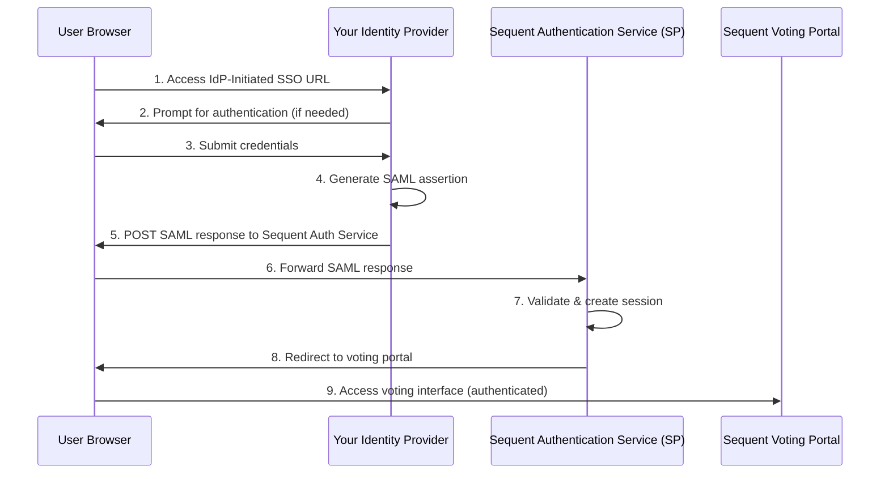

<!--
SPDX-FileCopyrightText: 2025 Sequent Tech <legal@sequentech.io>
SPDX-License-Identifier: AGPL-3.0-only
-->

# IdP-Initiated SAML SSO Integration Guide

## Overview

This guide is for **third-party organizations** who want to integrate their own Identity Provider (IdP) with Sequent's voting platform using IdP-initiated SAML 2.0 Single Sign-On (SSO).

### What is IdP-Initiated SSO?

In IdP-initiated SSO, users begin their authentication journey at **your identity provider** and are then redirected to Sequent's voting platform with an established authentication session. This allows your users to:

1. Start at your organization's portal or login page
2. Authenticate using your existing authentication system
3. Be automatically logged into Sequent's voting platform
4. Access the voting interface without additional login prompts

### Architecture Overview



### Roles

- **Your Identity Provider (IdP)**: Your organization's authentication system that you control
- **Sequent Authentication Service (SP)**: Sequent's authentication broker that receives SAML assertions from your IdP
- **Sequent Voting Portal**: The target application where users access voting functionality

---

## Prerequisites

Before beginning integration, ensure you have:

1. **SAML 2.0 Compliant IdP**: Your IdP must support SAML 2.0 protocol and IdP-initiated SSO flows
2. **HTTPS in Production**: All endpoints must use HTTPS for security (HTTP acceptable for local development only)
3. **X.509 Certificates**: Your IdP needs signing certificates for SAML message signing
4. **Sequent Integration Details**: Contact Sequent to obtain:
   - **Tenant ID** and **Event ID** (UUIDs for your voting event)
   - **Service Provider URL** (format: `https://auth-{subdomain}.sequentech.io`)
   - **Voting Portal URL** (format: `https://voting-{subdomain}.sequentech.io`)
   - **IdP Alias** (your identifier in Sequent's authentication service, typically based on your organization name)
   - **Service Provider Public Certificate** (for validating signed requests from Sequent)

**Note**: The realm identifier (`tenant-{TENANT_ID}-event-{EVENT_ID}`) is automatically constructed from the Tenant ID and Event ID.

---

## Integration Steps

### Step 1: Obtain Configuration Parameters from Sequent

Contact Sequent technical support to request your integration parameters. Sequent will provide:

| Parameter | Description | Example |
|-----------|-------------|---------|
| `TENANT_ID` | Your organization's tenant UUID | `abc12345-6789-...` |
| `EVENT_ID` | Your voting event UUID | `def67890-1234-...` |
| `SP_BASE_URL` | Keycloak Service Provider base URL | `https://login-example.sequent.vote` |
| `VOTING_PORTAL_URL` | Voting portal base URL | `https://voting-example.sequent.vote` |
| `SP_IDP_ALIAS` | Your IdP alias in Keycloak | `yourcompany-idp` |
| `SP_CLIENT_ID` | SAML client ID for voting portal | `vp-sso` |
| `SP_CERT_DATA` | Keycloak's public X.509 certificate | Base64-encoded certificate |

**Notes:**
- Sequent uses subdomain patterns: `login-{SUBDOMAIN}.sequent.vote` and `voting-{SUBDOMAIN}.sequent.vote`
- The realm identifier is automatically constructed as: `tenant-{TENANT_ID}-event-{EVENT_ID}`
- **Store these values securely** - you'll need them for configuration

### Step 2: Configure Your IdP to Trust Sequent's Service Provider

Your IdP needs to know about Sequent's authentication service as a trusted Service Provider.

#### 2.1 Service Provider Metadata

Sequent's SAML metadata will be available at:

```
{SP_BASE_URL}/realms/tenant-{TENANT_ID}-event-{EVENT_ID}/broker/{SP_IDP_ALIAS}/endpoint/descriptor
```

**Example** (substitute your actual values):
```
https://auth-example.sequentech.io/realms/tenant-abc123...-event-def456.../broker/yourcompany-idp/endpoint/descriptor
```

You can either:
- **Import this metadata** directly into your IdP (recommended), or
- **Manually configure** the following values:

#### 2.2 Manual Configuration Values

If not importing metadata, configure these in your IdP:

**Service Provider Entity ID (Realm Identifier):**
```
tenant-{TENANT_ID}-event-{EVENT_ID}
```

**Assertion Consumer Service (ACS) URL:**
```
{SP_BASE_URL}/realms/tenant-{TENANT_ID}-event-{EVENT_ID}/broker/{SP_IDP_ALIAS}/endpoint/clients/{SP_CLIENT_ID}
```

**Example:**
```
https://auth-example.sequentech.io/realms/tenant-abc123.../broker/yourcompany-idp/endpoint/clients/vp-sso
```

**Single Logout Service URL (optional):**
```
{SP_BASE_URL}/realms/tenant-{TENANT_ID}-event-{EVENT_ID}/broker/{SP_IDP_ALIAS}/endpoint
```

**SAML Binding:** HTTP-POST

**NameID Format:** Email address (recommended) or Transient

**Required Attributes:**
- `email`: User's email address (used as principal identifier)
- Additional attributes can be configured as needed

**Certificate:**
- Install the `SP_CERT_DATA` certificate provided by Sequent
- This is used to validate signed AuthnRequests from the Service Provider (if your IdP validates signatures)

### Step 3: Provide Your IdP Metadata to Sequent

Sequent needs your IdP's metadata to configure the trust relationship. Provide Sequent with:

1. **Your IdP's Entity ID** (SAML entity identifier)
2. **Your IdP's SSO Service URL** (where Keycloak would send AuthnRequests)
3. **Your IdP's public signing certificate** (X.509 certificate in PEM format)
4. **Your IdP's metadata URL** (if available), typically:
   ```
   https://your-idp.yourcompany.com/saml/metadata
   ```

Send this information to Sequent technical support.

### Step 4: Understanding the Reference Implementation

Sequent provides a **SimpleSAMLphp reference implementation** that demonstrates a complete, working integration. You can find it in the Step repository at `.devcontainer/simplesamlphp/`. This section explains how the reference implementation works and how you can adapt it to your own IdP platform.

#### 4.1 Centralized Configuration Pattern

The reference implementation uses a centralized configuration file that stores all deployment-specific values in one location.

**File:** `.devcontainer/simplesamlphp/config.php`

```php
<?php
return [
    // Your IdP deployment configuration
    'idp_base_url' => getenv('IDP_BASE_URL') ?: 'http://localhost:8083/simplesaml',
    'idp_hostname' => getenv('IDP_HOSTNAME') ?: 'localhost:8083',

    // Target application (provided by Sequent)
    'tenant_id' => getenv('TENANT_ID') ?: 'abc12345-6789-...',
    'event_id' => getenv('EVENT_ID') ?: 'def67890-1234-...',
    'voting_portal_url' => getenv('VOTING_PORTAL_URL') ?: 'https://voting-example.sequentech.io',

    // Service Provider configuration (provided by Sequent)
    'sp_base_url' => getenv('SP_BASE_URL') ?: 'https://auth-example.sequentech.io',
    'sp_realm' => 'tenant-' . (getenv('TENANT_ID') ?: '...') . '-event-' . (getenv('EVENT_ID') ?: '...'),
    'sp_idp_alias' => getenv('SP_IDP_ALIAS') ?: 'yourcompany-idp',
    'sp_client_id' => getenv('SP_CLIENT_ID') ?: 'vp-sso',
    'sp_cert_data' => getenv('SP_CERT_DATA') ?: 'MII...',
];
```

**Key principles:**
- All configuration in one place
- Environment variable support for different deployments
- No hardcoded values scattered throughout code
- Easy to switch between development, staging, and production

#### 4.2 Service Provider (Sequent) Metadata Configuration

The reference implementation shows how to configure Sequent's authentication service as a remote Service Provider.

**File:** `.devcontainer/simplesamlphp/metadata/saml20-sp-remote.php`

```php
<?php
// Load centralized configuration
$config = require __DIR__ . '/../config.php';

// Build the ACS URL dynamically
$keycloakSpAcsUrl = sprintf(
    '%s/realms/%s/broker/%s/endpoint/clients/%s',
    rtrim($config['sp_base_url'], '/'),
    $config['sp_realm'],
    $config['sp_idp_alias'],
    $config['sp_client_id']
);

// The entity ID is the realm identifier
$metadata[$config['sp_realm']] = [
    'AssertionConsumerService' => [
        [
            'Binding' => 'urn:oasis:names:tc:SAML:2.0:bindings:HTTP-POST',
            'Location' => $keycloakSpAcsUrl
        ],
    ],
    'certData' => $config['sp_cert_data'],
    'validate.authnrequest' => true,
    'validate.logoutrequest' => true,
];
```

**What this demonstrates:**
- How to build the correct ACS URL format
- Using the realm identifier as the SP entity ID
- Loading the SP certificate from configuration
- Dynamic metadata generation based on environment

#### 4.3 SSO Initiation Implementation

The reference implementation includes a trigger page that shows how to initiate the SSO flow.

**File:** `.devcontainer/simplesamlphp/public/idp-initiated-sso.php`

```php
<?php
// Load centralized configuration
$config = require __DIR__ . '/../config.php';

// Build the Service Provider Entity ID from realm
$spEntityId = $config['sp_realm'];

// Build the final redirect URL (voting portal login page)
$finalRedirectUrl = sprintf(
    '%s/tenant/%s/event/%s/login',
    $config['voting_portal_url'],
    $config['tenant_id'],
    $config['event_id']
);

// Construct the IdP-initiated SSO URL
$idpSsoUrl = "/simplesaml/saml2/idp/SSOService.php";
$queryParams = [
    'spentityid' => $spEntityId,
    'RelayState' => $finalRedirectUrl,
];
$loginUrl = $idpSsoUrl . '?' . http_build_query($queryParams);
?>

<!DOCTYPE html>
<html>
<head>
    <title>IdP Login Trigger</title>
</head>
<body>
    <h1>Access Voting System</h1>
    <p>Click below to authenticate and access the voting portal</p>
    <a href="<?php echo htmlspecialchars($loginUrl); ?>">
        Login to Voting Portal
    </a>
</body>
</html>
```

**Key components:**
1. **`spentityid` parameter**: Specifies which Service Provider to target (the realm identifier)
2. **`RelayState` parameter**: Specifies where to redirect after successful authentication
3. **Dynamic URL construction**: All values come from centralized configuration

#### 4.4 How the SSO Flow Works

When a user clicks the login link:

1. **User is redirected to IdP's SSO endpoint** with `spentityid` and `RelayState` parameters
2. **IdP authenticates the user** (if not already authenticated)
3. **IdP generates a SAML assertion** containing user attributes (email, etc.)
4. **IdP POSTs the SAML response** to Sequent's ACS URL along with the `RelayState`
5. **Sequent validates the assertion** and creates a session
6. **User is redirected to the RelayState URL** (voting portal login page)
7. **User accesses the voting portal** with an established session

#### 4.5 Adapting to Your IdP Platform

The reference implementation uses SimpleSAMLphp, but the **patterns and concepts apply to any SAML 2.0 IdP**:

**For ADFS:**
- Store configuration values in ADFS configuration database or app settings
- Build ACS URL using same format shown above
- Create relying party trust with Sequent's metadata
- Configure claim rules to include `email` attribute

**For Okta:**
- Configure SAML 2.0 app integration
- Use the ACS URL format from the reference implementation
- Map email attribute in attribute statements
- Enable IdP-initiated SSO in app settings

**For Shibboleth:**
- Configure `<RelyingParty>` in `relying-party.xml`
- Build ACS URL using the reference format
- Configure `<AttributeResolver>` for email attribute
- Set up IdP-initiated SSO endpoint

**For custom implementations:**
- Follow the configuration centralization pattern
- Use the same URL construction logic
- Ensure SAML assertions include required attributes
- Sign responses and/or assertions

### Step 5: Understanding SAML Assertion Requirements

When a user authenticates, your IdP must generate a valid SAML 2.0 assertion. The reference implementation shows how SimpleSAMLphp handles this automatically, but understanding the requirements helps you configure your own IdP correctly.

#### 5.1 IdP Metadata Configuration (Reference)

The reference implementation's IdP metadata shows the key configuration:

**File:** `.devcontainer/simplesamlphp/metadata/saml20-idp-hosted.php`

```php
<?php
$config = require __DIR__ . '/../config.php';

// Build entity ID dynamically
$entityId = rtrim($config['idp_base_url'], '/') . '/saml2/idp/metadata.php';

$metadata[$entityId] = [
    'host' => '__DEFAULT__',
    'privatekey' => 'server.pem',           // For signing
    'certificate' => 'server.crt',          // Public certificate
    'auth' => 'example-userpass',           // Authentication source
    'sign.logout' => true,
    'saml20.sign.response' => true,         // Sign the SAML response
    'saml20.sign.assertion' => true,        // Sign the assertion
];
```

**Key points:**
- **Signing enabled**: Both response and assertion are signed for security
- **Certificates configured**: Private key for signing, public cert for sharing
- **Authentication source**: Defines how users authenticate and what attributes are released

#### 5.2 Required Assertion Elements

**Subject:**
- `NameID`: User's email address (or as configured with Sequent)
- `NameID Format`: `urn:oasis:names:tc:SAML:1.1:nameid-format:emailAddress` (or as agreed)

**Conditions:**
- `AudienceRestriction`: Must include `{SP_REALM}` as the audience
- `NotBefore` / `NotOnOrAfter`: Appropriate validity window (e.g., 5 minutes)

**AttributeStatement:**
At minimum, include:
- `email`: User's email address

**Example from the reference implementation** - SimpleSAMLphp automatically generates assertions with this structure when properly configured. Your IdP should generate similar assertions:

```xml
<saml:Assertion xmlns:saml="urn:oasis:names:tc:SAML:2.0:assertion"
                ID="_unique-assertion-id"
                Version="2.0"
                IssueInstant="2025-01-15T10:30:00Z">
    <saml:Issuer>https://your-idp.yourcompany.com/saml/metadata</saml:Issuer>
    <saml:Subject>
        <saml:NameID Format="urn:oasis:names:tc:SAML:1.1:nameid-format:emailAddress">
            user@example.com
        </saml:NameID>
    </saml:Subject>
    <saml:Conditions NotBefore="2025-01-15T10:30:00Z" NotOnOrAfter="2025-01-15T10:35:00Z">
        <saml:AudienceRestriction>
            <saml:Audience>tenant-abc123...-event-def456...</saml:Audience>
        </saml:AudienceRestriction>
    </saml:Conditions>
    <saml:AttributeStatement>
        <saml:Attribute Name="email" NameFormat="urn:oasis:names:tc:SAML:2.0:attrname-format:basic">
            <saml:AttributeValue>user@example.com</saml:AttributeValue>
        </saml:Attribute>
    </saml:AttributeStatement>
</saml:Assertion>
```

#### 5.3 Signing Requirements

**CRITICAL SECURITY REQUIREMENT:**

Your IdP **MUST** sign either:
- The SAML Response, **or**
- The SAML Assertion, **or**
- Both (recommended for maximum security)

Use RSA-SHA256 or stronger signing algorithm.

The reference implementation shows this configuration in the IdP metadata (section 5.1 above) with:
```php
'saml20.sign.response' => true,
'saml20.sign.assertion' => true,
```

#### 5.4 Sending SAML Response to Sequent

After generating the signed SAML assertion, your IdP must:

1. Wrap it in a SAML Response
2. Create an HTML auto-submit form that POSTs to Sequent's ACS URL
3. Include the `RelayState` parameter from the original request

**ACS URL format:**
```
{SP_BASE_URL}/realms/{SP_REALM}/broker/{SP_IDP_ALIAS}/endpoint/clients/{SP_CLIENT_ID}
```

**Example auto-submit form:**

```html
<!DOCTYPE html>
<html>
<head><title>SAML Response</title></head>
<body onload="document.forms[0].submit()">
    <form method="post" action="https://auth-example.sequentech.io/realms/tenant-abc123.../broker/yourcompany-idp/endpoint/clients/vp-sso">
        <input type="hidden" name="SAMLResponse" value="BASE64_ENCODED_SAML_RESPONSE" />
        <input type="hidden" name="RelayState" value="https://voting-example.sequentech.io/tenant/abc12345.../event/def67890.../login" />
        <noscript>
            <button type="submit">Continue</button>
        </noscript>
    </form>
</body>
</html>
```

**Note:** SimpleSAMLphp handles this automatically. Most SAML IdP platforms have built-in support for generating these auto-submit forms.

---

## Development and Testing

### Using the Reference Implementation for Development

The SimpleSAMLphp reference implementation can be deployed in your development environment to test the integration before going to production.

#### Setting Up the Reference Implementation Locally

1. **Clone the Step repository** (you should have access to this)
2. **Navigate to the SimpleSAML directory:**
   ```bash
   cd .devcontainer/simplesamlphp/
   ```

3. **Copy the environment template:**
   ```bash
   cp .env.example .env
   ```

4. **Configure your environment variables** in `.env`:
   ```bash
   # Your local IdP URLs
   IDP_BASE_URL=http://localhost:8083/simplesaml
   IDP_HOSTNAME=localhost:8083

   # Sequent configuration (provided by Sequent)
   TENANT_ID=your-tenant-id
   EVENT_ID=your-event-id
   SP_BASE_URL=https://auth-staging.sequentech.io
   SP_IDP_ALIAS=yourcompany-idp
   SP_CLIENT_ID=vp-sso
   SP_CERT_DATA=MII...  # Certificate from Sequent
   VOTING_PORTAL_URL=https://voting-staging.sequentech.io
   ```

5. **Start the SimpleSAMLphp IdP** (using Docker or your preferred method)

6. **Access the trigger page:**
   ```
   http://localhost:8083/simplesaml/idp-initiated-sso.php
   ```

7. **Test the SSO flow:**
   - Click "Login to Voting Portal"
   - Authenticate with test credentials
   - Verify redirect to Sequent's staging voting portal

#### Development Testing Against Sequent Staging

**Step 1: Configure Sequent Staging**
- Provide Sequent with your local IdP metadata
- Sequent will configure their staging environment to trust your development IdP
- You'll receive staging URLs and configuration

**Step 2: Test Locally**
- Run the reference implementation locally
- Configure it to point to Sequent's staging environment
- Test the complete SSO flow

**Step 3: Iterate**
- Use SAML tracer browser extensions to debug issues
- Check SAML assertions and responses
- Verify attribute mapping

### Testing Checklist

Before going to production, verify:

- [ ] SAML assertions contain required attributes (email)
- [ ] SAML responses/assertions are properly signed
- [ ] Audience restriction matches Keycloak realm
- [ ] RelayState is correctly preserved through the flow
- [ ] Users land on the correct voting portal URL
- [ ] Clock synchronization (NTP) is configured (prevents timing issues)
- [ ] HTTPS is enabled on all endpoints
- [ ] Certificates are valid and not expired

---

## Production Deployment

### Pre-Production Checklist

1. **Security:**
   - [ ] All endpoints use HTTPS
   - [ ] Valid SSL/TLS certificates installed
   - [ ] SAML signing enabled and tested
   - [ ] Certificates stored securely
   - [ ] Private keys protected and not exposed

2. **Configuration:**
   - [ ] All URLs updated from development to production values
   - [ ] Configuration stored in environment variables or secure config management
   - [ ] Sensitive values (certificates, keys) not hardcoded in application code
   - [ ] RelayState validation implemented (prevent open redirects)

3. **Monitoring:**
   - [ ] Logging enabled for SAML transactions
   - [ ] Error handling and user-friendly error pages
   - [ ] Monitoring alerts configured for authentication failures

4. **Coordination with Sequent:**
   - [ ] Production metadata exchanged
   - [ ] Production certificates exchanged
   - [ ] Integration tested in Sequent's staging environment
   - [ ] Go-live date coordinated

### Environment Configuration Pattern

**Recommended approach:** Use environment variables for all deployment-specific values, exactly as shown in the reference implementation.

**Production `.env` file structure** (based on reference implementation):

```bash
# Your IdP Configuration
IDP_BASE_URL=https://idp.yourcompany.com/saml
IDP_HOSTNAME=idp.yourcompany.com

# Target Application (provided by Sequent)
TENANT_ID=abc12345-6789-...
EVENT_ID=def67890-1234-...

# Sequent SP Configuration (provided by Sequent)
SP_BASE_URL=https://auth-production.sequentech.io
SP_IDP_ALIAS=yourcompany-idp
SP_CLIENT_ID=vp-sso
SP_CERT_DATA=MIIDOzCCAiMCBg...  # Base64 certificate from Sequent

# Voting Portal (provided by Sequent)
VOTING_PORTAL_URL=https://voting-production.sequentech.io

# Note: SP realm is automatically constructed as tenant-{TENANT_ID}-event-{EVENT_ID}
# This matches the pattern used in config.php from the reference implementation
```

**How to use this configuration:**

If you're adapting the SimpleSAMLphp reference implementation:
1. Copy `.devcontainer/simplesamlphp/config.php` to your production IdP
2. Update your `.env` file with production values
3. All metadata files will automatically use the correct values

If you're using a different IdP platform:
1. Create equivalent configuration in your IdP's native format
2. Use the same environment variable names for consistency
3. Build URLs using the same patterns shown in the reference implementation

---

## Troubleshooting

### Common Issues

#### 1. "SAML Response Signature Invalid"

**Cause:** Sequent cannot verify your IdP's signature

**Solutions:**
- Verify Sequent has your correct public certificate
- Ensure you're signing the Response or Assertion (check section 5.3)
- Check signing algorithm is RSA-SHA256 or stronger
- Verify certificate hasn't expired
- Review the reference implementation's signing configuration in `saml20-idp-hosted.php`

#### 2. "Invalid AudienceRestriction"

**Cause:** Assertion audience doesn't match expected value

**Solution:**
- Ensure `<saml:Audience>` element contains the exact `SP_REALM` value
- Check for typos or whitespace in realm identifier
- The audience must be: `tenant-{TENANT_ID}-event-{EVENT_ID}`
- Review the reference implementation's SP remote metadata for correct audience configuration

#### 3. "User Not Created / Authentication Failed"

**Cause:** Required attributes missing or incorrect

**Solutions:**
- Verify `email` attribute is present in SAML assertion
- Check attribute name format matches Sequent's configuration
- Ensure NameID format matches expected format
- Compare your assertion structure with the example in section 5.2

#### 4. "Clock Skew Error"

**Cause:** Time difference between servers

**Solution:**
- Configure NTP on all servers
- Check `NotBefore` and `NotOnOrAfter` have reasonable validity window (5-10 minutes)

#### 5. "RelayState Not Working / User Redirected to Wrong Page"

**Cause:** RelayState not preserved or malformed

**Solutions:**
- Verify RelayState is included in initial SSO request
- Ensure your IdP passes RelayState through to SAML Response POST
- Check URL encoding is correct
- Verify final URL format matches expected pattern

### Debug Tools

1. **Browser SAML Tracers:**
   - SAML-tracer (Firefox)
   - SAML Chrome Panel (Chrome)
   - These tools let you inspect SAML messages in flight

2. **Log Analysis:**
   - Enable verbose logging on your IdP
   - Request authentication service logs from Sequent for debugging
   - Look for signature validation errors, attribute mapping issues
   - If using SimpleSAMLphp reference implementation, check logs at `/var/log/simplesamlphp/`

3. **Metadata Validation:**
   - Use online SAML metadata validators
   - Verify XML structure and signatures
   - Compare your metadata with the reference implementation's structure

4. **Reference Implementation Debugging:**
   - Deploy the SimpleSAMLphp reference locally
   - Test against Sequent staging to isolate issues
   - Compare SAML messages from reference vs. your implementation

---

## Security Considerations

### Critical Security Requirements

1. **Always use HTTPS in production** - HTTP is only acceptable for local development
2. **Sign all SAML messages** - Responses and/or Assertions must be signed
3. **Validate RelayState** - Implement allowlist validation to prevent open redirects
4. **Protect private keys** - Store signing keys securely, never in code repositories
5. **Certificate management** - Monitor expiration, rotate keys regularly
6. **Audience restriction** - Always include correct SP realm in assertions
7. **Time-based validation** - Implement NotBefore/NotOnOrAfter with reasonable windows
8. **Session security** - Use secure session management in your IdP
9. **Input validation** - Validate all inputs and parameters
10. **Logging and monitoring** - Log authentication events for security audit

### SAML-Specific Security

- **Signature validation:** Sequent validates your signatures - ensure they're correct (see section 5.3)
- **Certificate verification:** Use strong key sizes (2048-bit RSA minimum)
- **Message freshness:** Include IssueInstant and implement reasonable validity periods
- **Replay protection:** Use unique assertion IDs
- **XML security:** Protect against XML signature wrapping attacks (most SAML libraries handle this)
- **Reference:** The SimpleSAMLphp implementation demonstrates these security practices

---

## Support and Contact

For integration support:

1. **Technical Questions:** Contact Sequent technical support at [support@sequentech.io](mailto:support@sequentech.io)
2. **Integration Setup:** Request integration parameters and coordinate go-live
3. **Reference Implementation:** Review the SimpleSAMLphp reference in the Step repository at `.devcontainer/simplesamlphp/`
4. **Development Assistance:** Sequent can help troubleshoot integration issues during development

---

## Summary: Key Files in the Reference Implementation

The SimpleSAMLphp reference implementation in `.devcontainer/simplesamlphp/` contains everything you need:

**Configuration:**
- `config.php` - Centralized configuration pattern (⭐ **Start here**)
- `.env.example` - Environment variable template

**Metadata:**
- `metadata/saml20-idp-hosted.php` - IdP metadata configuration
- `metadata/saml20-sp-remote.php` - Service Provider (Sequent) metadata configuration

**Implementation:**
- `public/idp-initiated-sso.php` - SSO trigger page example
- `README.md` - Setup and usage instructions

**Development:**
- `Dockerfile` - Local development container setup
- `.devcontainer/` integration - VS Code dev container support

### Next Steps

1. **Review the reference implementation** in `.devcontainer/simplesamlphp/`
2. **Understand the configuration patterns** in `config.php`
3. **Study the metadata files** to understand URL construction
4. **Test locally** using the reference implementation against Sequent staging
5. **Adapt the patterns** to your IdP platform
6. **Coordinate with Sequent** for staging and production deployment

**Remember:** You don't have to use SimpleSAMLphp in production - the reference implementation demonstrates the **patterns and configuration** that apply to any SAML 2.0 IdP platform.
