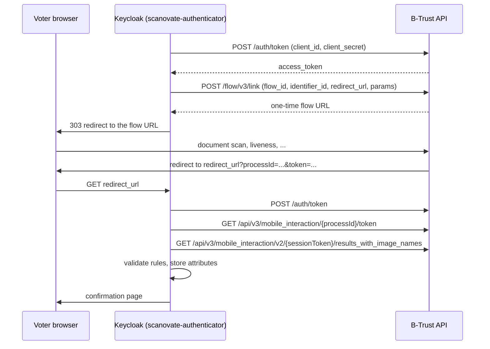

<!--
SPDX-FileCopyrightText: 2026 Sequent Tech <legal@sequentech.io>
SPDX-License-Identifier: AGPL-3.0-only
-->

# Scanovate Identity Verification

## Overview

Sequent can verify a voter's identity during enrollment with
[Scanovate B-Trust](https://www.scanovate.com/). The voter scans their identity
document and records a short selfie video. B-Trust then runs OCR, liveness
(presentation and injection attack detection), face matching and document fraud
checks. Sequent checks the results against rules you configure, stores the
extracted data, and asks the voter to confirm it.

The integration is the `scanovate-authenticator` Keycloak authenticator. It
follows the B-Trust v3.8.2 Identity Verification Tech Specs and replaces the
previous Inetum integration.

## How it works



Some design decisions to be aware of:

- **The browser is never trusted.** The `token` that B-Trust appends to the
  redirect URL is ignored. Keycloak stores the process id in the authentication
  session and exchanges it for a session token server to server.
- **Fast results.** Results are fetched from `results_with_image_names`, which
  returns file paths instead of base64 media, as the specs recommend. Images and
  videos are never downloaded.
- **Layered errors.** The top level `success`/`errorCode` reports whether the
  API call worked. `data.success`/`data.errorCode` reports the verification
  outcome: `1020`/`1030` mean the voter reached the maximum number of trials, and
  `1026` means the document authentication failed.
- **Fail closed.** Unknown rule types, malformed rules, and document types
  without validation rules reject the verification instead of skipping checks.
- **Confirmation is guarded.** The confirmation page only completes the step if
  a verification succeeded in the same authentication session.

On success the auth note named by `user-status`
(`sequent.read-only.id-card-number-validated` by default) is set to `VERIFIED`.
Later flow steps rely on it, e.g. the `already-validated` conditional and
`lookup-and-update-user`, which copies it into the user.

## Configuration

Add a `scanovate-authenticator` execution to the registration flow, after the
steps that collect the document number and type, and configure it:

| Key | Description | Default |
| --- | --- | --- |
| `base-url` | B-Trust API base URL. | |
| `client-id` / `client-secret` | OAuth credentials provided by Scanovate. | |
| `flow-id` | Numeric id of the B-Trust flow, configured in the B-Trust Flow Builder. | |
| `execution-mode` | `interactive` redirects the voter. `auto-complete` fetches results right away and is only for mock servers. | `interactive` |
| `save-option` | Empty (account default), `save` or `do_not_save`. | empty |
| `link-params` | JSON mapping B-Trust flow parameters to auth notes, e.g. `{"country": "country"}`. | `{}` |
| `doc-id` | Auth note with the document number, sent as `id_number`. | `sequent.read-only.id-card-number` |
| `doc-id-type` | Auth note with the document type, used to pick the rules. | `sequent.read-only.id-card-type` |
| `user-status` | Auth note set to `VERIFIED` on success. | `sequent.read-only.id-card-number-validated` |
| `attributes-to-validate` | Validation rules, see below. | liveness, face match, document number, expiry |
| `attributes-to-store` | Values to store and show for confirmation, see below. | first name, last name, date of birth |
| `max-retries` | Attempts per B-Trust API call, with exponential backoff from 1 second. | `3` |
| `max-attempts` | Failed verifications allowed before the voter is rejected. | `3` |

### Rules

Both rule settings are JSON objects keyed by document type (the value of the
`doc-id-type` auth note). The `default` key applies to any other document type.

Each rule reads a value from the results with a
[JSON pointer](https://datatracker.ietf.org/doc/html/rfc6901) in
`attributePath`. When `process` is set (`ocr`, `liveness_plus`,
`biometric_match`, `document_liveness_plus`, `STT`, `age_gender_compare` or
`mobileForm`), the pointer is relative to that process's entry in
`data.resultsList`. B-Trust adds an entry per attempt, so the last successful
entry is used, or the last entry if none succeeded. Without `process`, the
pointer is relative to the whole response.

Validation rule types. The expected value goes in the field named after the
type:

| `type` | Passes when |
| --- | --- |
| `equalValue` | The value equals the literal (ignoring case, accents and surrounding spaces). Works with booleans and statuses, e.g. `"true"` or `"passed"`. |
| `equalAuthnoteAttributeId` | The value equals the given auth note, e.g. the document number the voter typed. |
| `minValue` | The value is a number greater than or equal to the given one, e.g. a `biometric_match` score. |
| `equalDateAuthnoteAttributeId` | The date equals the date in the given auth note. Needs `valueDateFormat` and `sourceDateFormat`. |
| `isBeforeDateValue` | The given date (or `now`) is strictly before the value. Needs `sourceDateFormat`, and `valueDateFormat` unless it's `now`. |

`errorMsg` sets the message key shown when a rule fails
(`scanovateAttributesError` by default).

Store rules set `UserAttribute` (the auth note to write) and `type`: `text` or
`date`, which needs `sourceDateFormat` and `storeDateFormat`.

Example for a passport:

```json
{
  "philippinePassport": [
    { "type": "equalValue", "equalValue": "true", "process": "liveness_plus",
      "attributePath": "/livenessCheck", "errorMsg": "scanovateVerificationFailedError" },
    { "type": "minValue", "minValue": "0.67", "process": "biometric_match",
      "attributePath": "/score", "errorMsg": "scanovateScoringError" },
    { "type": "equalValue", "equalValue": "PHL", "process": "ocr",
      "attributePath": "/issuingCountry/alpha3" },
    { "type": "equalValue", "equalValue": "passed", "process": "document_liveness_plus",
      "attributePath": "/status", "errorMsg": "scanovateDocumentAuthenticationError" },
    { "type": "isBeforeDateValue", "isBeforeDateValue": "now", "process": "ocr",
      "attributePath": "/expiryDate", "sourceDateFormat": "dd.MM.yyyy" }
  ]
}
```

:::caution Check paths against your B-Trust flow
The fields available in the results depend on the tasks configured in the
B-Trust flow and on the document type. For example, OCR fields for documents
read with Regula depend on the scanned document. Before going live, fetch real
results for each accepted document type and check every `attributePath`.
:::

### Messages

The following message keys are provided in English and Tagalog:
`scanovateInternalError`, `scanovateVerificationFailedError`,
`scanovateDocumentAuthenticationError`, `scanovateMaxTrialsError`,
`scanovateAttributesError`, `scanovateScoringError` and
`scanovateMaxRetriesError`.

### COMELEC janitor

The COMELEC realm template (`packages/windmill/external-bin/janitor/templates/COMELEC/keycloak.hbs`)
has rules for PhilSys ID, Seaman's Book, Philippine passport, driver's license
and IBP. `run.py` fills it from these `settings` rows of the spreadsheet:

| Setting | Default |
| --- | --- |
| `keycloak_scanovate_base_url` | empty |
| `keycloak_scanovate_client_id` | empty |
| `keycloak_scanovate_client_secret` | empty |
| `keycloak_scanovate_flow_id` | empty |
| `keycloak_scanovate_execution_mode` | `interactive` |
| `keycloak_scanovate_min_biometric_score_<philis_id\|seaman_book\|passport\|driver_license\|ibp>` | `0.67` |

B-Trust scores go from 0.0 to 1.0, unlike Inetum's 0 to 100. The old
`keycloak_inetum_min_value_*` settings are no longer read.

## Testing

### Unit tests

The authenticator has unit tests for result interpretation, the rules engine,
the API client (request shapes, retries and backoff) and the authentication
flow (redirect, return, confirmation, retries and configuration errors):

```bash
cd packages/keycloak-extensions
mvn -B -pl scanovate-authenticator -am verify
```

The mock server has its own tests:

```bash
cd packages
cargo test -p mock_server
```

### Mock server

The e2e mock server (`packages/e2e/src/mock_server`, `mock_server` service of
the `full` docker compose profile, port `MOCK_SERVER_PORT`) implements the
B-Trust endpoints used by the authenticator:

| Endpoint | Behaviour |
| --- | --- |
| `POST /auth/token` | Returns a random access token. |
| `POST /flow/v3/link` | Stores the session and returns `MOCK_SERVER_PUBLIC_URL/flow?...&process_id=<identifier_id>`. |
| `GET /flow?process_id=` | Page standing in for the B-Trust UI, where you pick the outcome. |
| `GET /flow/complete?process_id=&outcome=` | Redirects to `redirect_url?processId=...&token=...`. |
| `GET /api/v3/mobile_interaction/{session}/token` | Returns a session token. |
| `GET /api/v3/mobile_interaction/v2/{token}/results_with_image_names` | Returns OCR, liveness, face match and document liveness results. |

If the `country` flow parameter is sent and voters were loaded with
`POST /upload-csv`, the OCR data comes from a random voter of that country.
Otherwise it's a fixed voter (`JUAN DELA CRUZ`, born `01.01.1990`) whose
document number is the `id_number` sent by Keycloak.

The outcome is picked on the flow page. It can also be preset with a
`mock_outcome` flow parameter, which `link-params` maps from an auth note like
any other parameter (e.g. `{"mock_outcome": "<auth note name>"}`). This is
mostly useful in `auto-complete` mode:

| Outcome | Result |
| --- | --- |
| `success` | Everything passes (face match score `0.86`). |
| `low_biometric_score` | The flow succeeds with a face match score of `0.21`, so a `minValue` rule should reject it. |
| `liveness_failed` | `data.errorCode = -1` with a failed liveness attempt. |
| `document_authentication_failed` | `data.errorCode = 1026`. |
| `max_trials` | `data.errorCode = 1030`. |

`MOCK_SERVER_PUBLIC_URL` must be reachable from the voter's browser
(`http://127.0.0.1:8500` in the dev container), while `base-url` must be
reachable from Keycloak (`http://mock_server:8500`).

### Manual test in the dev container

1. Start the `full` profile so that `mock_server` is running, and check it with
   `curl http://127.0.0.1:8500/`.
2. The development election event realm ships a `scanovate-registration`
   authenticator config pointing to the mock server in `interactive` mode. In
   the Keycloak admin console (http://127.0.0.1:8090), open that realm, go to
   **Authentication**, and add a **Scanovate B-Trust Identity Verification**
   step to the registration flow after the registration form. Select the
   `scanovate-registration` config.
3. Enroll a voter from the voting portal. After the registration form you are
   redirected to the mock flow page.
4. Choose `success`. You're sent back to Keycloak and shown the confirmation
   page with the extracted name and date of birth. Click **Continue** and check
   that the enrollment finishes and that the user has
   `sequent.read-only.id-card-number-validated = VERIFIED`.
5. Repeat with each failure outcome and check the error message. **Retry**
   starts a new B-Trust session, and after `max-attempts` failures the voter is
   rejected with `scanovateMaxRetriesError`.
6. Security checks:
   - Refresh the page after coming back from the mock. The same results must
     not be processed twice: a new session is started instead.
   - Edit the `processId` query parameter of the return URL. It must be
     ignored: either the session stored in Keycloak is processed, or a new
     session is started.
   - Submit the confirmation form (`action=confirm`) from a session that never
     completed a verification. It must not complete the step.
7. Check the Keycloak logs (`docker logs keycloak`) for
   `ScanovateAuthenticator` entries, and the Keycloak events for
   `scanovate_verification_failed` errors carrying `scanovate_error` and
   `scanovate_process_id` details.

### Load tests

For load tests, set `execution-mode` to `auto-complete`. The authenticator then
fetches the results right after creating the session without redirecting the
voter, so voters go through enrollment without any B-Trust UI. The step-cli
test election templates (`packages/step-cli/data/*.json`) use this mode against
`http://mock_server:8500`. Never use `auto-complete` against the real B-Trust.

### Testing against B-Trust

1. Ask Scanovate for sandbox credentials and a flow configured with the tasks
   you want to validate (OCR, Liveness Plus, Biometrics and, optionally,
   Document Liveness Plus). Add the Keycloak host to the allowed redirect URLs
   if B-Trust requires it.
2. Set `base-url`, `client-id`, `client-secret` and `flow-id`, with
   `execution-mode` set to `interactive`.
3. Enroll with each accepted document type, preferably from a phone. Log the
   response of `results_with_image_names` (for example by calling the API with
   the process id from the `scanovate_process_id` event detail) and check that
   every `attributePath` in your rules resolves.
4. Tune the `biometric_match` threshold with real documents, and check that
   expired documents, another person's selfie and a photo of a screen are
   rejected.
5. If `save-option` is `do_not_save`, remember that fetching the results deletes
   the session data in B-Trust.
