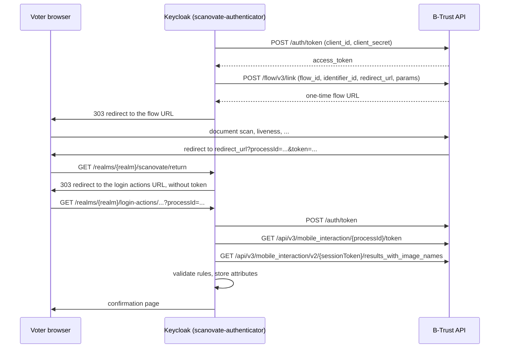

<!--
SPDX-FileCopyrightText: 2026 Sequent Tech <legal@sequentech.io>
SPDX-License-Identifier: AGPL-3.0-only
-->

# Scanovate Identity Verification

## Overview

Sequent can verify a voter's identity during enrollment with
[Scanovate B-Trust](https://www.scanovate.com/). The voter scans their identity
document and records a short selfie video. B-Trust then runs OCR, liveness
(presentation and injection attack detection), face matching and document fraud
checks. Sequent checks the results against rules you configure, stores the
extracted data, and asks the voter to confirm it.

The integration is the `scanovate-authenticator` Keycloak authenticator. It
follows the B-Trust v3.8.2 Identity Verification Tech Specs and replaces the
previous Inetum integration.

## How it works


```mermaid
sequenceDiagram
    participant V as Voter browser
    participant K as Keycloak (scanovate-authenticator)
    participant B as B-Trust API
    K->>B: POST /auth/token (client_id, client_secret)
    B-->>K: access_token
    K->>B: POST /flow/v3/link (flow_id, identifier_id, redirect_url, params)
    B-->>K: one-time flow URL
    K->>V: 303 redirect to the flow URL
    V->>B: document scan, liveness, ...
    B->>V: redirect to redirect_url?processId=...&token=...
    V->>K: GET /realms/{realm}/scanovate/return
    K->>V: 303 redirect to the login actions URL, without token
    V->>K: GET /realms/{realm}/login-actions/...?processId=...
    K->>B: POST /auth/token
    K->>B: GET /api/v3/mobile_interaction/{processId}/token
    K->>B: GET /api/v3/mobile_interaction/v2/{sessionToken}/results_with_image_names
    K->>K: validate rules, store attributes
    K->>V: confirmation page
```

Some design decisions to be aware of:

- **The browser is never trusted.** The `token` that B-Trust appends to the
  redirect URL is ignored. Keycloak stores the process id in the authentication
  session and exchanges it for a session token server to server.
- **Return endpoint.** The `redirect_url` sent to B-Trust is
  `/realms/{realm}/scanovate/return`, not the login actions URL. Keycloak's
  registration endpoint reads a `token` query parameter as an action token, so
  the `token` that B-Trust appends would break the registration flow. The
  endpoint forwards only Keycloak's own parameters and the process id to the
  login actions URL of the same realm, and only for known flows.
- **Fast results.** Results are fetched from `results_with_image_names`, which
  returns file paths instead of base64 media, as the specs recommend. Images and
  videos are never downloaded.
- **Layered errors.** The top level `success`/`errorCode` reports whether the
  API call worked. `data.success`/`data.errorCode` reports the verification
  outcome: `1020`/`1030` mean the voter reached the maximum number of trials, and
  `1026` means the document authentication failed.
- **Fail closed.** Unknown rule types, malformed rules, and document types
  without validation rules reject the verification instead of skipping checks.
- **Confirmation is guarded.** The confirmation page only completes the step if
  a verification succeeded in the same authentication session.

On success the auth note named by `user-status`
(`sequent.read-only.id-card-number-validated` by default) is set to `VERIFIED`.
Later flow steps rely on it, e.g. the `already-validated` conditional and
`lookup-and-update-user`, which copies it into the user.

## Configuration

Add a `scanovate-authenticator` execution to the registration flow, after the
steps that collect the document number and type, and configure it:

| Key | Description | Default |
| --- | --- | --- |
| `base-url` | B-Trust API base URL. | |
| `client-id` / `client-secret` | OAuth credentials provided by Scanovate. | |
| `flow-id` | Numeric id of the B-Trust flow, configured in the B-Trust Flow Builder. | |
| `execution-mode` | `interactive` redirects the voter. `auto-complete` fetches results right away and is only for mock servers. | `interactive` |
| `save-option` | Empty (account default), `save` or `do_not_save`. | empty |
| `link-params` | JSON mapping B-Trust flow parameters to auth notes, e.g. `{"country": "country"}`. | `{}` |
| `doc-id` | Auth note with the document number, sent as `id_number`. | `sequent.read-only.id-card-number` |
| `doc-id-type` | Auth note with the document type, used to pick the rules. | `sequent.read-only.id-card-type` |
| `user-status` | Auth note set to `VERIFIED` on success. | `sequent.read-only.id-card-number-validated` |
| `attributes-to-validate` | Validation rules, see below. | liveness, face match, document number, expiry |
| `attributes-to-store` | Values to store and show for confirmation, see below. | first name, last name, date of birth |
| `max-retries` | Attempts per B-Trust API call, with exponential backoff from 1 second. | `3` |
| `max-attempts` | Failed verifications allowed before the voter is rejected. | `3` |

### Rules

Both rule settings are JSON objects keyed by document type (the value of the
`doc-id-type` auth note). The `default` key applies to any other document type.

Each rule reads a value from the results with a
[JSON pointer](https://datatracker.ietf.org/doc/html/rfc6901) in
`attributePath`. When `process` is set (`ocr`, `liveness_plus`,
`biometric_match`, `document_liveness_plus`, `STT`, `age_gender_compare` or
`mobileForm`), the pointer is relative to that process's entry in
`data.resultsList`. B-Trust adds an entry per attempt, so the last successful
entry is used, or the last entry if none succeeded. Without `process`, the
pointer is relative to the whole response.

Validation rule types. The expected value goes in the field named after the
type:

| `type` | Passes when |
| --- | --- |
| `equalValue` | The value equals the literal (ignoring case, accents and surrounding spaces). Works with booleans and statuses, e.g. `"true"` or `"passed"`. |
| `equalAuthnoteAttributeId` | The value equals the given auth note, e.g. the document number the voter typed. |
| `minValue` | The value is a number greater than or equal to the given one, e.g. a `biometric_match` score. |
| `equalDateAuthnoteAttributeId` | The date equals the date in the given auth note. Needs `valueDateFormat` and `sourceDateFormat`. |
| `isBeforeDateValue` | The given date (or `now`) is strictly before the value. Needs `sourceDateFormat`, and `valueDateFormat` unless it's `now`. |

`errorMsg` sets the message key shown when a rule fails
(`scanovateAttributesError` by default).

Store rules set `UserAttribute` (the auth note to write) and `type`: `text` or
`date`, which needs `sourceDateFormat` and `storeDateFormat`.

Example for a passport:

```json
{
  "philippinePassport": [
    { "type": "equalValue", "equalValue": "true", "process": "liveness_plus",
      "attributePath": "/livenessCheck", "errorMsg": "scanovateVerificationFailedError" },
    { "type": "minValue", "minValue": "0.67", "process": "biometric_match",
      "attributePath": "/score", "errorMsg": "scanovateScoringError" },
    { "type": "equalValue", "equalValue": "PHL", "process": "ocr",
      "attributePath": "/issuingCountry/alpha3" },
    { "type": "equalValue", "equalValue": "passed", "process": "document_liveness_plus",
      "attributePath": "/status", "errorMsg": "scanovateDocumentAuthenticationError" },
    { "type": "isBeforeDateValue", "isBeforeDateValue": "now", "process": "ocr",
      "attributePath": "/expiryDate", "sourceDateFormat": "dd.MM.yyyy" }
  ]
}
```

:::caution Check paths against your B-Trust flow
The fields available in the results depend on the tasks configured in the
B-Trust flow and on the document type. For example, OCR fields for documents
read with Regula depend on the scanned document. Before going live, fetch real
results for each accepted document type and check every `attributePath`.
:::

### Messages

The following message keys are provided in English and Tagalog:
`scanovateInternalError`, `scanovateVerificationFailedError`,
`scanovateDocumentAuthenticationError`, `scanovateMaxTrialsError`,
`scanovateAttributesError`, `scanovateScoringError` and
`scanovateMaxRetriesError`.

### COMELEC janitor

The COMELEC realm template (`packages/windmill/external-bin/janitor/templates/COMELEC/keycloak.hbs`)
offers the voter these document types, each with its own rules:

| Document type | `sequent.read-only.id-card-type` |
| --- | --- |
| Passport | `philippinePassport` |
| Driver’s License | `driversLicense` |
| PhilSys ID | `philSysID` |
| Integrated Bar of the Philippines ID | `iBP` |
| Seafarer’s Book | `seamanBook` |

All of them require liveness, a minimum face match score and an authentic
document. All but the PhilSys ID, which has no expiry date, must not have
expired, and all but the Integrated Bar of the Philippines ID must be issued by
the Philippines (`PHL`).

Only Filipino citizens can enroll. The document rules alone don't guarantee
it: a Philippine driver's license or PhilSys ID can also be issued to foreign
residents. Eligibility comes from the voter registry: after the identity
verification, `lookup-and-update-user` only accepts the enrollment when the
name and date of birth read from the document match a pre-loaded voter of the
election event. The `country` and `embassy` fields are the post abroad where
the Filipino voter is registered, not their nationality.

If a document type must also prove citizenship by itself, add a rule on the
OCR nationality, e.g.
`{"type": "equalValue", "equalValue": "PHL", "process": "ocr", "attributePath": "/nationality/alpha3"}`,
only once real B-Trust results confirm that the field is read for that
document. Otherwise the rule fails closed and rejects every voter using it.

`run.py` fills the template from these `settings` rows of the spreadsheet:

| Setting | Default |
| --- | --- |
| `keycloak_scanovate_base_url` | empty |
| `keycloak_scanovate_client_id` | empty |
| `keycloak_scanovate_client_secret` | empty |
| `keycloak_scanovate_flow_id` | empty |
| `keycloak_scanovate_execution_mode` | `interactive` |
| `keycloak_scanovate_min_biometric_score_<philis_id\|seaman_book\|passport\|driver_license\|ibp>` | `0.67` |

B-Trust scores go from 0.0 to 1.0, unlike Inetum's 0 to 100. The old
`keycloak_inetum_min_value_*` settings are no longer read.

## Testing

### Unit tests

The authenticator has unit tests for result interpretation, the rules engine,
the API client (request shapes, retries and backoff) and the authentication
flow (redirect, return, confirmation, retries and configuration errors):

```bash
cd packages/keycloak-extensions
mvn -B -pl scanovate-authenticator -am verify
```

The mock server has its own tests:

```bash
cd packages
cargo test -p mock_server
```

### Mock server

The e2e mock server (`packages/e2e/src/mock_server`, `mock_server` service of
the `full` docker compose profile, port `MOCK_SERVER_PORT`) implements the
B-Trust endpoints used by the authenticator:

| Endpoint | Behaviour |
| --- | --- |
| `POST /auth/token` | Returns a random access token. |
| `POST /flow/v3/link` | Stores the session and returns `MOCK_SERVER_PUBLIC_URL/flow?...&process_id=<identifier_id>`. |
| `GET /flow?process_id=` | Page standing in for the B-Trust UI, where you pick the outcome. |
| `GET /flow/complete?process_id=&outcome=` | Redirects to `redirect_url?processId=...&token=...`. |
| `GET /api/v3/mobile_interaction/{session}/token` | Returns a session token. |
| `GET /api/v3/mobile_interaction/v2/{token}/results_with_image_names` | Returns OCR, liveness, face match and document liveness results. |

If the `country` flow parameter is sent and voters were loaded with
`POST /upload-csv`, the OCR data comes from a random voter of that country.
Otherwise it's a fixed voter (`JUAN DELA CRUZ`, born `01.01.1990`) whose
document number is the `id_number` sent by Keycloak.

The outcome is picked on the flow page. It can also be preset with a
`mock_outcome` flow parameter, which `link-params` maps from an auth note like
any other parameter (e.g. `{"mock_outcome": "<auth note name>"}`). This is
mostly useful in `auto-complete` mode:

| Outcome | Result |
| --- | --- |
| `success` | Everything passes (face match score `0.86`). |
| `low_biometric_score` | The flow succeeds with a face match score of `0.21`, so a `minValue` rule should reject it. |
| `liveness_failed` | `data.errorCode = -1` with a failed liveness attempt. |
| `document_authentication_failed` | `data.errorCode = 1026`. |
| `max_trials` | `data.errorCode = 1030`. |

`MOCK_SERVER_PUBLIC_URL` must be reachable from the voter's browser
(`http://127.0.0.1:8500` in the dev container), while `base-url` must be
reachable from Keycloak (`http://mock_server:8500`).

### Starting the development environment

The mock server belongs to the `full` docker compose profile, while the dev
container starts the `base` profile by default.

1. Set `COMPOSE_PROFILES=full` in `.devcontainer/.env.development` before
   opening the dev container (VS Code **Dev Containers: Reopen in Container**,
   or `devcontainer up --workspace-folder .`). With the dev container already
   running, start the missing services from the host instead:

   ```bash
   cd .devcontainer
   docker compose --profile full up -d mock_server janitor
   ```

2. Check that the mock server answers with `curl http://127.0.0.1:8500/`.
3. The Keycloak image compiles the extensions when it's built. After changing
   `packages/keycloak-extensions`, rebuild and restart it:

   ```bash
   cd .devcontainer
   docker compose build keycloak && docker compose up -d keycloak
   ```

4. Start the admin portal from `packages/` in a `devenv shell`. It imports the
   shared UI libraries from their builds, so build them first:

   ```bash
   yarn && yarn build:ui-core && yarn build:ui-essentials && yarn start:admin-portal
   ```

5. Enrollment OTPs aren't sent: the dummy email and SMS senders write them to
   the Keycloak log. Read them with `docker logs keycloak 2>&1 | grep "Your OTP is"`.

### Sample election event

`packages/step-cli/data/scanovate-enrollment/` has an election event that
enrolls voters with Scanovate against the mock server:

| File | Contents |
| --- | --- |
| `election-event.json` | The *Scanovate Enrollment Demo* election event: one area (`Japan - Tokyo PE`), one election and one contest. Its Keycloak realm is the COMELEC realm template with enrollment enabled, `scanovate-registration` pointing to `http://mock_server:8500` in `interactive` mode, and the five accepted document types. |
| `voters.csv` | The voter registry: `JUAN DELA CRUZ`, born `1990-01-01`, registered at the Tokyo PE. It's the voter the mock server returns when no voters were uploaded to it. |

To use it:

1. In the admin portal (http://127.0.0.1:3002), import `election-event.json`
   with **Import Election Event**.
2. Open the new election event, go to **Voters** and import `voters.csv`.
3. Open the enrollment page of the election event from the voting portal, or
   directly at
   `http://127.0.0.1:8090/realms/tenant-<tenant id>-event-<election event id>/protocol/openid-connect/registrations?client_id=voting-portal&response_type=code&scope=openid&redirect_uri=http%3A%2F%2F127.0.0.1%3A3000%2F`.
4. Fill in the form with any valid ID, a password and an email, select
   **Japan/Tokyo PE** and **Tokyo PE**, and click **Enroll**. Enter the OTPs
   from the Keycloak log.
5. You're redirected to the mock flow page. Pick an outcome, as described
   below.

The voter can only enroll once. To enroll again, for example with another
document type, delete the enrolled voter and import `voters.csv` again.

Since the B-Trust flow is mocked, no identity document is needed: the mock
returns the data of the voter above. To test with documents against the real
B-Trust, see [Testing against B-Trust](#testing-against-b-trust).

### Manual test

1. Enroll a voter as described in [Sample election event](#sample-election-event).
   The development election event realm also ships a `scanovate-registration`
   config pointing to the mock server, to be added to its registration flow
   from the Keycloak admin console (http://127.0.0.1:8090).
2. Choose `success`. You're sent back to Keycloak and shown the confirmation
   page with the extracted name, ID number and date of birth. Click
   **Continue** and check that the enrollment finishes and that the user has
   `sequent.read-only.id-card-number-validated = VERIFIED`.
3. Repeat with each failure outcome and check the error message. **Retry**
   starts a new B-Trust session, and after `max-attempts` failures the voter is
   rejected with `scanovateMaxRetriesError`.
4. Security checks:
   - Refresh the page after coming back from the mock. The same results must
     not be processed twice: a new session is started instead.
   - Edit the `processId` query parameter of the return URL. It must be
     ignored: either the session stored in Keycloak is processed, or a new
     session is started.
   - Change the `flow` query parameter of the return URL to anything other
     than a Keycloak login actions flow. The return endpoint must answer
     `400 Bad Request`.
   - Submit the confirmation form (`action=confirm`) from a session that never
     completed a verification. It must not complete the step.
5. Check the Keycloak logs (`docker logs keycloak`) for
   `ScanovateAuthenticator` entries, and the Keycloak events for
   `scanovate_verification_failed` errors carrying `scanovate_error` and
   `scanovate_process_id` details.

### Load tests

For load tests, set `execution-mode` to `auto-complete`. The authenticator then
fetches the results right after creating the session without redirecting the
voter, so voters go through enrollment without any B-Trust UI. The step-cli
test election templates (`packages/step-cli/data/*.json`) use this mode against
`http://mock_server:8500`. Never use `auto-complete` against the real B-Trust.

### Testing against the Scanovate test environment

This is the real voter journey: the voter scans their ID and records a selfie
video in B-Trust, from a browser. The same steps apply to production, with
production values.

#### What to ask Scanovate for

- The test environment API base URL, and a `client_id` and `client_secret`.
- A flow (`flow_id`) built in the B-Trust Flow Builder with:
  - OCR for the accepted documents: the Philippine passport (MRZ) and the
    driver's license, PhilSys ID, IBP ID and Seafarer's Book (read with Regula).
  - Liveness Plus, Biometrics (face match) and Document Liveness Plus.
  - The voter journey used with Inetum: selfie, photo of the ID, and a short
    video holding the ID.
  - If voters may start on a computer and continue on their phone (QR code),
    desktop sync. Keycloak sends the return URL as both `redirect_url` and
    `desktop_redirect_url`, so the computer, which holds the Keycloak session,
    returns to the enrollment.
- A callback URL configured for the company. Otherwise the session token
  endpoint that Keycloak calls fails with `Company {companyId} callback url not
  defined`.
- If B-Trust restricts redirect URLs, allow
  `https://<keycloak host>/realms/<realm>/scanovate/return` for each realm.
- Test documents, if available (see
  [Testing without your own documents](#testing-without-your-own-documents)).

#### Pointing a realm to a B-Trust environment

`packages/keycloak-extensions/scanovate-authenticator/scripts/btrust.sh`
updates every Scanovate step of a realm. It needs `curl` and `jq`:

```bash
export SCANOVATE_BASE_URL=<test environment API base URL>
export SCANOVATE_CLIENT_ID=<client id>
export SCANOVATE_CLIENT_SECRET=<client secret>
export SCANOVATE_FLOW_ID=<flow id>
packages/keycloak-extensions/scanovate-authenticator/scripts/btrust.sh \
  configure tenant-<tenant id>-event-<election event id>
```

It sets `execution-mode` to `interactive`, unless `SCANOVATE_EXECUTION_MODE`
says otherwise, and `save-option` from `SCANOVATE_SAVE_OPTION`. `KEYCLOAK_URL`,
`KEYCLOAK_ADMIN` and `KEYCLOAK_ADMIN_PASSWORD` default to the dev container
Keycloak (`http://127.0.0.1:8090`, `admin`/`admin`). Run it again with the mock
server values (`http://mock_server:8500`, `mock-client`, `mock-secret`, flow
`1`) to go back to the mock. The same settings can be edited in the Keycloak
admin console: **Authentication**, the registration flow, then the settings of
the Scanovate step.

#### Enrolling

1. Import the [sample election event](#sample-election-event) and point its
   realm to the test environment as shown above.
2. The data read from the ID must match a voter of the registry. Import a
   voters CSV with the document holder's data instead of the sample voter:

   ```csv
   username,first_name,last_name,enabled,area_name,dateOfBirth,embassy,country
   tester,<FIRST NAME>,<LAST NAME>,true,Japan - Tokyo PE,<yyyy-MM-dd>,Tokyo PE,Japan/Tokyo PE
   ```

   Names are compared ignoring case, accents, hyphens and dots. For Seafarer's
   Books and driver's licenses, the first and middle names are compared
   together.
3. Enroll from a browser with a camera. With the dev container, Keycloak's URLs
   use `KC_HOSTNAME` (`localhost`), so B-Trust can only bring the voter back to
   the computer running it. To enroll from a phone, or to try desktop sync,
   expose Keycloak over HTTPS, for example with
   `cloudflared tunnel --url http://127.0.0.1:8090`. Then set `KC_HOSTNAME` to
   the tunnel URL in `.devcontainer/.env` and recreate the `keycloak`
   container.
4. Complete the B-Trust flow: selfie, ID, video. You're back in Keycloak on
   the Voter Validation page.
5. Look up the process id in the Keycloak log (`startVerification: created
   B-Trust session <process id>`) or in the `scanovate_process_id` event
   detail, and fetch the results:

   ```bash
   packages/keycloak-extensions/scanovate-authenticator/scripts/btrust.sh results <process id>
   ```

   Check that every `attributePath` of the rules for that document type
   resolves. The OCR fields of documents read with Regula depend on the
   document. In particular, check `/issuingCountry/alpha3` and `/expiryDate` for
   the driver's license, IBP ID and Seafarer's Book. The PhilSys ID has no
   expiry date, so it has no expiry rule. A missing value rejects the voter.
6. Tune the `biometric_match` threshold with real documents. Check that expired
   documents, another person's selfie and a photo of a screen are rejected.
7. If `save-option` is `do_not_save`, remember that fetching the results
   deletes the session data in B-Trust, including through `btrust.sh results`.

#### Going to production

Only configuration changes, never code:

- New election events: set the `keycloak_scanovate_base_url`,
  `keycloak_scanovate_client_id`, `keycloak_scanovate_client_secret` and
  `keycloak_scanovate_flow_id` settings of the janitor spreadsheet to the
  production values, and leave `keycloak_scanovate_execution_mode` as
  `interactive` (see [COMELEC janitor](#comelec-janitor)).
- Existing election events: run `btrust.sh configure` with the production
  values, and `KEYCLOAK_URL`, `KEYCLOAK_ADMIN` and `KEYCLOAK_ADMIN_PASSWORD` of
  the production Keycloak.
- Ask Scanovate to set up the production flow with the same tasks as the
  tested one, the company callback URL, and the production return URLs.
- Never use `auto-complete`, or rules relaxed for testing, in production.

#### Testing without your own documents

With the mock server, no document is needed at all. Against B-Trust, avoid
using personal documents in shared environments:

- Ask Scanovate for test documents. B-Trust test environments usually come
  with sample documents, or can be configured to accept them.
- Official specimen images (for example the passport and PhilSys specimens
  published by the issuing agencies) are useful to check that OCR fields
  resolve. Expect Document Liveness Plus to reject them when shown on a screen
  or printed, and the face match to fail because the selfie isn't the holder's.
  To exercise the whole flow with them, use a separate test authenticator
  config without the `document_liveness_plus` rule and with a lower
  `biometric_match` threshold. Never use that config in production.
- Real voters' documents must never be used for testing.
