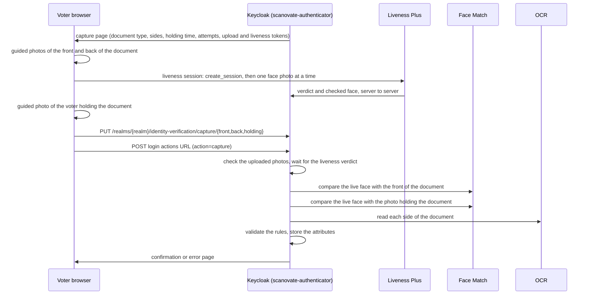

<!--
SPDX-FileCopyrightText: 2026 Sequent Tech <legal@sequentech.io>
SPDX-License-Identifier: AGPL-3.0-only
-->

# Scanovate Identity Verification

## Overview

Sequent can verify a voter's identity during enrollment with the
[Scanovate](https://www.scanovate.com/) services, hosted on our own
infrastructure. The voter photographs their identity document and the
capture page checks that they are a live person in front of the camera. Keycloak
then compares their face with the photo on the document, reads the document,
checks the results against rules you configure, stores the extracted data and
asks the voter to confirm it.

Nothing is sent to any third party: every check runs on Scanovate software we
host ourselves, and we own the flow. Scanovate's B-Trust cloud, which used to
read the document, is no longer used.

| Check | Service | Called by |
| --- | --- | --- |
| The voter is a live person (not a photo, a screen, a mask or a deepfake) | Liveness Plus, with its presentation attack detection (PAD) server | The capture page |
| The live face matches the photo on the document and the photo of the voter holding it | Face Match | Keycloak |
| The document's details (name, date of birth, number, nationality, expiry) and its machine readable zone (MRZ) | OCR | Keycloak |

[Scanovate On-Premise Services](scanovate_on_premise_guide.md) describes how
to get the images, run them, configure them and the contract with each one.

The integration is the `scanovate-authenticator` Keycloak authenticator and the
capture page of the React login themes (`packages/keycloak-ui`). It replaces the
previous Inetum integration.

## How it works


```mermaid
sequenceDiagram
    participant V as Voter browser
    participant K as Keycloak (scanovate-authenticator)
    participant L as Liveness Plus
    participant F as Face Match
    participant O as OCR
    K->>V: capture page (document type, sides, holding time, attempts, upload and liveness tokens)
    V->>V: guided photos of the front and back of the document
    V->>L: liveness session: create_session, then one face photo at a time
    L->>K: verdict and checked face, server to server
    V->>V: guided photo of the voter holding the document
    V->>K: PUT /realms/{realm}/identity-verification/capture/{front,back,holding}
    V->>K: POST login actions URL (action=capture)
    K->>K: check the uploaded photos, wait for the liveness verdict
    K->>F: compare the live face with the front of the document
    K->>F: compare the live face with the photo holding the document
    K->>O: read each side of the document
    K->>K: validate the rules, store the attributes
    K->>V: confirmation or error page
```

1. Keycloak renders the capture page with a new case id of its own, a one-time
   upload token and a one-time token for Liveness Plus.
2. The page guides the voter through the photos of the front of the document
   and, for documents with one, its back. The camera is analysed in the browser
   by the `id-capture` WebAssembly module; only the photos are kept. The guide
   takes the shape of the voter's document: a passport data page (ICAO TD3)
   when its OCR type is `passport`, an ID-1 card otherwise (the page's
   `format`). The photo is taken automatically once the whole document is in
   the frame, about centred and at least half the guide's size, held flat to
   the camera, without glare, sharp and still: the guide only shows where to
   hold it, since the whole frame is uploaded and the OCR service finds the
   document in it. The live checks run on small frames, so the photo itself is
   checked again before it is kept: the document must be found in it, at least
   480 pixels wide (or most of the guide, with a low resolution camera) and
   sharp at that width; otherwise the page tells the voter why and takes
   another. On a desktop, the preview of a webcam is mirrored like a mirror.
3. For the face, the page takes a photo once the face is steady in the oval and
   sends it to Liveness Plus, one photo at a time, until Liveness Plus completes
   the scan. Liveness Plus posts the verdict and the checked face to Keycloak,
   server to server.
4. The page takes a photo of the voter holding the document next to their face,
   uploads the photos to Keycloak and posts the capture.
5. Keycloak rejects the attempt unless the liveness check passed, and unless the
   live face matches both the front of the document and the photo holding it.
6. Only then, Keycloak reads each side of the document with the OCR service,
   validates the results with the realm's rules and stores the voter's data,
   which later steps compare with the voter registry.

Some design decisions to be aware of:

- **The browser is never trusted.** The quality checks in the browser
  (framing, blur, glare, face position, ...) and the answers of the Liveness
  Plus API only guide the voter. The liveness verdict and the face that Keycloak
  compares come from Liveness Plus, server to server; the document is read by
  Keycloak from the photos it received.
- **Needs a React login theme.** The capture page is part of the React login
  themes (`packages/keycloak-ui`), e.g. `sequent-ui-voting`, which the Keycloak
  image ships (see
  [React login and OTP development](../07-developers/06-keycloak/developers_keycloak.md#react-login-and-otp-development)).
  The authenticator also ships a FreeMarker `scanovate-capture.ftl`, but it only
  tells the voter that the step needs that theme (`scanovateCaptureThemeRequired`).
- **No vendor names on the wire.** The voter's browser sees every request to
  Keycloak, so the realm resource is served at `identity-verification`, the
  capture token travels in the `X-Capture-Token` header and Liveness Plus is
  served under `/biometric/`: none names the provider behind them. Keep any new
  browser-facing path, header or parameter just as generic.
- **One design from the form to the outcome.** The enrollment form is step 1 of
  4 and shares the card, progress bar and header of the identity verification
  pages; so do the pages that end an enrollment (enrolled, manual verification
  required, disapproved, already validated), with every step done.
- **Buttons stay in view.** The buttons that move the voter on (Register on
  the enrollment form, Start, Submit on the code page, Confirm and enroll, Try
  again) and the submit button of every FreeMarker form stay at the bottom of
  the viewport while the page scrolls, so a long page on a phone never hides
  them.
- **Confirmation always posts its action.** The confirmation page disables its
  buttons once submitted. Some browsers apply that before collecting the form,
  which would leave out the clicked button, so the page also posts the chosen
  action (`confirm` or `retry`) in a field of its own.
- **Fail closed.** Unknown rule types, malformed rules, document types without
  validation rules or without an OCR type, and missing service settings reject
  the verification instead of skipping checks.
- **Confirmation is guarded.** The confirmation page only completes the step if
  a verification succeeded in the same authentication session.
- **Attempts.** A failed liveness check, a face that doesn't match or can't be
  found, an unreadable document and a failed rule each use up an attempt. Once
  the attempts of the authentication session reach `max-attempts`, no new
  capture starts, whether through **Retry**, a page refresh, a forged
  confirmation or a capture posted without one: the voter gets
  `scanovateMaxRetriesError` without a retry button.
- **Errors of the services aren't attempts.** If Liveness Plus doesn't post a
  verdict within `liveness-result-wait-seconds`, or Face Match or the OCR
  service can't be reached or can't process an image, the voter gets a
  retryable `scanovateInternalError`.
- **Invalid captures are not attempts.** A capture with a missing photo, one
  that isn't a JPEG image (`FF D8 FF`, judging by its content, not by the
  content type the browser sends) or one over `max-image-bytes` shows the
  capture page again with `scanovateCaptureInvalidError`.
- **Refresh.** Reloading the capture page renders it again for the same case,
  with new one-time tokens.
- **Uploads, then the capture.** Keycloak's authentication flow can't receive
  files: on every form post to the login actions URL it reads the whole form as
  text, which fails on file parts, and text fields are limited to 128 KiB
  (`quarkus.http.limits.max-form-attribute-size`). So the page uploads each
  photo to `PUT /realms/{realm}/identity-verification/capture/{part}` as a
  plain request body, with the one-time capture token in the `X-Capture-Token`
  header. Keycloak keeps them in its single-use object store, for the
  authentication session only, and the page then posts `action=capture` to the
  login actions URL. The upload endpoint answers `401` for an unknown token,
  `400` for an unknown part (`front`, `back` and `holding` are the only ones),
  `413` for a file over 8 MiB and `415` for a file that isn't a JPEG image.
- **Request size.** Each photo is its own request, within Keycloak's body limit
  (`quarkus.http.limits.max-body-size`, 10 MiB by default). The page encodes
  them as JPEG of at most 1920 px and 1.8 MB, under `max-image-bytes` (2 MiB).
  Any reverse proxy in front of Keycloak must accept bodies of up to 8 MiB on
  `/realms/{realm}/identity-verification/capture/`, e.g. with nginx
  `client_max_body_size 8m;`, since nginx's default is 1 MiB.
- **Nothing is stored but the result.** The photos live in Keycloak's
  single-use object store until the capture is checked, and are discarded
  then. Liveness Plus keeps its sessions in memory for 5 minutes, and Face Match
  and the OCR service keep nothing. Keycloak stores the attributes the voter
  confirms, and logs and adds to its events the case id, the outcome and the
  face similarities (`scanovate_case_id`, `scanovate_face_match_document`,
  `scanovate_face_match_holding`), never an image.

On success the auth note named by `user-status`
(`sequent.read-only.id-card-number-validated` by default) is set to `VERIFIED`.
Later flow steps rely on it, e.g. the `already-validated` conditional and
`lookup-and-update-user`, which copies it into the user.

The capture page receives a `scanovate` attribute with `documentType`, `sides`
(`FRONT`, and `BACK` if the document has one), `videoSeconds` (how long the
voter holds the document before its photo), `attemptsLeft`, `maxAttempts`,
`upload` (the `url` of the upload endpoint and the one-time capture `token`)
and `liveness` (the `url` of the Liveness Plus API, the one-time `token` and
the `caseId`). The error page receives `attemptsLeft`, and the confirmation
page receives `storedAttributes` as a list of `{key, value, type}` and
`documentType`.

## Configuration

Add a `scanovate-authenticator` execution to the registration flow, after the
steps that collect the document type, and configure it:

| Key | Description | Default |
| --- | --- | --- |
| `ocr-url` | OCR base URL as Keycloak reaches it, on the internal network, e.g. `http://scanovate-ocr:5040`. | |
| `ocr-types` | JSON keyed by document type (the value of the `doc-id-type` auth note), with a `default` key for any other type, of how the OCR service reads it, e.g. `{"philippinePassport": "passport"}`. See [Document types](#document-types). | `{"default": "passport"}` |
| `liveness-url` | Liveness Plus base URL as the voter's browser reaches it, `https://<keycloak host>/biometric` in our deployments. The page calls its API under `/liveness`. | |
| `liveness-secret` | Secret that Liveness Plus sends as the `secret` query parameter of its `token_verification_url` and `callback_url`. | |
| `liveness-result-wait-seconds` | How long to wait for the result callback of Liveness Plus once the voter is done. | `15` |
| `face-match-url` | Face Match base URL as Keycloak reaches it, on the internal network, e.g. `http://scanovate-face-match:3000`. | |
| `face-match-min-similarity` | JSON keyed by document type, with a `default` key for any other type, of the minimum similarity (0 to 1) of the voter's face with the document and with the photo holding it. The service's own threshold (`0.67`) applies if higher. | `{"default": 0.67}` |
| `doc-id-type` | Auth note with the document type, used to pick the settings and rules. | `sequent.read-only.id-card-type` |
| `user-status` | Auth note set to `VERIFIED` on success. | `sequent.read-only.id-card-number-validated` |
| `attributes-to-validate` | Validation rules, see [Rules](#rules). | the document hasn't expired |
| `attributes-to-store` | Values to store and show for confirmation, see [Rules](#rules). | first name, last name, date of birth |
| `max-attempts` | Failed verifications allowed before the voter is rejected. | `3` |
| `capture-sides` | JSON keyed by document type, with a `default` key for any other type, listing the sides to capture: `["front"]` or `["front", "back"]`. Document types without an entry capture both sides. | `{"default": ["front", "back"]}` |
| `video-seconds` | Seconds the voter holds the document next to their face before its photo is taken. | `5` |
| `max-image-bytes` | Maximum size of each photo, at most 8 MiB. | `2097152` (2 MiB) |

Missing or malformed service settings, a malformed `capture-sides` (not an
object, an empty or unknown side, a repeated side, or no front), a non-positive
number, or a document type without an OCR type reject the verification with
`scanovateInternalError` before the capture starts. For example, to capture
only the data page of passports:

```json
{
  "philippinePassport": ["front"],
  "default": ["front", "back"]
}
```

Realms configured for the B-Trust integration keep working once their
services are set, since the old settings (`base-url`, `client-id`,
`client-secret`, `flow-id`, `execution-mode`, `save-option`, `link-params`,
`doc-id`, `face-capture`, `max-retries`, `max-video-bytes`) are ignored. Their
rules must be rewritten for the OCR results, though: rules on B-Trust's
processes find no value and reject every voter.
`packages/keycloak-extensions/scanovate-authenticator/scripts/configure-realm.sh`
sets the services and removes the old settings, and warns about such rules (see
[End-to-end test](scanovate_on_premise_guide.md#end-to-end-test)).

### Document types

`ocr-types` says how the OCR service reads each document type. The service
has these OCR types:

| OCR type | Reads | Use |
| --- | --- | --- |
| `passport` | Any ICAO passport, from its MRZ | The Philippine passport. |
| `regula` | Any document known to a Regula Document Reader server, which the OCR service forwards the photo to | Not available: we have no Regula server. See below. |
| `israel_id`, `israel_dl`, `israel_passport`, `stay_permit`, `europe_cards` | Israeli and European documents | Not for COMELEC. |

The `passport` type only accepts a photo whose MRZ it can read and whose check
digits are valid (ICAO 9303). A photo it can't read, of another kind of
document or without a valid MRZ, is an unreadable document
(`scanovateDocumentUnreadableError`), which uses up an attempt.

:::warning Other Philippine documents
The OCR service has no native type for the Philippine driver's license, the
PhilSys ID, the IBP ID or the Seafarer's Book: only the `regula` type could
read them, and it needs a Regula Document Reader server on our infrastructure,
with its own license, configured in the OCR service (`regula.url`). Until that
is decided, leave them out of `ocr-types`: choosing them fails with
`scanovateInternalError`.
:::

:::warning Document authenticity
Checking that a document is genuine (not a photocopy, a screen or an edited
image) is out of scope for now: none of the on-premise images does it, and the
`passport` type's `template_matching_valid` and `document_in_frame_valid`
checks are always `true`, so rules on them prove nothing.
:::

### Rules

Both rule settings are JSON objects keyed by document type (the value of the
`doc-id-type` auth note). The `default` key applies to any other document type.

Each rule reads a value from the results of the OCR service with a
[JSON pointer](https://datatracker.ietf.org/doc/html/rfc6901) in
`attributePath`. When `process` is `ocr`, the pointer is relative to the fields
read from the document; when it's `authentications`, to the checks of the
service. Without `process`, the pointer is relative to the whole results:

```json
{
  "ocr": {
    "mrz_type": "TD3",
    "document_type": "P",
    "document_number": "P1234567A",
    "issuing_country_code": "PHL",
    "nationality_code": "PHL",
    "first_name_english": "JUAN",
    "last_name_english": "DELA CRUZ",
    "date_of_birth": "1990-01-15",
    "date_of_expiry": "2031-01-01",
    "gender": "M",
    "personal_number": "",
    "mrz_text": "P<PHLDELA<CRUZ<<JUAN<<<..."
  },
  "authentications": {
    "template_matching_valid": true,
    "document_in_frame_valid": true,
    "expiry_date_valid": true,
    "face_size_valid": true,
    "face_position_valid": true,
    "face_rotation_valid": true
  }
}
```

These are the fields of the `passport` type. The service gives the MRZ dates
as `yyMMdd`; Keycloak converts `date_of_birth` and `date_of_issue` to
`yyyy-MM-dd` in the past, and `date_of_expiry` to `yyyy-MM-dd` in this
century. For documents read from both sides, a field read on both keeps the
value of the front, unless it's empty. The images the service returns are never
kept.

Validation rule types. The expected value goes in the field named after the
type:

| `type` | Passes when |
| --- | --- |
| `equalValue` | The value equals the literal (ignoring case, accents and surrounding spaces). Works with booleans, e.g. `"true"`. |
| `equalAuthnoteAttributeId` | The value equals the given auth note. |
| `minValue` | The value is a number greater than or equal to the given one. |
| `equalDateAuthnoteAttributeId` | The date equals the date in the given auth note. Needs `valueDateFormat` and `sourceDateFormat`. |
| `isBeforeDateValue` | The given date (or `now`) is strictly before the value. Needs `sourceDateFormat`, and `valueDateFormat` unless it's `now`. |

`errorMsg` sets the message key shown when a rule fails
(`scanovateAttributesError` by default). A missing value fails the rule.

Store rules set `UserAttribute` (the auth note to write) and `type`: `text` or
`date`, which needs `sourceDateFormat` and `storeDateFormat`.

Example for a passport:

```json
{
  "philippinePassport": [
    { "type": "equalValue", "equalValue": "PHL", "process": "ocr",
      "attributePath": "/issuing_country_code" },
    { "type": "isBeforeDateValue", "isBeforeDateValue": "now", "process": "ocr",
      "attributePath": "/date_of_expiry", "sourceDateFormat": "yyyy-MM-dd" }
  ]
}
```

### Messages

The following message keys are provided in English and Tagalog:
`scanovateInternalError`, `scanovateVerificationFailedError`,
`scanovateDocumentAuthenticationError`, `scanovateDocumentUnreadableError`,
`scanovateAttributesError`, `scanovateScoringError`,
`scanovateMaxRetriesError`, `scanovateCaptureInvalidError`,
`scanovateCaptureTitle`, `scanovateCaptureThemeRequired`,
`scanovateLivenessError`, `scanovateFaceMismatchError` and
`scanovateFaceNotFoundError`. The capture, error and confirmation pages have
their own texts in English and Spanish (`packages/keycloak-ui/src/login/scanovate/messages.ts`).

### COMELEC janitor

The COMELEC realm template (`packages/windmill/external-bin/janitor/templates/COMELEC/keycloak.hbs`)
offers the voter these document types:

| Document type | `sequent.read-only.id-card-type` | Read on premise |
| --- | --- | --- |
| Passport | `philippinePassport` | Yes, front only (`passport` OCR type) |
| Driver’s License | `driversLicense` | No, see [Document types](#document-types) |
| PhilSys ID | `philSysID` | No |
| Integrated Bar of the Philippines ID | `iBP` | No |
| Seafarer’s Book | `seamanBook` | No |

The passport must have been issued by the Philippines (`PHL`) and must not have
expired. The voter confirms the first and last names, the document number and
the date of birth read from it.

Only Filipino citizens can enroll. The document rules alone don't guarantee
it. Eligibility comes from the voter registry: after the identity verification,
`lookup-and-update-user` only accepts the enrollment when the name and date of
birth read from the document match a pre-loaded voter of the election event.
The `country` and `embassy` fields are the post abroad where the Filipino voter
is registered, not their nationality.

`run.py` fills the template from these `settings` rows of the spreadsheet:

| Setting | Default |
| --- | --- |
| `keycloak_scanovate_ocr_url` | empty |
| `keycloak_scanovate_liveness_url` | empty |
| `keycloak_scanovate_liveness_secret` | empty |
| `keycloak_scanovate_face_match_url` | empty |
| `keycloak_scanovate_min_biometric_score_<philis_id\|seaman_book\|passport\|driver_license\|ibp>` | `0.67` |

The `min_biometric_score` settings are the minimum Face Match similarity of
each document type (`face-match-min-similarity`), from 0.0 to 1.0. The service
settings have no usable default: until they're set, enrollment fails with
`scanovateInternalError`. The B-Trust settings (`keycloak_scanovate_base_url`,
`keycloak_scanovate_client_id`, `keycloak_scanovate_client_secret`,
`keycloak_scanovate_flow_id`), the Inetum ones (`keycloak_inetum_min_value_*`)
and `keycloak_scanovate_execution_mode` are no longer read.

:::note Login theme
The COMELEC template selects `sequent-ui-voting` as the realm's login theme and
as the login theme of the `voting-portal`, `onsite-voting-portal` and
`voting-portal-kiosk` clients; the account theme stays `sequent.voting-portal`.
`sequent-ui-voting` inherits `sequent.voting-portal`, so every page not
ported to React looks as before. Import these realms
only into a Keycloak image that ships the React themes: on an older image,
Keycloak falls back to its built-in theme for the whole realm.
:::

### After the identity verification

Once the voter confirms the details from their ID, the registration flow of
the COMELEC template looks them up in the census (`lookup-and-update-user`),
by the names and date of birth read from the document, which the Scanovate
step stores in place of what the voter typed. The step's
`no-matching-voter-policy` decides what an enrollment that matches no voter
becomes:

| Value | Enrollment that matches no voter of the census |
| --- | --- |
| `REJECT` (default) | Rejected automatically (`no-matching-voter`). |
| `PENDING_APPROVAL` | Pending in the election event's **Approvals**, with the same reason, for an election manager to review. The voter sees that their enrollment needs a manual verification. |

The COMELEC template and the sample election event use `PENDING_APPROVAL`.
Approving a pending enrollment links it to a voter of the census, so a voter
missing from it is added to the census first.

### Several codes in a row

The COMELEC registration flow asks for a code by email if the voter gave an
email, by SMS if they gave a mobile number, and then for one more to the
same contact details: an email-only voter gets two codes by email. So that
the second doesn't look like the first one failed, the code steps of the
template set `code-progress-policy` to `SHOW` (default `NONE`): with more than
one code, the page shows *Code 1 of 2* and a progress bar, says that another
code follows, and on the last one that the previous code was accepted. The
count comes from the flow: each code step that runs for this voter, the
conditional subflows evaluated with their own conditions. If a condition can't
be evaluated, the page shows no count rather than a wrong one.

## Testing

### Unit tests

The authenticator has unit tests for the OCR results and the MRZ dates, the
rules engine, the clients of the OCR and Face Match services (request shapes,
retries and backoff), the liveness sessions, the capture checks and the
authentication flow (capture, liveness, face comparisons, document reading,
confirmation, attempts and configuration errors):

```bash
cd packages/keycloak-extensions
mvn -B -pl scanovate-authenticator -am verify
```

The capture page has unit and Storybook interaction tests, with a synthetic
camera, analysers, Liveness Plus and uploads:

```bash
cd packages/keycloak-ui
yarn test
```

### Sample election event

`packages/step-cli/data/scanovate-enrollment/` has an election event that
enrolls voters with the Scanovate services of the dev container:

| File | Contents |
| --- | --- |
| `election-event.json` | The *Scanovate Enrollment Demo* election event: one area (`Japan - Tokyo PE`), one election and one contest. Its Keycloak realm is the COMELEC realm template with enrollment enabled, the `sequent-ui-voting` login theme, and `scanovate-registration` pointing to the services of the dev container (`http://scanovate-ocr:5040`, `https://localhost:8443/biometric` and `http://scanovate-face-match:3000`). Like the template, it reads passports with the `passport` OCR type and captures only their front (`ocr-types` and `capture-sides`). |
| `voters.csv` | The voter registry: `JUAN DELA CRUZ`, born `1990-01-01`, registered at the Tokyo PE. |

The data read from the document must match a voter of the registry, so to
enroll with your own passport, import a voters CSV with your data instead. The
[End-to-end test](scanovate_on_premise_guide.md#end-to-end-test) goes through
the whole enrollment step by step.

The development election event realm also ships a `scanovate-registration`
config pointing to the same services, to be added to its registration flow
from the Keycloak admin console (http://127.0.0.1:8090).

### Load tests

Every enrollment needs a camera, a live person and a document, so load tests
can't enroll voters through the identity verification. Load test their
enrollment without the `scanovate-authenticator` step, and size the Scanovate
services with their own figures (see
[Running them in the development environment](scanovate_on_premise_guide.md#running-them-in-the-development-environment)).

### Testing without your own documents

Real voters' documents must never be used for testing, and avoid using
personal documents in shared environments:

- Official specimen images published by issuing agencies are useful to check
  that the OCR fields resolve. The
  face match fails with them because the holder isn't you: use a separate test
  authenticator config with a lower `face-match-min-similarity`, and never use
  it in production.
- A synthetic passport data page with a valid MRZ, printed in the OCR-B
  typeface (e.g. the free `ocrb10.otf` of the CTAN `ocr-b-outline` package),
  is read by the `passport` OCR type. Check digits must be valid, and MRZ text
  in other typefaces is misread.
