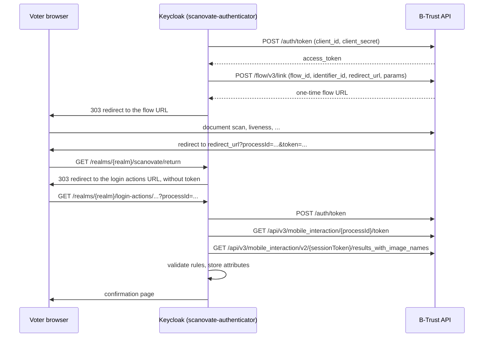
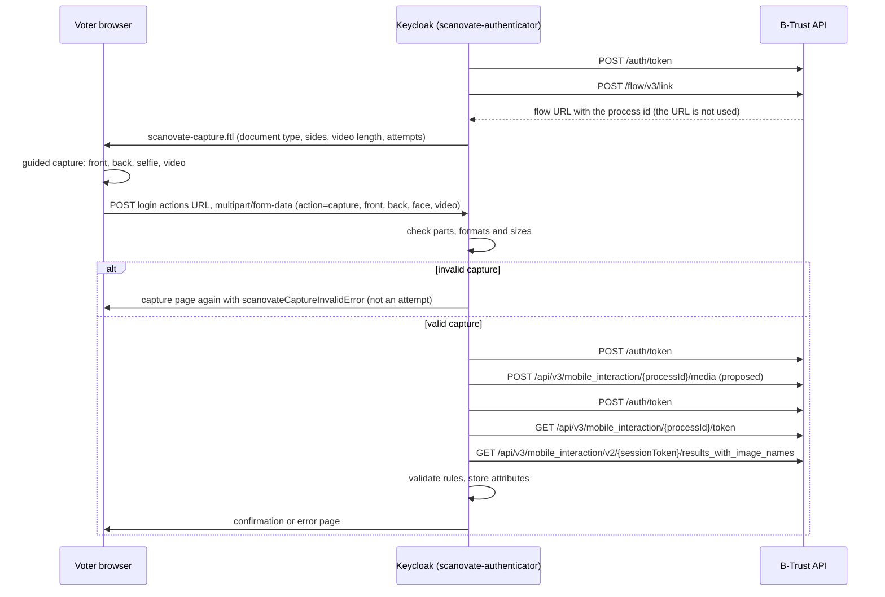
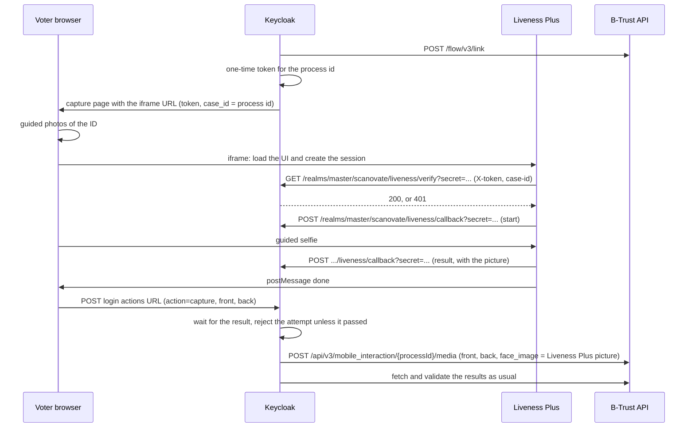

<!--
SPDX-FileCopyrightText: 2026 Sequent Tech <legal@sequentech.io>
SPDX-License-Identifier: AGPL-3.0-only
-->

# Scanovate Identity Verification

## Overview

Sequent can verify a voter's identity during enrollment with
[Scanovate B-Trust](https://www.scanovate.com/). The voter scans their identity
document and records a short selfie video. B-Trust then runs OCR, liveness
(presentation and injection attack detection), face matching and document fraud
checks. Sequent checks the results against rules you configure, stores the
extracted data, and asks the voter to confirm it.

The integration is the `scanovate-authenticator` Keycloak authenticator. It
follows the B-Trust v3.8.2 Identity Verification Tech Specs and replaces the
previous Inetum integration.

Scanovate also ships Liveness Plus and 1:N Face Match as services we run
ourselves. See [Scanovate On-Premise Services](scanovate_on_premise_guide.md)
for how to get access to their images and run them.

## How it works


```mermaid
sequenceDiagram
    participant V as Voter browser
    participant K as Keycloak (scanovate-authenticator)
    participant B as B-Trust API
    K->>B: POST /auth/token (client_id, client_secret)
    B-->>K: access_token
    K->>B: POST /flow/v3/link (flow_id, identifier_id, redirect_url, params)
    B-->>K: one-time flow URL
    K->>V: 303 redirect to the flow URL
    V->>B: document scan, liveness, ...
    B->>V: redirect to redirect_url?processId=...&token=...
    V->>K: GET /realms/{realm}/scanovate/return
    K->>V: 303 redirect to the login actions URL, without token
    V->>K: GET /realms/{realm}/login-actions/...?processId=...
    K->>B: POST /auth/token
    K->>B: GET /api/v3/mobile_interaction/{processId}/token
    K->>B: GET /api/v3/mobile_interaction/v2/{sessionToken}/results_with_image_names
    K->>K: validate rules, store attributes
    K->>V: confirmation page
```

Some design decisions to be aware of:

- **The browser is never trusted.** The `token` that B-Trust appends to the
  redirect URL is ignored. Keycloak stores the process id in the authentication
  session and exchanges it for a session token server to server.
- **Return endpoint.** The `redirect_url` sent to B-Trust is
  `/realms/{realm}/scanovate/return`, not the login actions URL. Keycloak's
  registration endpoint reads a `token` query parameter as an action token, so
  the `token` that B-Trust appends would break the registration flow. The
  endpoint forwards only Keycloak's own parameters and the process id to the
  login actions URL of the same realm, and only for known flows.
- **Fast results.** Results are fetched from `results_with_image_names`, which
  returns file paths instead of base64 media, as the specs recommend. Images and
  videos are never downloaded.
- **Layered errors.** The top level `success`/`errorCode` reports whether the
  API call worked. `data.success`/`data.errorCode` reports the verification
  outcome: `1020`/`1030` mean the voter reached the maximum number of trials, and
  `1026` means the document authentication failed.
- **Fail closed.** Unknown rule types, malformed rules, and document types
  without validation rules reject the verification instead of skipping checks.
- **Confirmation is guarded.** The confirmation page only completes the step if
  a verification succeeded in the same authentication session.
- **Attempts are enforced on every new session.** Once the failed attempts of
  the authentication session reach `max-attempts`, no new B-Trust session is
  created, whether through **Retry**, a page refresh, a forged confirmation or
  a capture posted without a session: the voter gets `scanovateMaxRetriesError`
  without a retry button.

On success the auth note named by `user-status`
(`sequent.read-only.id-card-number-validated` by default) is set to `VERIFIED`.
Later flow steps rely on it, e.g. the `already-validated` conditional and
`lookup-and-update-user`, which copies it into the user.

## Embedded capture

With `execution-mode` set to `embedded`, the voter doesn't leave Keycloak. The
capture page of the `sequent-ui` login theme guides them through the photos of
the front (and, if the document has one, the back) of their ID, a selfie and a
short video holding the ID. Each camera frame is analysed in the browser, so the
voter gets live guidance and photos are taken automatically once the frame is
good. Keycloak then uploads the capture to the B-Trust session and processes the
results exactly as in the `interactive` mode.

With `face-capture` set to `liveness`, the selfie and the video are replaced by
a liveness check of the on-premise Scanovate Liveness Plus service, see
[Liveness face capture](#liveness-face-capture).


```mermaid
sequenceDiagram
    participant V as Voter browser
    participant K as Keycloak (scanovate-authenticator)
    participant B as B-Trust API
    K->>B: POST /auth/token
    K->>B: POST /flow/v3/link
    B-->>K: flow URL with the process id (the URL is not used)
    K->>V: scanovate-capture.ftl (document type, sides, video length, attempts)
    V->>V: guided capture: front, back, selfie, video
    V->>K: POST login actions URL, multipart/form-data (action=capture, front, back, face, video)
    K->>K: check parts, formats and sizes
    alt invalid capture
        K->>V: capture page again with scanovateCaptureInvalidError (not an attempt)
    else valid capture
        K->>B: POST /auth/token
        K->>B: POST /api/v3/mobile_interaction/{processId}/media (proposed)
        K->>B: POST /auth/token
        K->>B: GET /api/v3/mobile_interaction/{processId}/token
        K->>B: GET /api/v3/mobile_interaction/v2/{sessionToken}/results_with_image_names
        K->>K: validate rules, store attributes
        K->>V: confirmation or error page
    end
```

:::warning Proposed endpoint
B-Trust v3.8.2 doesn't document a way to submit media captured outside its own
flow UI. The upload endpoint below is a proposal pending Scanovate's
confirmation. It's implemented by the e2e mock server, so the mode can be
developed and tested, but don't use `embedded` against B-Trust until Scanovate
confirms the endpoint. `interactive` stays the default.
:::

`POST {base-url}/api/v3/mobile_interaction/{processId}/media`, with
`Authorization: Bearer <access token>` and a `multipart/form-data` body with
these parts:

| Part | Content |
| --- | --- |
| `front_image` | JPEG photo of the front of the document. |
| `back_image` | JPEG photo of the back of the document. Only for documents with a back side. |
| `face_image` | JPEG selfie, or the picture taken by Liveness Plus with the `liveness` face capture. |
| `scan_video` | WebM or MP4 video of the voter holding the document. Not sent with the `liveness` face capture. |

The expected response is `{"success": true, "errorCode": 0}`. Like the other
calls, it's retried with exponential backoff on network and server errors, and
any other response is an internal error that the voter can retry. It doesn't
count as a failed verification.

Some design decisions to be aware of:

- **Needs the `sequent-ui` login theme.** The capture page is part of the
  React login theme (`packages/keycloak-ui`). The authenticator also ships a
  FreeMarker `scanovate-capture.ftl`, but it only tells the voter that the step
  needs that theme (`scanovateCaptureThemeRequired`). Only use `embedded` in
  realms whose login theme is `sequent-ui`.
- **Browser checks are guidance only.** The quality checks run in the browser
  (framing, blur, glare, face position, ...) only help the voter take good
  photos. The server never trusts them: it only checks that the expected parts
  are there, once each, that they are JPEG (`FF D8 FF`), WebM (`1A 45 DF A3`) or
  MP4 (`ftyp` at offset 4) judging by their content, not by the content type
  the browser sends, and that they fit the size limits. B-Trust does the actual
  verification, and its results go through the same rules as in the
  `interactive` mode.
- **Invalid captures are not attempts.** A capture that fails these checks
  shows the capture page again with `scanovateCaptureInvalidError`, keeping the
  same B-Trust session. Only verifications rejected by B-Trust or by the rules
  count towards `max-attempts`.
- **Refresh.** Reloading the capture page renders it again for the same
  B-Trust session. A capture posted without a session in progress starts a new
  one.
- **Request size.** Captures are kept small instead of raising Keycloak's
  limits. Keycloak (Quarkus) rejects request bodies larger than
  `quarkus.http.limits.max-body-size`, 10 MiB (10240K) by default, before they
  reach the authenticator. Keycloak 26.6, the development container and
  `packages/Dockerfile.keycloak` all keep that default. The capture page
  encodes the photos as JPEG of at most 1920 px and the video at about
  1.5 Mbps (about 1 MiB for the default 5 seconds), and the size limits are set
  so that the worst case fits: 3 photos of up to 2 MiB (`max-image-bytes`) and a
  video of up to 3 MiB (`max-video-bytes`) add up to 9 MiB, leaving room for
  the multipart overhead. If you raise `max-image-bytes`, `max-video-bytes` or
  `video-seconds`, keep that total under the body limit.
- **Reverse proxies.** Any reverse proxy in front of Keycloak must accept
  request bodies of at least 10 MiB on the login actions path
  (`/realms/{realm}/login-actions/`), e.g. with nginx
  `client_max_body_size 10m;` in that `location`, since its default is 1 MiB.
  Otherwise the proxy rejects the capture with `413` before it reaches
  Keycloak.
- **File parts.** Quarkus only treats multipart parts with a file name as files.
  The capture page must send each photo and the video with a file name (as
  `FormData.append(name, blob)` does), otherwise the part is read as a text
  field and rejected.

The capture page receives a `scanovate` attribute with `documentType`, `sides`
(`FRONT`, and `BACK` if the document has one), `videoSeconds`, `attemptsLeft`,
`maxAttempts` and, with the `liveness` face capture, `liveness` (`url`,
`origin` and `languages` of the iframe). The error page also receives `attemptsLeft`, and the
confirmation page receives `storedAttributes` as a list of `{key, value, type}`
and `documentType`.

### Liveness face capture

With `face-capture` set to `liveness`, the voter's face is checked by
[Liveness Plus](scanovate_on_premise_guide.md), which runs its presentation
(PAD, including deepfakes) and injection attack detection on the camera frames.
Our capture page still guides the voter through the photos of the ID, and then
hands over to the Liveness Plus UI in an iframe, which guides the voter through
the selfie itself. We can't change what it does, but its colours, fonts and
texts are configured to match ours (see
[Sequent look](scanovate_on_premise_guide.md#sequent-look)).


```mermaid
sequenceDiagram
    participant V as Voter browser
    participant K as Keycloak
    participant L as Liveness Plus
    participant B as B-Trust API
    K->>B: POST /flow/v3/link
    K->>K: one-time token for the process id
    K->>V: capture page with the iframe URL (token, case_id = process id)
    V->>V: guided photos of the ID
    V->>L: iframe: load the UI and create the session
    L->>K: GET /realms/master/scanovate/liveness/verify?secret=... (X-token, case-id)
    K-->>L: 200, or 401
    L->>K: POST /realms/master/scanovate/liveness/callback?secret=... (start)
    V->>L: guided selfie
    L->>K: POST .../liveness/callback?secret=... (result, with the picture)
    L->>V: postMessage done
    V->>K: POST login actions URL (action=capture, front, back)
    K->>K: wait for the result, reject the attempt unless it passed
    K->>B: POST /api/v3/mobile_interaction/{processId}/media (front, back, face_image = Liveness Plus picture)
    K->>B: fetch and validate the results as usual
```

- **The verdict never comes from the browser.** The iframe's `postMessage`
  only tells the page to move on. Liveness Plus posts the result to Keycloak
  server to server, and the capture only goes on if that result is `completed`
  with `liveness_check_passed`. Its picture of the voter is then sent to B-Trust
  as `face_image`, which matches it against the ID. Any `face` or `video` part
  posted by the browser is ignored.
- **One-time tokens.** Each time the capture page is shown, Keycloak issues a
  random token for the iframe and discards the previous one. Tokens live for
  30 minutes in Keycloak's single-use object store, shared by the cluster, and
  are discarded once the capture is submitted. A token allows 3 liveness
  sessions, so the voter can retry after a camera problem without reloading.
  After that, Liveness Plus reports `invalid token` (`1014`) and the page asks
  the voter to start over, which renders it again with a new token.
- **Shared secret.** The token and the case id go through the browser, so they
  alone can't authenticate Liveness Plus. Its `token_verification_url` and
  `callback_url` carry a `secret` query parameter that matches
  `liveness-secret`, which the browser never sees. The public reverse proxy
  also answers `404` for `/realms/*/scanovate/liveness/`: only Liveness Plus
  calls it, on the internal network. The endpoints aren't tied to a realm, so the
  `master` realm URL serves every realm.
- **Failed liveness counts as an attempt** (`scanovateLivenessError`). If no
  result arrives within `liveness-result-wait-seconds` of the voter being
  done, the voter gets a retryable `scanovateInternalError` instead.
- **Content Security Policy.** The page allows the Liveness Plus origin in
  `frame-src`. We serve Liveness Plus on Keycloak's own origin under
  `/biometric/` (`liveness-url` `https://<keycloak host>/biometric`, see
  [Deployment on Keycloak's origin](scanovate_on_premise_guide.md#deployment-on-keycloaks-origin)),
  so the iframe is same origin. A separate origin also works, as long as its
  proxy lets Keycloak's origin frame it.
- **Language.** The iframe asks for the voter's language if it's listed in
  `liveness-languages`, and the service default otherwise.

## Configuration

Add a `scanovate-authenticator` execution to the registration flow, after the
steps that collect the document number and type, and configure it:

| Key | Description | Default |
| --- | --- | --- |
| `base-url` | B-Trust API base URL. | |
| `client-id` / `client-secret` | OAuth credentials provided by Scanovate. | |
| `flow-id` | Numeric id of the B-Trust flow, configured in the B-Trust Flow Builder. | |
| `execution-mode` | `interactive` redirects the voter. `embedded` captures the media in Keycloak's own page and uploads it (see [Embedded capture](#embedded-capture)). `auto-complete` fetches results right away and is only for mock servers. | `interactive` |
| `save-option` | Empty (account default), `save` or `do_not_save`. | empty |
| `link-params` | JSON mapping B-Trust flow parameters to auth notes, e.g. `{"country": "country"}`. | `{}` |
| `doc-id` | Auth note with the document number, sent as `id_number`. | `sequent.read-only.id-card-number` |
| `doc-id-type` | Auth note with the document type, used to pick the rules. | `sequent.read-only.id-card-type` |
| `user-status` | Auth note set to `VERIFIED` on success. | `sequent.read-only.id-card-number-validated` |
| `attributes-to-validate` | Validation rules, see below. | liveness, face match, document number, expiry |
| `attributes-to-store` | Values to store and show for confirmation, see below. | first name, last name, date of birth |
| `max-retries` | Attempts per B-Trust API call, with exponential backoff from 1 second. | `3` |
| `max-attempts` | Failed verifications allowed before the voter is rejected. | `3` |
| `capture-sides` | `embedded` only. JSON keyed by document type (the value of the `doc-id-type` auth note), with a `default` key for any other type, listing the sides to capture: `["front"]` or `["front", "back"]`. Document types without an entry capture both sides. | `{"default": ["front", "back"]}` |
| `video-seconds` | `embedded` only. Length of the video holding the document, in seconds. | `5` |
| `max-image-bytes` | `embedded` only. Maximum size of each photo. 3 photos and the video must fit in Keycloak's 10 MiB body limit. | `2097152` (2 MiB) |
| `max-video-bytes` | `embedded` only. Maximum size of the video. | `3145728` (3 MiB) |
| `face-capture` | `embedded` only. `photo` takes a selfie and a video holding the ID in our page. `liveness` checks the voter's liveness with Liveness Plus, see [Liveness face capture](#liveness-face-capture). | `photo` |
| `liveness-url` | `liveness` only. Liveness Plus base URL as the voter's browser reaches it, `https://<keycloak host>/biometric` in our deployments. | |
| `liveness-secret` | `liveness` only. Secret that Liveness Plus sends as the `secret` query parameter of its `token_verification_url` and `callback_url`. | |
| `liveness-ui-theme` | `liveness` only. Liveness Plus UI configuration (`ui_theme`). | `sequent_ui` |
| `liveness-translation-variant` | `liveness` only. Liveness Plus texts (`translation_variant`). | `sequent` |
| `liveness-languages` | `liveness` only. Comma separated languages of that variant. | `en,es` |
| `liveness-result-wait-seconds` | `liveness` only. How long to wait for the result callback once the voter is done. | `15` |

A malformed `capture-sides` (not an object, an empty or unknown side, a
repeated side, or no front) or a non-positive number in the other `embedded`
settings rejects the verification with `scanovateInternalError`, like the other
settings, as does a `liveness` face capture without a valid `liveness-url` or
without `liveness-secret`. For example, to capture only the data page of passports:

```json
{
  "philippinePassport": ["front"],
  "default": ["front", "back"]
}
```

### Rules

Both rule settings are JSON objects keyed by document type (the value of the
`doc-id-type` auth note). The `default` key applies to any other document type.

Each rule reads a value from the results with a
[JSON pointer](https://datatracker.ietf.org/doc/html/rfc6901) in
`attributePath`. When `process` is set (`ocr`, `liveness_plus`,
`biometric_match`, `document_liveness_plus`, `STT`, `age_gender_compare` or
`mobileForm`), the pointer is relative to that process's entry in
`data.resultsList`. B-Trust adds an entry per attempt, so the last successful
entry is used, or the last entry if none succeeded. Without `process`, the
pointer is relative to the whole response.

Validation rule types. The expected value goes in the field named after the
type:

| `type` | Passes when |
| --- | --- |
| `equalValue` | The value equals the literal (ignoring case, accents and surrounding spaces). Works with booleans and statuses, e.g. `"true"` or `"passed"`. |
| `equalAuthnoteAttributeId` | The value equals the given auth note, e.g. the document number the voter typed. |
| `minValue` | The value is a number greater than or equal to the given one, e.g. a `biometric_match` score. |
| `equalDateAuthnoteAttributeId` | The date equals the date in the given auth note. Needs `valueDateFormat` and `sourceDateFormat`. |
| `isBeforeDateValue` | The given date (or `now`) is strictly before the value. Needs `sourceDateFormat`, and `valueDateFormat` unless it's `now`. |

`errorMsg` sets the message key shown when a rule fails
(`scanovateAttributesError` by default).

Store rules set `UserAttribute` (the auth note to write) and `type`: `text` or
`date`, which needs `sourceDateFormat` and `storeDateFormat`.

Example for a passport:

```json
{
  "philippinePassport": [
    { "type": "equalValue", "equalValue": "true", "process": "liveness_plus",
      "attributePath": "/livenessCheck", "errorMsg": "scanovateVerificationFailedError" },
    { "type": "minValue", "minValue": "0.67", "process": "biometric_match",
      "attributePath": "/score", "errorMsg": "scanovateScoringError" },
    { "type": "equalValue", "equalValue": "PHL", "process": "ocr",
      "attributePath": "/issuingCountry/alpha3" },
    { "type": "equalValue", "equalValue": "passed", "process": "document_liveness_plus",
      "attributePath": "/status", "errorMsg": "scanovateDocumentAuthenticationError" },
    { "type": "isBeforeDateValue", "isBeforeDateValue": "now", "process": "ocr",
      "attributePath": "/expiryDate", "sourceDateFormat": "dd.MM.yyyy" }
  ]
}
```

:::caution Check paths against your B-Trust flow
The fields available in the results depend on the tasks configured in the
B-Trust flow and on the document type. For example, OCR fields for documents
read with Regula depend on the scanned document. Before going live, fetch real
results for each accepted document type and check every `attributePath`.
:::

### Messages

The following message keys are provided in English and Tagalog:
`scanovateInternalError`, `scanovateVerificationFailedError`,
`scanovateDocumentAuthenticationError`, `scanovateMaxTrialsError`,
`scanovateAttributesError`, `scanovateScoringError`,
`scanovateMaxRetriesError` and, for the `embedded` mode,
`scanovateCaptureInvalidError`, `scanovateCaptureTitle` and
`scanovateCaptureThemeRequired`.

### COMELEC janitor

The COMELEC realm template (`packages/windmill/external-bin/janitor/templates/COMELEC/keycloak.hbs`)
offers the voter these document types, each with its own rules:

| Document type | `sequent.read-only.id-card-type` |
| --- | --- |
| Passport | `philippinePassport` |
| Driver’s License | `driversLicense` |
| PhilSys ID | `philSysID` |
| Integrated Bar of the Philippines ID | `iBP` |
| Seafarer’s Book | `seamanBook` |

All of them require liveness, a minimum face match score and an authentic
document. All but the PhilSys ID, which has no expiry date, must not have
expired, and all but the Integrated Bar of the Philippines ID must be issued by
the Philippines (`PHL`).

Only Filipino citizens can enroll. The document rules alone don't guarantee
it: a Philippine driver's license or PhilSys ID can also be issued to foreign
residents. Eligibility comes from the voter registry: after the identity
verification, `lookup-and-update-user` only accepts the enrollment when the
name and date of birth read from the document match a pre-loaded voter of the
election event. The `country` and `embassy` fields are the post abroad where
the Filipino voter is registered, not their nationality.

If a document type must also prove citizenship by itself, add a rule on the
OCR nationality, e.g.
`{"type": "equalValue", "equalValue": "PHL", "process": "ocr", "attributePath": "/nationality/alpha3"}`,
only once real B-Trust results confirm that the field is read for that
document. Otherwise the rule fails closed and rejects every voter using it.

`run.py` fills the template from these `settings` rows of the spreadsheet:

| Setting | Default |
| --- | --- |
| `keycloak_scanovate_base_url` | empty |
| `keycloak_scanovate_client_id` | empty |
| `keycloak_scanovate_client_secret` | empty |
| `keycloak_scanovate_flow_id` | empty |
| `keycloak_scanovate_execution_mode` | `interactive` |
| `keycloak_scanovate_min_biometric_score_<philis_id\|seaman_book\|passport\|driver_license\|ibp>` | `0.67` |

B-Trust scores go from 0.0 to 1.0, unlike Inetum's 0 to 100. The old
`keycloak_inetum_min_value_*` settings are no longer read.

## Testing

### Unit tests

The authenticator has unit tests for result interpretation, the rules engine,
the API client (request shapes, multipart encoding, retries and backoff), the
capture checks and the authentication flow (redirect, return, embedded capture,
confirmation, retries and configuration errors):

```bash
cd packages/keycloak-extensions
mvn -B -pl scanovate-authenticator -am verify
```

The mock server has its own tests:

```bash
cd packages
cargo test -p mock_server
```

### Mock server

The e2e mock server (`packages/e2e/src/mock_server`, `mock_server` service of
the `full` docker compose profile, port `MOCK_SERVER_PORT`) implements the
B-Trust endpoints used by the authenticator:

| Endpoint | Behaviour |
| --- | --- |
| `POST /auth/token` | Returns a random access token. |
| `POST /flow/v3/link` | Stores the session and returns `MOCK_SERVER_PUBLIC_URL/flow?...&process_id=<identifier_id>`. |
| `GET /flow?process_id=` | Page standing in for the B-Trust UI, where you pick the outcome. |
| `GET /flow/complete?process_id=&outcome=` | Redirects to `redirect_url?processId=...&token=...`. |
| `GET /api/v3/mobile_interaction/{session}/token` | Returns a session token. |
| `GET /api/v3/mobile_interaction/v2/{token}/results_with_image_names` | Returns OCR, liveness, face match and document liveness results. |
| `POST /api/v3/mobile_interaction/{session}/media` | Proposed endpoint for the `embedded` mode. Requires a bearer token (`401` otherwise) and the `front_image` and `face_image` parts (`400` otherwise), with `back_image` and `scan_video` optional, and marks the session as having media. The results then list the uploaded back image. The outcome is still the one selected with `mock_outcome`. |

If the `country` flow parameter is sent and voters were loaded with
`POST /upload-csv`, the OCR data comes from a random voter of that country.
Otherwise it's a fixed voter (`JUAN DELA CRUZ`, born `01.01.1990`) whose
document number is the `id_number` sent by Keycloak.

The outcome is picked on the flow page. It can also be preset with a
`mock_outcome` flow parameter, which `link-params` maps from an auth note like
any other parameter (e.g. `{"mock_outcome": "<auth note name>"}`). This is
mostly useful in `auto-complete` mode:

| Outcome | Result |
| --- | --- |
| `success` | Everything passes (face match score `0.86`). |
| `low_biometric_score` | The flow succeeds with a face match score of `0.21`, so a `minValue` rule should reject it. |
| `liveness_failed` | `data.errorCode = -1` with a failed liveness attempt. |
| `document_authentication_failed` | `data.errorCode = 1026`. |
| `max_trials` | `data.errorCode = 1030`. |

`MOCK_SERVER_PUBLIC_URL` must be reachable from the voter's browser
(`http://127.0.0.1:8500` in the dev container), while `base-url` must be
reachable from Keycloak (`http://mock-server:8500`).

### Starting the development environment

The mock server belongs to the `full` docker compose profile, while the dev
container starts the `base` profile by default.

1. Set `COMPOSE_PROFILES=full` in `.devcontainer/.env.development` before
   opening the dev container (VS Code **Dev Containers: Reopen in Container**,
   or `devcontainer up --workspace-folder .`). With the dev container already
   running, start the missing services from the host instead:

   ```bash
   cd .devcontainer
   docker compose --profile full up -d mock_server janitor
   ```

2. Check that the mock server answers with `curl http://127.0.0.1:8500/`.
3. The Keycloak image compiles the extensions when it's built. After changing
   `packages/keycloak-extensions`, rebuild and restart it:

   ```bash
   cd .devcontainer
   docker compose build keycloak && docker compose up -d keycloak
   ```

4. Start the admin portal from `packages/` in a `devenv shell`. It imports the
   shared UI libraries from their builds, so build them first:

   ```bash
   yarn && yarn build:ui-core && yarn build:ui-essentials && yarn start:admin-portal
   ```

5. Enrollment OTPs aren't sent: the dummy email and SMS senders write them to
   the Keycloak log. Read them with `docker logs keycloak 2>&1 | grep "Your OTP is"`.

### Sample election event

`packages/step-cli/data/scanovate-enrollment/` has an election event that
enrolls voters with Scanovate against the mock server:

| File | Contents |
| --- | --- |
| `election-event.json` | The *Scanovate Enrollment Demo* election event: one area (`Japan - Tokyo PE`), one election and one contest. Its Keycloak realm is the COMELEC realm template with enrollment enabled, `scanovate-registration` pointing to `http://mock-server:8500` in `interactive` mode, and the five accepted document types. |
| `voters.csv` | The voter registry: `JUAN DELA CRUZ`, born `1990-01-01`, registered at the Tokyo PE. It's the voter the mock server returns when no voters were uploaded to it. |

To use it:

1. In the admin portal (http://127.0.0.1:3002), import `election-event.json`
   with **Import Election Event**.
2. Open the new election event, go to **Voters** and import `voters.csv`.
3. Open the enrollment page of the election event from the voting portal, or
   directly at
   `http://127.0.0.1:8090/realms/tenant-<tenant id>-event-<election event id>/protocol/openid-connect/registrations?client_id=voting-portal&response_type=code&scope=openid&redirect_uri=http%3A%2F%2F127.0.0.1%3A3000%2F`.
4. Fill in the form with any valid ID, a password and an email, select
   **Japan/Tokyo PE** and **Tokyo PE**, and click **Enroll**. Enter the OTPs
   from the Keycloak log.
5. You're redirected to the mock flow page. Pick an outcome, as described
   below.

The voter can only enroll once. To enroll again, for example with another
document type, delete the enrolled voter and import `voters.csv` again.

Since the B-Trust flow is mocked, no identity document is needed: the mock
returns the data of the voter above. To test with documents against the real
B-Trust, see [Testing against B-Trust](#testing-against-b-trust).

### Manual test

1. Enroll a voter as described in [Sample election event](#sample-election-event).
   The development election event realm also ships a `scanovate-registration`
   config pointing to the mock server, to be added to its registration flow
   from the Keycloak admin console (http://127.0.0.1:8090).
2. Choose `success`. You're sent back to Keycloak and shown the confirmation
   page with the extracted name, ID number and date of birth. Click
   **Continue** and check that the enrollment finishes and that the user has
   `sequent.read-only.id-card-number-validated = VERIFIED`.
3. Repeat with each failure outcome and check the error message. **Retry**
   starts a new B-Trust session, and after `max-attempts` failures the voter is
   rejected with `scanovateMaxRetriesError`.
4. Security checks:
   - Refresh the page after coming back from the mock. The same results must
     not be processed twice: a new session is started instead.
   - Edit the `processId` query parameter of the return URL. It must be
     ignored: either the session stored in Keycloak is processed, or a new
     session is started.
   - Change the `flow` query parameter of the return URL to anything other
     than a Keycloak login actions flow. The return endpoint must answer
     `400 Bad Request`.
   - Submit the confirmation form (`action=confirm`) from a session that never
     completed a verification. It must not complete the step.
   - After `max-attempts` failures, refresh the page. It must show
     `scanovateMaxRetriesError` again, and the Keycloak log must not show a new
     `startVerification: created B-Trust session` entry.
5. Embedded mode, in a realm using the `sequent-ui` login theme: set
   `execution-mode` to `embedded` and enroll again. Check that the capture page
   asks for the back only for document types listed with both sides in
   `capture-sides`, that reloading it keeps the same B-Trust session, and that
   a capture with a missing or non-JPEG photo shows
   `scanovateCaptureInvalidError` without using up an attempt.
   With the default `link-params`, the mock completes with `success`; map a
   `mock_outcome` auth note to try the failure outcomes.
6. Check the Keycloak logs (`docker logs keycloak`) for
   `ScanovateAuthenticator` entries, and the Keycloak events for
   `scanovate_verification_failed` errors carrying `scanovate_error` and
   `scanovate_process_id` details.

### Load tests

For load tests, set `execution-mode` to `auto-complete`. The authenticator then
fetches the results right after creating the session without redirecting the
voter, so voters go through enrollment without any B-Trust UI. The step-cli
test election templates (`packages/step-cli/data/*.json`) use this mode against
`http://mock-server:8500`. Never use `auto-complete` against the real B-Trust.

### Testing against the Scanovate test environment

This is the real voter journey: the voter scans their ID and records a selfie
video in B-Trust, from a browser. The same steps apply to production, with
production values.

#### What to ask Scanovate for

- The test environment API base URL, and a `client_id` and `client_secret`.
- A flow (`flow_id`) built in the B-Trust Flow Builder with:
  - OCR for the accepted documents: the Philippine passport (MRZ) and the
    driver's license, PhilSys ID, IBP ID and Seafarer's Book (read with Regula).
  - Liveness Plus, Biometrics (face match) and Document Liveness Plus.
  - The voter journey used with Inetum: selfie, photo of the ID, and a short
    video holding the ID.
  - If voters may start on a computer and continue on their phone (QR code),
    desktop sync. Keycloak sends the return URL as both `redirect_url` and
    `desktop_redirect_url`, so the computer, which holds the Keycloak session,
    returns to the enrollment.
- A callback URL configured for the company. Otherwise the session token
  endpoint that Keycloak calls fails with `Company {companyId} callback url not
  defined`.
- If B-Trust restricts redirect URLs, allow
  `https://<keycloak host>/realms/<realm>/scanovate/return` for each realm.
- Test documents, if available (see
  [Testing without your own documents](#testing-without-your-own-documents)).

#### Pointing a realm to a B-Trust environment

`packages/keycloak-extensions/scanovate-authenticator/scripts/btrust.sh`
updates every Scanovate step of a realm. It needs `curl` and `jq`:

```bash
export SCANOVATE_BASE_URL=<test environment API base URL>
export SCANOVATE_CLIENT_ID=<client id>
export SCANOVATE_CLIENT_SECRET=<client secret>
export SCANOVATE_FLOW_ID=<flow id>
packages/keycloak-extensions/scanovate-authenticator/scripts/btrust.sh \
  configure tenant-<tenant id>-event-<election event id>
```

It sets `execution-mode` to `interactive`, unless `SCANOVATE_EXECUTION_MODE`
says otherwise, and `save-option` from `SCANOVATE_SAVE_OPTION`. `KEYCLOAK_URL`,
`KEYCLOAK_ADMIN` and `KEYCLOAK_ADMIN_PASSWORD` default to the dev container
Keycloak (`http://127.0.0.1:8090`, `admin`/`admin`). Run it again with the mock
server values (`http://mock-server:8500`, `mock-client`, `mock-secret`, flow
`1`) to go back to the mock. The same settings can be edited in the Keycloak
admin console: **Authentication**, the registration flow, then the settings of
the Scanovate step.

#### Enrolling

1. Import the [sample election event](#sample-election-event) and point its
   realm to the test environment as shown above.
2. The data read from the ID must match a voter of the registry. Import a
   voters CSV with the document holder's data instead of the sample voter:

   ```csv
   username,first_name,last_name,enabled,area_name,dateOfBirth,embassy,country
   tester,<FIRST NAME>,<LAST NAME>,true,Japan - Tokyo PE,<yyyy-MM-dd>,Tokyo PE,Japan/Tokyo PE
   ```

   Names are compared ignoring case, accents, hyphens and dots. For Seafarer's
   Books and driver's licenses, the first and middle names are compared
   together.
3. Enroll from a browser with a camera. With the dev container, Keycloak's URLs
   use `KC_HOSTNAME` (`localhost`), so B-Trust can only bring the voter back to
   the computer running it. To enroll from a phone, or to try desktop sync,
   expose Keycloak over HTTPS, for example with
   `cloudflared tunnel --url http://127.0.0.1:8090`. Then set `KC_HOSTNAME` to
   the tunnel URL in `.devcontainer/.env` and recreate the `keycloak`
   container.
4. Complete the B-Trust flow: selfie, ID, video. You're back in Keycloak on
   the Voter Validation page.
5. Look up the process id in the Keycloak log (`startVerification: created
   B-Trust session <process id>`) or in the `scanovate_process_id` event
   detail, and fetch the results:

   ```bash
   packages/keycloak-extensions/scanovate-authenticator/scripts/btrust.sh results <process id>
   ```

   Check that every `attributePath` of the rules for that document type
   resolves. The OCR fields of documents read with Regula depend on the
   document. In particular, check `/issuingCountry/alpha3` and `/expiryDate` for
   the driver's license, IBP ID and Seafarer's Book. The PhilSys ID has no
   expiry date, so it has no expiry rule. A missing value rejects the voter.
6. Tune the `biometric_match` threshold with real documents. Check that expired
   documents, another person's selfie and a photo of a screen are rejected.
7. If `save-option` is `do_not_save`, remember that fetching the results
   deletes the session data in B-Trust, including through `btrust.sh results`.

#### Going to production

Only configuration changes, never code:

- New election events: set the `keycloak_scanovate_base_url`,
  `keycloak_scanovate_client_id`, `keycloak_scanovate_client_secret` and
  `keycloak_scanovate_flow_id` settings of the janitor spreadsheet to the
  production values, and leave `keycloak_scanovate_execution_mode` as
  `interactive` (see [COMELEC janitor](#comelec-janitor)).
- Existing election events: run `btrust.sh configure` with the production
  values, and `KEYCLOAK_URL`, `KEYCLOAK_ADMIN` and `KEYCLOAK_ADMIN_PASSWORD` of
  the production Keycloak.
- Ask Scanovate to set up the production flow with the same tasks as the
  tested one, the company callback URL, and the production return URLs.
- Never use `auto-complete`, or rules relaxed for testing, in production.

#### Testing without your own documents

With the mock server, no document is needed at all. Against B-Trust, avoid
using personal documents in shared environments:

- Ask Scanovate for test documents. B-Trust test environments usually come
  with sample documents, or can be configured to accept them.
- Official specimen images (for example the passport and PhilSys specimens
  published by the issuing agencies) are useful to check that OCR fields
  resolve. Expect Document Liveness Plus to reject them when shown on a screen
  or printed, and the face match to fail because the selfie isn't the holder's.
  To exercise the whole flow with them, use a separate test authenticator
  config without the `document_liveness_plus` rule and with a lower
  `biometric_match` threshold. Never use that config in production.
- Real voters' documents must never be used for testing.
