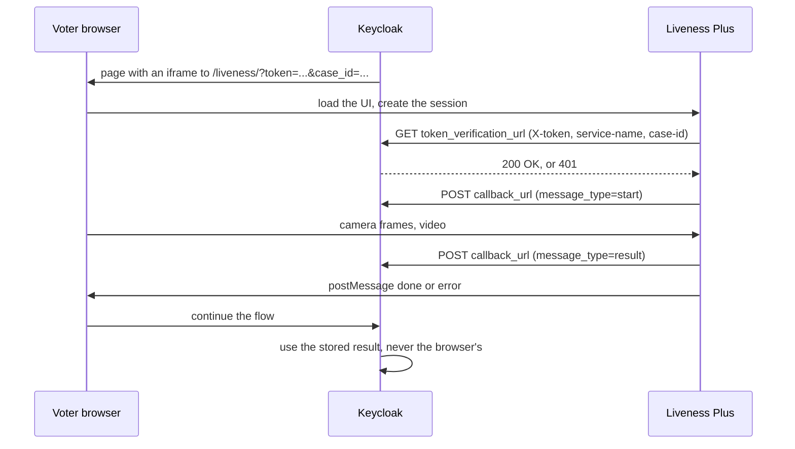

<!--
SPDX-FileCopyrightText: 2026 Sequent Tech <legal@sequentech.io>
SPDX-License-Identifier: AGPL-3.0-only
-->

# Scanovate On-Premise Services

## Overview

Besides the B-Trust cloud API used by the
[Scanovate Identity Verification](scanovate_identity_verification_guide.md)
authenticator, Scanovate ships two services that run on our own
infrastructure:

- **Liveness Plus** checks that a real, live person is in front of the camera.
  It guides the voter from a web UI, runs Presentation Attack Detection (PAD,
  including deepfake detection) and Injection Attack Detection (IAD) on the
  camera frames, and posts the result to a callback URL.
- **1:N Face Match** enrolls face templates into groups and searches them, for
  example to find out whether a face was already enrolled in an election event.

They don't do OCR or document authenticity checks, which stay in B-Trust.

:::note Keycloak integration
The `scanovate-authenticator` uses Liveness Plus for the selfie of the embedded
capture when `face-capture` is `liveness` (see
[Liveness face capture](scanovate_identity_verification_guide.md#liveness-face-capture)).
It doesn't call Face Match yet. This page describes how to run the services,
how to configure them, and the contract between them and Keycloak.
:::

| Service | Image | Role |
| --- | --- | --- |
| `scanovate-liveness` | `scanovate/liveness-plus-service:version_3.9.0_e0dc72e_115` | Liveness backend and web UI. Manages the sessions, calls PAD and IAD, sends the callbacks. |
| `scanovate-presentation-detection` | `scanovate/liveness-presentation-detection-service:release_1.52.0` | PAD server, with the `pad-r-2` and `dfd-3` (deepfake) pipelines. |
| `scanovate-injection-detection` | `scanovate/liveness-injection-detection-service:release-2.6.2` | IAD server. Checks that frames come from a real camera. |
| `scanovate-face-match` | `scanovate/face-match:version_3.9.0_ba58397_79` | 1:N Face Match API (`/facematch1N`). |
| `scanovate-valkey` | `valkey/valkey-extensions:8.1` | Vector database of the face templates, with the search module. |

## Access to the images

The Scanovate images are private on Docker Hub. Without access, pulling them
fails with:

```text
denied: requested access to the resource is denied
unauthorized: authentication required
```

Scanovate grants access to a Docker Hub account, or gives us the credentials
of one. Log in with them in the Docker client that pulls the images: your host,
since the dev container talks to the host's Docker daemon, or each server that
runs them. Use an access token rather than the account password when possible,
and read it from standard input so it doesn't end up in the shell history:

```bash
docker login --username <docker hub user> --password-stdin
# paste the token, then Ctrl-D
```

Then check the access without downloading anything:

```bash
docker manifest inspect scanovate/liveness-plus-service:version_3.9.0_e0dc72e_115
```

Some rules:

- Never commit the credentials, or put them in `.env.development`, election
  event data or tickets. Keep them in the team's password manager.
- `docker login` stores them in `~/.docker/config.json`, in plain text unless a
  [credential helper](https://docs.docker.com/reference/cli/docker/login/#credential-stores)
  is configured. Log out (`docker logout`) on shared machines.
- For deployments, prefer copying the images to our own registry once
  (`docker pull`, `docker tag`, `docker push`) and pulling from there, instead of
  spreading the Scanovate credentials to every server. Air-gapped servers can
  load them with `docker save` and `docker load`.

## Running them in the development environment

The services belong to the `scanovate` docker compose profile of the dev
container (`.devcontainer/docker-compose-base.yml`). No mode starts them: once
logged in, start them from the host.

```bash
.devcontainer/scripts/initialize-command.sh
cd .devcontainer
docker compose --profile scanovate up -d
```

`initialize-command.sh` writes the `SCANOVATE_*` variables of
`.env.development` into `.devcontainer/.env`. You only need to run it again if
your `.env` predates them.

| Variable | Default | Description |
| --- | --- | --- |
| `SCANOVATE_LIVENESS_PORT` | `5050` | Host port of `scanovate-liveness`. The voter's browser loads the liveness UI from it. |
| `SCANOVATE_FACE_MATCH_PORT` | `5060` | Host port of `scanovate-face-match`. Scanovate's examples use `3000` or `3002`, which the voting and admin portals use. |
| `SCANOVATE_LIVENESS_JWT_SECRET_KEY` | `liveness-dev-secret` | Secret of the liveness session tokens. |

The PAD, IAD and Valkey services aren't published on the host: only the
liveness and face match services talk to them. Inside the compose network they
are reachable by service name, e.g. `http://scanovate-liveness:5050` and
`http://scanovate-face-match:3000` from Keycloak.

The detection servers are heavy. Scanovate's requirements, on Intel CPUs:

| Service | Needs |
| --- | --- |
| Liveness | 1 CPU, plus 1 CPU and 1 GB of memory per concurrent session. |
| PAD | 1 CPU and 8 GB of memory to start, plus 0.5 CPU and 0.5 GB per concurrent session. |
| IAD | 1 CPU and 4 GB of memory to start, plus 0.5 CPU and 0.5 GB per concurrent session. |

Give Docker at least 14 GB of memory for the whole profile. If a container
exits right after starting, check `docker compose logs <service>`. Scanovate
suggests running it with `security_opt: [seccomp=unconfined]` if it's killed
by the seccomp profile.

### Smoke tests

```bash
# Liveness backend
curl -i http://127.0.0.1:5050/alive

# Face Match: an empty group list means the service, its configuration and
# Valkey all work
curl -s -H "x-company-id: sequent-dev" http://127.0.0.1:5060/facematch1N/get_groups
```

To try the liveness UI with the Sequent look, open it through `keycloak-nginx`,
which serves it on Keycloak's origin under `/biometric/` (see
[Deployment on Keycloak's origin](#deployment-on-keycloaks-origin)), in a
browser with a camera:

```text
https://localhost:8443/biometric/liveness/?scan_config=scan_config&video_config=video_config&translation_variant=sequent&translation_language=en&ui_theme=sequent_ui
```

Loading it straight from port `5050` doesn't work: its client sends the API
calls under `/biometric/`, which only `keycloak-nginx` strips.

Without a token from Keycloak, the session is rejected with `invalid token`
(`1014`): the dev configuration verifies tokens with Keycloak. To look at the
UI alone, empty `token_verification_url` in a local copy of
`service_config.json`.

To try it from Keycloak, configure the `scanovate-authenticator` of a realm
with `execution-mode` `embedded`, `face-capture` `liveness`, `liveness-url`
`https://localhost:8443/biometric` and `liveness-secret`
`liveness-dev-callback-secret`, and go through the flow on
`https://localhost:8443` so that the login pages and the iframe share the
origin.

## Configuration

### Liveness Plus

Environment variables:

| Variable | Description |
| --- | --- |
| `MODE` | `onprem`. |
| `JWT_SECRET_KEY` | Secret of the session tokens. Required. A secure random value outside development. |
| `PRESENTATION_DETECTION_SERVER_URL` | PAD server URL. |
| `INJECTION_DETECTION_SERVER_URL` | IAD server URL. |
| `LIVENESS_MODE` | `PRESENTATION` runs PAD only, without an IAD server. Otherwise both run (`full` in Scanovate's compose file). |
| `ENABLE_HTTPS` | `true` to serve HTTPS, with `SSL_KEYFILE`, `SSL_CERTFILE` and `SSL_CAFILE` (e.g. under `/app/certs`, mounted read-only). |
| `SSL_EXTERNAL_CA_VERIFICATION_FILE` | CA bundle to verify the callback and token verification URLs. |
| `SSL_EXTERNAL_USE_CA_VERIFICATION` | `false` disables that verification. Never in production. |
| `CLIENT_BASE_URL_PREFIX` | Prefix that the client adds to its API and static resource paths, ending with a slash. We use `biometric/`, see [Deployment on Keycloak's origin](#deployment-on-keycloaks-origin). |

The service also reads JSON files from its `config` directory. The image ships
defaults. The dev container replaces the whole directory with
`.devcontainer/scanovate/liveness/`, which has our own versions:

| File | Contents |
| --- | --- |
| `service_config.json` | Session timeouts, bandwidth, PAD pipelines and thresholds, face quality thresholds, and the `onprem` integration settings. |
| `video_config.json` | Camera rotation and mirroring, video resolution and bitrates, and video compression. |
| `scan_config.json` | Reserved. |
| `default_ui.json` | Scanovate's UI colours and fonts, selected with `ui_theme`. We use `sequent_ui.json` instead. |
| `locales/default/{en,he}.json` | Scanovate's UI texts, selected with `translation_variant` and `translation_language`. We use `locales/sequent/{en,es}.json` instead. |

Our `service_config.json` is Scanovate's with the `onprem` section pointing to
Keycloak (see [Integration contract](#integration-contract)), without the video
in the results (`send_video_in_results: false`, which keeps the callbacks small
and stores no video of the voter), and defaulting to the `sequent_ui` theme and
the `sequent` English texts.

### Sequent look

`sequent_ui.json` gives the Liveness Plus UI the colours and type of our
capture page, so the iframe doesn't look like a different product:

| Setting | Value | Matches |
| --- | --- | --- |
| `title` | white, bold 22 px | the step title over the camera |
| `instruction` | navy `#173449` on white, bold 18 px, pill shaped | the guidance pill |
| `frame.overlay_background` | `#0b2231` at 72 % | the dimmed camera stage |
| `frame.segment_color` | green `#43e3a1` | the progress ring |
| `loading_screen` | white, teal `#0d796a` spinner and shield, navy and grey texts | our cards |
| `success_indicator.checkmark_color` | teal `#0d796a` | our primary colour |

All the texts use `Roboto, "Segoe UI", system-ui, sans-serif`: Sequent Sans is
Roboto, and the iframe can't load our fonts. The loading screen shield is our
own SVG, inlined as a data URI. The `sequent` locales use the wording of our
own face guidance, in English and Spanish. Deployments with another brand can
mount their own theme and variant, and select them with `liveness-ui-theme` and
`liveness-translation-variant`.

The `onprem` section of `service_config.json` is what connects the service to
Keycloak. Its defaults:

| Key | Default | Description |
| --- | --- | --- |
| `callback_url` | empty | Where the results are posted. May contain `{placeholders}` filled from the `callback_url_params` query parameter. |
| `token_verification_url` | empty | Where the session token is verified. **Empty accepts any token**, which is only acceptable in development. |
| `max_active_sessions` | `0` | Maximum concurrent sessions (`0`: no limit). |
| `send_results_to_server` | `true` | Post the result to `callback_url`. |
| `send_debug_results_to_server` | `false` | Also post the full internal session. |
| `send_video_in_results` | `true` | Include the video in the result. |
| `send_results_to_client` | `false` | Return the result to the browser. Keep it `false`: the browser is never trusted. |
| `default_parameters` | `he`, `default_ui`, ... | Query parameters used when the URL doesn't set them. |

Other defaults to be aware of: sessions expire after 90 seconds
(`expiry_timeout_in_seconds`) and are deleted 5 minutes later
(`deletion_timeout_in_minutes`). The PAD pipelines are `pad-r-2` (main,
threshold `0.56`) and `dfd-3` (`0.5`). Exactly one pipeline must be `main`, and
the names must match `IDFACE_SERVER_AVAILABLE_PIPELINES` of the PAD server.

The files are read from `/app/config`: check it with
`docker compose exec scanovate-liveness ls /app/config` when upgrading the
image. A partial file replaces the whole default, so start from Scanovate's
copy of each file.

### 1:N Face Match

The service reads two files from `/app/config`, mounted from
`.devcontainer/scanovate/face-match/` in the dev container:

- `service_config.json`: `db_connections_clear_interval_hours`, how often idle
  database connections are closed.
- `db_config.json`: maps each company id to its database. Every request to
  `/facematch1N/*` must send the company id in the `x-company-id` header, and
  ids missing from the file don't work.

```json
{
  "sequent-dev": {
    "database_type": "valkey",
    "database_url": "valkey://scanovate-valkey:6379",
    "use_cluster": false
  }
}
```

`database_type` is `valkey` or `redis`. Redis needs the RediSearch module,
e.g. the `redis/redis-stack` image. Set `use_cluster` to `true` for a cluster.
Restart the service after editing the files. Companies that share a
`database_url` share their storage, so give tenants that need isolated data a
database of their own.

Other environment variables: `SUPPORT_1_TO_MANY=true` enables the 1:N API,
`ENABLE_HTTPS` with `SSL_KEYFILE`, `SSL_CERTFILE`, `SSL_CAFILE`,
`SSL_KEY_PASSWORD` and `SSL_USE_TLS_1_2` serve HTTPS, and `OMP_NUM_THREADS`,
`OPENBLAS_NUM_THREADS`, `MKL_NUM_THREADS`,
`ONNXRUNTIME_INTER_OP_NUM_THREADS` and `ONNXRUNTIME_INTRA_OP_NUM_THREADS` limit
the CPU threads it uses (all of them by default). `LOG_IMAGES` logs face
images and is only for debugging: never enable it with real voters.

## Integration contract

This is what Keycloak has to implement to use the services.

Liveness Plus only replaces the selfie step of the
[embedded capture](scanovate_identity_verification_guide.md#embedded-capture):

- The photos of the ID stay in our capture page, which keeps guiding the voter
  with the `id-capture` analyzers until the document is centred and readable.
  Liveness Plus doesn't capture documents.
- The selfie is taken in the Liveness Plus UI, which has its own face guidance.
  Its injection detection relies on its own client capturing the frames, so a
  selfie captured by our page can't be sent to it. Our page must release the
  camera before loading the iframe.

### Liveness session

Keycloak implements it in the `scanovate-authenticator` (`LivenessSessions` and
the `scanovate` realm resource):



1. Keycloak embeds the UI in an iframe that can use the camera:
   `<iframe allow="camera *; microphone *" onload="this.contentWindow.focus()">`,
   with the page's viewport set to `width=device-width, initial-scale=1.0`. The
   URL adds, to the parameters shown in [Smoke tests](#smoke-tests), a one-time
   `token` and a `case_id` tied to the authentication session. Keycloak's
   Content Security Policy must allow the liveness origin in `frame-src`.
2. On session creation, Liveness Plus calls
   `GET {token_verification_url}` with the `X-token`, `service-name` and
   `case-id` headers. Any answer but `2xx` rejects the session with
   `invalid token` (error `1014`).
3. Liveness Plus posts JSON to `callback_url`, with the `x-token` and `case-id`
   headers and any `callback_headers_params`: first `message_type: "start"`,
   then `message_type: "result"`. A successful result has `status: "completed"`
   and, in `scan.processing_result`, `liveness_check_passed`,
   `presentation_attack_check_passed`, `injection_attack_check_passed`, the PAD
   and deepfake probabilities and the face image. Otherwise `status` is
   `aborted`, `expired` or `client_error`, with an `error_message`.
4. The UI tells the parent page how it went with `window.parent.postMessage`:
   `{type: "init"}`, `{type: "done"}` or
   `{type: "error", error_code, error_message}`. These messages are only a
   signal to move on: the outcome comes from the callback, which Keycloak must
   match to the authentication session with the token and case id.

Keycloak's endpoints, under any realm (the dev configuration uses `master`):

| Endpoint | Answers |
| --- | --- |
| `GET /realms/{realm}/scanovate/liveness/verify?secret=...` | `200` if the `X-token` is known, matches the `case-id` and hasn't used its 3 sessions, `401` otherwise. |
| `POST /realms/{realm}/scanovate/liveness/callback?secret=...` | `200` once the `start` or `result` message is recorded (other message types are ignored), `401` for an unknown token, a wrong secret or another case, `400` for a malformed body. The token is read from `x-token`, or from `onprem_params.token`. |

The `secret` is the authenticator's `liveness-secret`, set in both URLs of
`service_config.json`. The case id is the B-Trust process id, so the two can be
matched in the logs.

Client error codes:

| Code | Name |
| --- | --- |
| `1000` | `COULD_NOT_INIT_ANALYTICS` |
| `1001` | `COULD_NOT_CREATE_SESSION` |
| `1002` | `MAX_ACTIVE_SESSIONS_REACHED` |
| `1003` | `CAMERA_PERMISSION_BLOCKED` |
| `1004` | `CAMERA_NOT_FOUND` |
| `1005` | `COULD_NOT_OPEN_CAMERA` |
| `1006` | `SESSION_EXPIRED` |
| `1007` | `SERVER_ERROR` |
| `1008` | `SLOW_NETWORK` |
| `1009` | `USER_PRESSED_CLOSE` |
| `1010` | `USER_LEFT_PAGE` |
| `1011` | `NO_NETWORK` |
| `1012` | `CLIENT_ERROR` |
| `1013` | `CAMERA_PERMISSION_DISMISSED` |
| `1014` | `INVALID_TOKEN` |
| `1015` | `USER_CLOSED_PAGE` |
| `1016` | `COULD_NOT_START_MEDIA_RECORDER` |

### Face Match

All endpoints are under `/facematch1N` and need the `x-company-id` header:

| Endpoint | Purpose |
| --- | --- |
| `GET /get_groups`, `GET /get_group` | List groups, or get one. |
| `POST /create_group`, `POST /rename_group`, `DELETE /delete_group` | Manage groups. |
| `POST /insert_image`, `POST /insert_template` | Enroll a face in a group, from an image or a template. |
| `GET /get_template/{group_id}/{template_id}`, `GET /get_template_global/{template_id}` | Get a template. |
| `DELETE /delete_template/{template_id}`, `POST /move_template` | Remove or move a template. |
| `POST /search_image`, `POST /search_template` | Search a group. |
| `POST /search_image_global`, `POST /search_template_global` | Search all the groups of the company. |
| `POST /compare_image_and_template_uuid` | Compare an image with a known template. |

For example, to reject an enrollment whose face was already enrolled in the
election event, search the event's group with the liveness face image, and
enroll it only when there's no match.

Scanovate's guide doesn't fully specify the request bodies and responses, e.g.
multipart form or base64 JSON. Check them against the service's OpenAPI
description (usually `/docs` or `/openapi.json`) before implementing the
client. Also confirm whether `DELETE /delete_group` deletes the templates of
the group before relying on it to delete voters' biometric data.

## Deployment on Keycloak's origin

Liveness Plus runs on our infrastructure, so its public URL is ours to choose.
We serve it on the same origin as Keycloak, under `/biometric/`:

| | URL |
| --- | --- |
| Liveness UI | `https://<keycloak host>/biometric/liveness/` |
| Its API and events | `https://<keycloak host>/biometric/create_session`, `.../biometric/sse/events`, ... |
| Authenticator `liveness-url` | `https://<keycloak host>/biometric` |
| Keycloak endpoints for Liveness Plus | `http://<keycloak internal host>/realms/master/scanovate/liveness/{verify,callback}`, internal only |

`/biometric/` is vendor neutral, and none of Keycloak's own top-level paths
(`/realms`, `/admin`, `/resources`, `/js`, `/health`, `/metrics`) use it.

- `CLIENT_BASE_URL_PREFIX=biometric/` makes the client send its calls under the
  prefix.
- Keycloak's public reverse proxy routes `/biometric/` to the Liveness Plus
  service, stripping the prefix, with Server-Sent Events unbuffered. Only that
  prefix is routed: the PAD and IAD servers stay internal.
- The same proxy answers `404` for `/realms/*/scanovate/liveness/`: only
  Liveness Plus calls those endpoints, on the internal network.

The dev container does exactly this in `keycloak-nginx`
(`.devcontainer/keycloak-nginx/keycloak-mtls.conf.template`), on
`https://localhost:8443`:

```nginx
location /biometric/ {
    set $liveness_upstream http://scanovate-liveness:5050;
    rewrite ^/biometric/(.*)$ /$1 break;
    proxy_pass $liveness_upstream;
    proxy_http_version 1.1;
    proxy_set_header Connection "";
    proxy_buffering off;
    proxy_cache off;
    proxy_read_timeout 1h;
    client_max_body_size 20m;
}

location ~ ^/realms/[^/]+/scanovate/liveness/ {
    return 404;
}
```

The iframe is then same origin: Keycloak's default `frame-src 'self'` already
allows it, the proxy sets the framing headers for both, the voter's browser
grants the camera to a single origin, and the TLS certificate is Keycloak's.
The iframe's messages also come from Keycloak's origin, which the page checks.

Hosting it only moves where the UI is served from: the verdict still comes from
the server callback, and the UI's client (frame encryption, injection
detection) is still Scanovate's.

## Production

- Serve Liveness Plus over HTTPS (`ENABLE_HTTPS` or a TLS proxy): browsers
  only give camera access to secure origins. Proxies must pass Server-Sent
  Events (`/sse/events`) without buffering.
- Keep PAD, IAD, Face Match and Valkey on the internal network.
- Set `token_verification_url` and `callback_url` with a random `secret`, the
  same as the authenticator's `liveness-secret`, and test both before going
  live. Liveness Plus reaches Keycloak on the internal network.
- Serve the liveness UI under `/biometric/` on Keycloak's origin, and block
  `/realms/*/scanovate/liveness/` on the public proxy (see
  [Deployment on Keycloak's origin](#deployment-on-keycloaks-origin)).
- Use a secure random `JWT_SECRET_KEY`, and keep it and the Docker Hub
  credentials in the secrets store.
- Pin image tags, never `latest`.
- Valkey holds biometric templates: persist and back up its volume, restrict
  access to it, and delete templates when the voter data is deleted.
- Tune the PAD thresholds and the session expiry with real devices.
- Size the servers for the expected concurrent sessions (see the requirements
  in [Running them in the development environment](#running-them-in-the-development-environment)),
  and set `max_active_sessions` to match.
