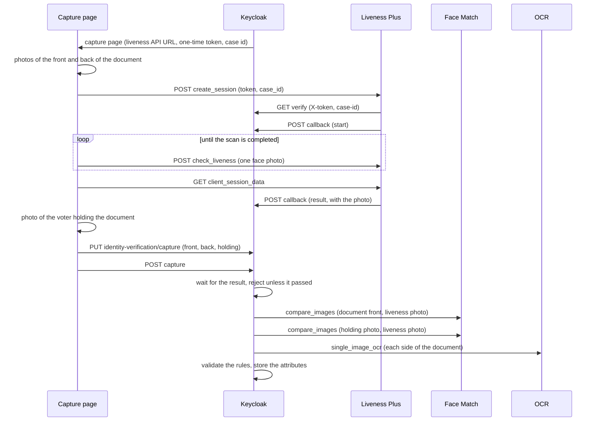

<!--
SPDX-FileCopyrightText: 2026 Sequent Tech <legal@sequentech.io>
SPDX-License-Identifier: AGPL-3.0-only
-->

# Scanovate On-Premise Services

## Overview

The [Scanovate Identity Verification](scanovate_identity_verification_guide.md)
authenticator only uses Scanovate services that run on our own infrastructure.
Nothing is sent to any third party:

- **Liveness Plus** checks that a real, live person is in front of the camera.
  It runs Presentation Attack Detection (PAD, including deepfake detection) on
  the face photos our capture page sends to its API, and posts the verdict to
  Keycloak.
- **Face Match** compares two face images (1:1) and returns their similarity.
  It finds the face in each image itself, so it can compare a photo of a whole
  document with a photo of the voter.
- **OCR** reads the fields of a photo of an identity document and validates its
  machine readable zone (MRZ).

On premise we only get their APIs. Their own web UIs, which the SaaS versions
show in an iframe, aren't used: Keycloak's capture page takes every photo
itself and calls the Liveness Plus API, and Keycloak calls Face Match and the
OCR service.

This page describes how to run the services, how to configure them, and the
contract between them, the capture page and Keycloak.

| Service | Image | Role |
| --- | --- | --- |
| `scanovate-liveness` | `133529410358.dkr.ecr.eu-west-1.amazonaws.com/scanovate/liveness-plus-service:version_3.9.0_e0dc72e_115` | Liveness API. Manages the sessions, checks the face quality of each photo, calls PAD, sends the callbacks. |
| `scanovate-presentation-detection` | `133529410358.dkr.ecr.eu-west-1.amazonaws.com/scanovate/liveness-presentation-detection-service:release_1.52.0` | PAD server, with the `pad-r-2` (presentation attacks) and `dfd-3` (deepfakes) pipelines. |
| `scanovate-face-match` | `133529410358.dkr.ecr.eu-west-1.amazonaws.com/scanovate/ngfacematch:version_3.9.0_ba58397_79` | Face Match API. We use its 1:1 API (`/facematch11`). |
| `scanovate-ocr` | `133529410358.dkr.ecr.eu-west-1.amazonaws.com/scanovate/ocr:version_3.9.0_aefa131_285` | OCR API. We use its single image API (`/single_image_ocr`). |

Scanovate also ships an injection attack detection server
(`133529410358.dkr.ecr.eu-west-1.amazonaws.com/scanovate/liveness-injection-detection-service:release-2.6.2`)
and a 1:N API in the Face Match image. We don't use them, see
[Injection attacks](#injection-attacks) and [Face Match](#face-match).

### What runs where

| Check | Where it runs |
| --- | --- |
| Liveness: presentation attacks and deepfakes | Our network: Liveness Plus and PAD. |
| The voter's live face against the photo on the document (1:1) | Our network: Face Match. |
| The voter's live face against the photo of them holding the document (1:1) | Our network: Face Match. |
| Reading the document (name, date of birth, number, nationality, expiry) and its MRZ check digits | Our network: OCR, for passports. Other documents would need a Regula Document Reader server, see [Document types](scanovate_identity_verification_guide.md#document-types). |
| Document authenticity | Not checked: out of scope for now, see [Document types](scanovate_identity_verification_guide.md#document-types). |

The services only call each other and Keycloak. Liveness Plus and the OCR
service send analytics only in their SaaS mode, never with `MODE=onprem`, and
our capture page loads nothing from Scanovate.

### Order of the checks



1. Keycloak renders the capture page with a new case id, which is also the case
   id of the liveness sessions.
2. The capture page guides the voter through the photos of the front and back
   of the document. They stay in the browser.
3. For the face, the page shows its own oval and guidance. The camera is
   analysed in the browser; once the face is steady and well placed, the page
   takes one photo and sends it to Liveness Plus, with a session opened with
   Keycloak's one-time token. It waits for the answer before taking another,
   until Liveness Plus completes the scan. Liveness Plus posts the verdict and
   the checked photo to Keycloak, server to server.
4. The page takes a photo of the voter holding the document next to their face,
   and uploads the document photos and that photo to Keycloak, then posts the
   capture.
5. Keycloak waits for the liveness verdict, and rejects the attempt unless it
   passed.
6. Keycloak asks Face Match whether the face in the liveness photo is the one on
   the document, and the one in the photo holding it. Either failing rejects the
   attempt.
7. Only then, Keycloak has the OCR service read each side of the document,
   validates the results with the realm rules and stores the voter's data,
   which later steps compare with the voter registry.

## Access to the images

We run the images from our own mirror on AWS ECR, in the `133529410358` account
(`eu-west-1`), with the same tags and digests as Scanovate's private images on
Docker Hub:

| Repository | Tag |
| --- | --- |
| `133529410358.dkr.ecr.eu-west-1.amazonaws.com/scanovate/liveness-plus-service` | `version_3.9.0_e0dc72e_115` |
| `133529410358.dkr.ecr.eu-west-1.amazonaws.com/scanovate/liveness-presentation-detection-service` | `release_1.52.0` |
| `133529410358.dkr.ecr.eu-west-1.amazonaws.com/scanovate/liveness-injection-detection-service` | `release-2.6.2` (not used) |
| `133529410358.dkr.ecr.eu-west-1.amazonaws.com/scanovate/ngfacematch` | `version_3.9.0_ba58397_79` |
| `133529410358.dkr.ecr.eu-west-1.amazonaws.com/scanovate/ocr` | `version_3.9.0_aefa131_285` |

Log in to the registry in the Docker client that pulls the images: your host,
since the dev container talks to the host's Docker daemon, or each server that
runs them. With an AWS SSO profile for that account (e.g. `sequent-ecr`, role
`ECRPushPull`):

```bash
aws sso login --profile sequent-ecr
aws ecr get-login-password --profile sequent-ecr --region eu-west-1 \
  | docker login --username AWS --password-stdin 133529410358.dkr.ecr.eu-west-1.amazonaws.com
```

ECR login tokens expire after 12 hours: log in again before pulling a new tag.
Without a valid login, pulling fails with `no basic auth credentials` or
`authorization token has expired`. Check the access without downloading
anything:

```bash
docker manifest inspect 133529410358.dkr.ecr.eu-west-1.amazonaws.com/scanovate/liveness-plus-service:version_3.9.0_e0dc72e_115
```

Some rules:

- Mirror a new version by pulling it from Scanovate's Docker Hub repositories
  (`scanovate/<name>:<tag>`, with the access Scanovate gives us) and pushing it
  with the same tag. Pin tags, never `latest`, and check that the digests match
  (`docker buildx imagetools inspect <image>`).
- Never commit credentials, or put them in `.env.development`, election event
  data or tickets.
- `docker login` stores the token in `~/.docker/config.json`, in plain text
  unless a
  [credential helper](https://docs.docker.com/reference/cli/docker/login/#credential-stores)
  is configured. Log out (`docker logout`) on shared machines.
- Air-gapped servers can load the images with `docker save` and `docker load`.

## Running them in the development environment

The services belong to the `scanovate` docker compose profile of the dev
container (`.devcontainer/docker-compose-base.yml`). No mode starts them, since
pulling their images needs an ECR login and they need about 18 GB of memory:
start them from the host, in the checkout, next to the `backend` or `full` mode.

```bash
# Once every 12 hours: log in to our ECR mirror (see Access to the images)
aws sso login --profile sequent-ecr
aws ecr get-login-password --profile sequent-ecr --region eu-west-1 \
  | docker login --username AWS --password-stdin 133529410358.dkr.ecr.eu-west-1.amazonaws.com

.devcontainer/scripts/initialize-command.sh
(cd .devcontainer && docker compose --profile scanovate up -d)

# Stop them, and free their memory, when done
(cd .devcontainer && docker compose --profile scanovate stop)
```

`step-dev mode status` lists them under `outsideModes`. The development realm
and the [sample election event](scanovate_identity_verification_guide.md#sample-election-event)
already point to them.

`initialize-command.sh` writes the `SCANOVATE_*` variables of
`.env.development` into `.devcontainer/.env`. You only need to run it again if
your `.env` predates them.

| Variable | Default | Description |
| --- | --- | --- |
| `SCANOVATE_LIVENESS_PORT` | `5050` | Host port of `scanovate-liveness`, for direct checks. The capture page calls it through `keycloak-nginx`. |
| `SCANOVATE_FACE_MATCH_PORT` | `5060` | Host port of `scanovate-face-match`, for direct checks. Scanovate's examples use `3000` or `3002`, which the voting and admin portals use. |
| `SCANOVATE_OCR_PORT` | `5070` | Host port of `scanovate-ocr`, for direct checks. |
| `SCANOVATE_LIVENESS_JWT_SECRET_KEY` | `liveness-dev-secret` | Secret of the liveness session tokens. |
| `SCANOVATE_OCR_JWT_SECRET_KEY` | `ocr-dev-secret` | Secret of the OCR session tokens, which the single image API doesn't use, but the service needs. |

The PAD server isn't published on the host: only Liveness Plus talks to it.
Inside the compose network the services are reachable by name, e.g.
`http://scanovate-liveness:5050`, `http://scanovate-face-match:3000` and
`http://scanovate-ocr:5040` from Keycloak.

Scanovate's requirements, on Intel CPUs:

| Service | Needs |
| --- | --- |
| Liveness Plus | 1 CPU, plus 1 CPU and 1 GB of memory per concurrent session. |
| PAD | 1 CPU and 8 GB of memory to start, plus 0.5 CPU and 0.5 GB per concurrent session. |

Idle, PAD takes about 5.4 GB of memory, the OCR service 7.8 GB, Face Match
1.7 GB and Liveness Plus 0.5 GB: give Docker at least 18 GB for the profile, on
top of the rest of the dev container. The OCR service reads a passport photo in
about 0.6 seconds. If a container exits right after starting, check
`docker compose logs <service>`.

### Smoke tests

```bash
# Liveness Plus, Face Match and OCR
curl -i http://127.0.0.1:5050/alive
curl -i http://127.0.0.1:5060/alive
curl -i http://127.0.0.1:5070/alive

# OCR: with a photo of the data page of a passport, the status is "completed"
# and front.processing_result has status "success" and the fields
jq -n --rawfile image <(base64 -w0 passport.jpg) \
  '{ocr_type: "passport", image_base64: $image, request_id: "smoke"}' \
  | curl -s -H 'content-type: application/json' --data @- \
    http://127.0.0.1:5070/single_image_ocr \
  | jq '{status, result: .front.processing_result | {status, fields}, auth}'

# Face Match 1:1: with two photos of the same person, success is true and the
# similarity is above the threshold (0.67)
jq -n --rawfile a <(base64 -w0 id.jpg) --rawfile b <(base64 -w0 selfie.jpg) \
  '{image_1_base64: $a, image_2_base64: $b, allow_multiple_faces: true}' \
  | curl -s -H 'content-type: application/json' --data @- \
    http://127.0.0.1:5060/facematch11/compare_images

# Through keycloak-nginx, only the API the capture page uses is routed:
# create_session answers (401 without a token from Keycloak), the rest is 404
curl -sk -o /dev/null -w '%{http_code}\n' -X POST -H 'content-type: application/json' \
  -d '{}' https://localhost:8443/biometric/liveness/create_session
curl -sk -o /dev/null -w '%{http_code}\n' https://localhost:8443/biometric/liveness/docs
```

## End-to-end test

This runs the whole enrollment in the dev container with your own face and
passport, on the real services: Liveness Plus and PAD check your face, Face
Match compares it with your passport and with the photo of you holding it, and
the OCR service reads your passport.

Everything stays on your machine. Liveness Plus keeps its sessions in memory for
5 minutes, Face Match and the OCR service keep nothing, and Keycloak keeps the
photos and the liveness photo in memory until the capture is checked (at most
30 minutes). No image is logged.

### What you need

- Access to our ECR mirror of the Scanovate images (see
  [Access to the images](#access-to-the-images)), and about 18 GB of memory for
  Docker on top of the dev container.
- A computer with a webcam of at least 1280×720, and Chrome or Firefox.
- Your passport: the data page, with your photo and the machine readable zone.
- This branch checked out, and the dev container (`base` profile) working.

### 1. Start the services

From the host, in the checkout:

```bash
# Writes the SCANOVATE_* variables into .devcontainer/.env if it predates them
.devcontainer/scripts/initialize-command.sh
aws ecr get-login-password --profile sequent-ecr --region eu-west-1 \
  | docker login --username AWS --password-stdin 133529410358.dkr.ecr.eu-west-1.amazonaws.com

cd .devcontainer
docker compose --profile scanovate up -d
```

Wait until the four Scanovate services answer. PAD and the OCR service take a
minute or two to load their models:

```bash
docker compose ps scanovate-liveness scanovate-presentation-detection scanovate-face-match scanovate-ocr
curl -s http://127.0.0.1:5050/alive
curl -s http://127.0.0.1:5060/alive
curl -s http://127.0.0.1:5070/alive
```

### 2. Build Keycloak with the capture page

The capture page is in the React login theme, which the Keycloak image builds
from `packages/keycloak-ui` and ships. From the host, rebuild Keycloak with this
branch's extensions and themes, and `keycloak-nginx` with its proxy rules, then
start them:

```bash
cd .devcontainer
docker compose build keycloak keycloak-nginx
docker compose up -d keycloak keycloak-nginx
```

After changing `packages/keycloak-ui` or `packages/keycloak-extensions`,
rebuild Keycloak. To iterate on the capture page without rebuilding, build the
themes in a `devenv shell` (it needs Node, Yarn and Maven) and mount them over
the image's with the `docker-compose-keycloak-ui.yml` overlay:

```bash
scripts/dev/step-dev keycloak prepare --runtime built
cd .devcontainer
docker compose -f docker-compose.yml -f docker-compose-keycloak-ui.yml up -d keycloak keycloak-nginx
```

Recreating Keycloak without the overlay (a plain `docker compose up`) goes back
to the themes in the image.

Check that the proxy only routes the API the page uses:

```bash
curl -sk -o /dev/null -w '%{http_code}\n' https://localhost:8443/biometric/liveness/docs      # 404
curl -sk -o /dev/null -w '%{http_code}\n' -X POST -H 'content-type: application/json' \
  -d '{"token": "x"}' https://localhost:8443/biometric/liveness/create_session    # 401
```

### 3. Import the election event

Start the admin portal from `packages/` in a `devenv shell`:

```bash
yarn && yarn build:ui-core && yarn build:ui-essentials && yarn start:admin-portal
```

In the admin portal (http://127.0.0.1:3002), import the
[sample election event](scanovate_identity_verification_guide.md#sample-election-event)
(`packages/step-cli/data/scanovate-enrollment/election-event.json`) with
**Import Election Event**. Its realm is
`tenant-<tenant id>-event-<election event id>`, which the Keycloak admin
console (http://127.0.0.1:8090) lists. It already uses the `sequent-ui-voting`
login theme and the services of the dev container.

### 4. Load yourself as a voter

Enrollment only succeeds if the names and date of birth read from your passport
match a voter of the election event. In the election event, **Voters**, import
a CSV with your names and date of birth exactly as in your passport's machine
readable zone:

```csv
username,first_name,last_name,enabled,area_name,dateOfBirth,embassy,country
tester,<FIRST NAMES>,<LAST NAME>,true,Japan - Tokyo PE,<yyyy-MM-dd>,Tokyo PE,Japan/Tokyo PE
```

### 5. Configure other realms

The sample election event is ready. For another realm, such as an export of an
election event configured for the B-Trust integration,
`configure-realm.sh` points its Scanovate steps to the services, removes the
B-Trust settings, warns about rules written for B-Trust, and sets the React
login theme on the realm and on the clients that set their own. It needs
`curl` and `jq`:

```bash
SCANOVATE_OCR_URL=http://scanovate-ocr:5040 \
SCANOVATE_OCR_TYPES='{"philippinePassport": "passport"}' \
SCANOVATE_LIVENESS_URL=https://localhost:8443/biometric \
SCANOVATE_LIVENESS_SECRET=liveness-dev-callback-secret \
SCANOVATE_FACE_MATCH_URL=http://scanovate-face-match:3000 \
SCANOVATE_LOGIN_THEME=sequent-ui-voting \
  packages/keycloak-extensions/scanovate-authenticator/scripts/configure-realm.sh \
  configure tenant-<tenant id>-event-<election event id>
```

`liveness-dev-callback-secret` is the secret of
`.devcontainer/scanovate/liveness/service_config.json`. The script captures
only the front of passports; set `SCANOVATE_CAPTURE_SIDES` or
`SCANOVATE_FACE_MATCH_MIN_SIMILARITY` to change the sides or the threshold
(`{"default": 0.67}`). `KEYCLOAK_URL`, `KEYCLOAK_ADMIN` and
`KEYCLOAK_ADMIN_PASSWORD` default to the dev container Keycloak
(`http://127.0.0.1:8090`, `admin`/`admin`). The same settings can be edited in
the Keycloak admin console: **Authentication**, the registration flow, then the
settings of the Scanovate step.

### 6. Enroll

Open the enrollment page on `https://localhost:8443`, the origin of the
Liveness Plus API, and accept the development certificate:

```text
https://localhost:8443/realms/<realm>/protocol/openid-connect/registrations?client_id=voting-portal&response_type=code&scope=openid&redirect_uri=http%3A%2F%2Flocalhost%3A3000%2F
```

1. Fill in the form: **Passport**, **Japan/Tokyo PE** and **Tokyo PE**, an
   email, a phone and a password. The development senders don't deliver the
   OTPs, and the codes aren't logged: to skip them, set the OTP steps of the
   registration flow to **Disabled** (the `message-otp-authenticator` step and
   the `deferred-otp-subflow*` subflows), and enable them again after the test.
2. **Verify your identity**: allow the camera.
3. **Front of the ID**: the data page of your passport, flat, with the four
   corners in the frame. It's taken automatically.
4. **Your face**: keep it in the oval, looking at the camera. The page sends
   photos to Liveness Plus until one is good enough, then moves on.
5. **You holding your ID**: hold the data page next to your face until the
   progress ring completes.
6. **Checking**: Keycloak waits for the liveness result, compares your face
   with the passport and with the photo holding it, and has the OCR service
   read the passport.
7. **Check the details from your ID**: your names, passport number and date of
   birth. **Confirm and enroll**. The voting portal isn't running, so the final
   redirect to `localhost:3000` fails; the enrollment is done by then.

Follow it in the logs, from `.devcontainer`:

```bash
docker compose logs -f scanovate-liveness      # token check, photos, start and result callbacks
docker compose logs -f scanovate-ocr           # the passport read, without its fields
docker compose logs -f keycloak | grep -E "ScanovateAuthenticator|capture:|readDocument|liveness"
```

Keycloak logs the liveness verdict of the case and the similarity of each
comparison, e.g. `capture: scanovate_face_match_document of <case id>:
MATCH, similarity=0.8123, statuses=0/0`. The Keycloak events (**Realm settings**,
**Events**, or the admin API) carry them as `scanovate_face_match_document`
and `scanovate_face_match_holding`, with the case id as `scanovate_case_id`.

### 7. Try to break it

Each of these must fail, and use up an attempt out of `max-attempts` (3):

| Try | Expected |
| --- | --- |
| Show a photo of yourself, printed or on a screen, in the face step | `scanovateLivenessError` |
| Show someone else's passport, or have someone else do the face step | `scanovateFaceMismatchError` |
| Cover the photo on the passport, or keep it out of the frame when holding it | `scanovateFaceNotFoundError` |
| Cover the machine readable zone, or show another kind of document | `scanovateDocumentUnreadableError` |

These must not use up an attempt:

- Deny the camera: the page shows how to allow it.
- Stop a service's container (`docker compose stop scanovate-ocr`) before the
  checking step: `scanovateInternalError`, which the voter can retry.
- Leave the face step for more than 90 seconds: the session expires and the
  page opens a new one. After three sessions the page asks you to start over.

The similarities of your tries are a first hint for
`face-match-min-similarity`: note the ones of genuine and of mismatched
faces for each document type.

### 8. Clean up

- Delete the enrolled voter from the election event to enroll again.
- `docker compose restart scanovate-liveness keycloak` drops what's still in
  memory, and `docker compose --profile scanovate stop` frees the memory of the
  Scanovate services.
- Never commit, attach or share photos of your passport or face, including
  screenshots of the capture page.

## Configuration

### Liveness Plus

Environment variables:

| Variable | Description |
| --- | --- |
| `MODE` | `onprem`. |
| `LIVENESS_MODE` | `PRESENTATION`: PAD only. See [Injection attacks](#injection-attacks). |
| `JWT_SECRET_KEY` | Secret of the session tokens. Required. A secure random value outside development. |
| `PRESENTATION_DETECTION_SERVER_URL` | PAD server URL. |
| `CLIENT_BASE_URL_PREFIX` | Prefix of the service's paths, ending with a slash. We use `biometric/`, see [Deployment on Keycloak's origin](#deployment-on-keycloaks-origin). |
| `ENABLE_HTTPS` | `true` to serve HTTPS, with `SSL_KEYFILE`, `SSL_CERTFILE` and `SSL_CAFILE` (e.g. under `/app/certs`, mounted read-only). |
| `SSL_EXTERNAL_CA_VERIFICATION_FILE` | CA bundle to verify the callback and token verification URLs. |
| `SSL_EXTERNAL_USE_CA_VERIFICATION` | `false` disables that verification. Never in production. |

The service reads JSON files from `/app/config`. The dev container only
replaces `service_config.json`, with
`.devcontainer/scanovate/liveness/service_config.json`: the others are the
image's own. `video_config.json`, the UI theme and the texts only matter to
Scanovate's UI, which we don't use, but the service still loads them when it
creates a session.

Our `service_config.json` is Scanovate's with the `onprem` section pointing to
Keycloak (see [Integration contract](#integration-contract)), without the video
in the results (`send_video_in_results: false`), and with English as the
default language of the image's texts. Its `onprem` section:

| Key | Our value | Description |
| --- | --- | --- |
| `callback_url` | Keycloak's `.../identity-verification/liveness/callback?secret=...` | Where the start and the result are posted. |
| `token_verification_url` | Keycloak's `.../identity-verification/liveness/verify?secret=...` | Where the session token is verified. **Empty accepts any token**, never do it. |
| `max_active_sessions` | `0` | Maximum concurrent sessions (`0`: no limit). |
| `send_results_to_server` | `true` | Post the result to `callback_url`. |
| `send_debug_results_to_server` | `false` | Also post the full internal session. |
| `send_video_in_results` | `false` | Include the video in the result. We send no video. |
| `send_results_to_client` | `false` | Return the result to the browser. Keep it `false`: the browser is never trusted. |
| `default_parameters` | `default_ui`, `default`, `en`, ... | Configuration files used when `create_session` doesn't name them. |

Other settings of the file: sessions expire after 90 seconds
(`expiry_timeout_in_seconds`) and are deleted 5 minutes later
(`deletion_timeout_in_minutes`). The PAD pipelines are `pad-r-2` (main,
threshold `0.56`) and `dfd-3` (`0.5`): the check passes only if every pipeline
scores above its threshold. Exactly one pipeline must be `main`, and the names
must match `IDFACE_SERVER_AVAILABLE_PIPELINES` of the PAD server. `face_config`
sets the face quality a frame needs before PAD runs: a face of at least
200×200 pixels, 60 pixels between the eyes, the nose near the centre of the
frame, the head turned less than 15° and tilted less than 18°, sharp, lit, and
without sunglasses or a mask.

### Face Match

The 1:1 API needs no configuration file. Environment variables:

| Variable | Description |
| --- | --- |
| `MODE` | `onprem`. |
| `SUPPORT_1_TO_MANY` | `true` also serves the 1:N API (`/facematch1N`), which needs a Valkey or Redis database. We leave it unset. |
| `ENABLE_HTTPS`, `SSL_KEYFILE`, `SSL_CERTFILE`, `SSL_CAFILE`, `SSL_KEY_PASSWORD`, `SSL_USE_TLS_1_2` | Serve HTTPS. |
| `OMP_NUM_THREADS`, `OPENBLAS_NUM_THREADS`, `MKL_NUM_THREADS`, `ONNXRUNTIME_INTER_OP_NUM_THREADS`, `ONNXRUNTIME_INTRA_OP_NUM_THREADS` | Limit the CPU threads it uses (all of them by default). |
| `LOG_IMAGES` | Logs face images, only for debugging: never enable it with real voters. |

The match threshold is the authenticator's `face-match-min-similarity`, per
document type. Keycloak uses it or the service's own threshold (`0.67`),
whichever is higher.

### OCR

Environment variables:

| Variable | Description |
| --- | --- |
| `MODE` | `onprem`. In `saas` mode the service fetches its configuration from Scanovate's cloud (`AUTH_URL`) and can send analytics (`ENABLE_ANALYTICS`): never use it. |
| `JWT_SECRET_KEY` | Secret of the session tokens of its interactive API. Required, even though the single image API doesn't use them. A secure random value outside development. |
| `ENABLE_HTTPS`, `SSL_KEYFILE`, `SSL_CERTFILE`, `SSL_CAFILE`, `SSL_USE_TLS_1_2` | Serve HTTPS. |

The dev container uses the image's own configuration files. The single image
API ignores their `onprem` section (callback and token verification URLs),
which only applies to the interactive sessions of Scanovate's UI. The
`regula.url` of `service_config.json` is where the `regula` OCR type forwards
the photos: empty, as we have no Regula server, so that type fails.

## Integration contract

### Liveness session

The capture page drives the session through the Liveness Plus API, on
Keycloak's origin under `/biometric/liveness/`. Keycloak gives it the API URL, a
one-time token and the case id of the capture.

| Call | Request | Answer |
| --- | --- | --- |
| `POST /create_session` | JSON `{"token": ..., "case_id": ...}` | `{"session_token": ..., "client_config": ...}`. `401` if Keycloak rejects the token. |
| `POST /check_liveness` | Header `service-session-token`. Multipart `encrypted_file` (the frame, a plain JPEG in `PRESENTATION` mode), `timestamp` (ISO 8601) and `frame_id` (unique per session). | `{"status": {"code": ..., "message": ...}}`, see below. |
| `GET /client_session_data` | Header `service-session-token`. | Ends the session, which posts the result to Keycloak. `{"status": {"code": 1}}` once completed. |
| `POST /client_error` | Header `service-session-token`. JSON `{"error": "user left page"}` or `"user pressed close"`. | Ends the session as aborted. |

The frame codes of `check_liveness`:

| Code | Meaning | The page |
| --- | --- | --- |
| `2` | Scan completed: the frame passed the face quality checks and PAD ran on it. | Ends the session. |
| `0` | Frame skipped, e.g. while another one is being checked. | Sends another frame. |
| `10`–`110` | The face isn't good enough: several faces, none, too small, too big, off centre, turned, blurred, badly lit, sunglasses or a mask. | Shows the matching guidance, and sends more frames. |
| `1002` | Session expired (90 seconds). | Opens a new session. |
| `1000`, `1001`, `1003`, `200`–`202`, `5000`+ | Invalid token, unknown session, server errors. | Shows an error. |

Liveness Plus completes the scan on the first frame that passes the face
quality checks, whatever PAD says: the verdict is only in the result callback,
never in these answers.

Liveness Plus calls Keycloak, server to server:

1. On `create_session`, `GET {token_verification_url}` with the `X-token`,
   `service-name` and `case-id` headers. Any answer but `2xx` rejects the
   session.
2. `POST {callback_url}` with the `x-token` and `case-id` headers: first
   `message_type: "start"`, then `message_type: "result"`. A completed session
   has `status: "completed"` and, in `scan.processing_result`, the verdicts
   (`liveness_check_passed`, `presentation_attack_check_passed`,
   `injection_attack_check_passed`), the PAD and deepfake probabilities, the
   checked frame (`image`) and the face cropped from it (`face_image`).
   Otherwise `status` is `aborted`, `expired` or `client_error`, with an
   `error_message`.

Keycloak's endpoints, under any realm (the dev configuration uses `master`):

| Endpoint | Answers |
| --- | --- |
| `GET /realms/{realm}/identity-verification/liveness/verify?secret=...` | `200` if the `X-token` is known, matches the `case-id` and hasn't used its 3 sessions, `401` otherwise. |
| `POST /realms/{realm}/identity-verification/liveness/callback?secret=...` | `200` once the `start` or `result` message is recorded (other message types are ignored), `401` for an unknown token, a wrong secret or another case, `400` for a malformed body. The token is read from `x-token`, or from `onprem_params.token`. |

The `secret` is the authenticator's `liveness-secret`, set in both URLs of
`service_config.json`. Keycloak accepts the liveness check only if the result
is `completed` with `liveness_check_passed` and
`presentation_attack_check_passed`, `injection_attack_check_passed` isn't
`false`, and it has the frame, which is what Face Match compares.

### Face Match

Keycloak calls `POST /facematch11/compare_images`:

```json
{"image_1_base64": "...", "image_2_base64": "...", "allow_multiple_faces": true}
```

```json
{"success": true, "similarity": 0.81, "threshold": 0.67,
 "image_1_status": {"code": 0, "message": "ok"},
 "image_2_status": {"code": 0, "message": "ok"}}
```

`allow_multiple_faces` makes it use the best matching face of each image:
many IDs print a second, smaller copy of the portrait, and the photo holding
the ID shows both the voter and the ID. The image status codes are `0` (ok),
`1000` (cannot read the file), `1001` (invalid image), `1100` (image too
small), `1101` (face not found), `1102` (several faces, without
`allow_multiple_faces`) and `1103` (cannot align the face).

A comparison passes only if `success` is `true`, both statuses are `0` and the
similarity reaches both the service's threshold and the configured minimum.
Keycloak compares the liveness frame with the front of the ID, and with the
photo holding the ID. A status other than `0` fails the attempt with
`scanovateFaceNotFoundError`, a low similarity with
`scanovateFaceMismatchError`.

The API also has `POST /facematch11/upload_and_compare_images` (the same, as a
multipart upload), `/facematch11/create_template` and
`/facematch11/compare_image_and_template` (to keep a template instead of an
image), `POST /faceutils/crop_face_image` (returns the face found in an image)
and `POST /faceutils/check_face_quality`. `GET /openapi.json` describes them.

### OCR

Keycloak calls `POST /single_image_ocr` once per captured side of the document:

```json
{"ocr_type": "passport", "image_base64": "...", "request_id": "<case id>-front"}
```

```json
{"status": "completed", "ocr_type": "passport", "request_id": "<case id>-front",
 "front": {"processing_result": {
   "status": "success", "card_type": "MRZ",
   "fields": {"document_number": "P1234567A", "first_name_english": "JUAN",
              "last_name_english": "DELA CRUZ", "date_of_birth": "900115",
              "date_of_expiry": "310101", "issuing_country_code": "PHL",
              "nationality_code": "PHL", "gender": "M", "mrz_type": "TD3", ...},
   "images": {"face_image": "...", "cropped_image": "...", ...}}},
 "auth": {"template_matching_valid": true, "document_in_frame_valid": true,
          "expiry_date_valid": true, "face_size_valid": true, ...}}
```

The side the service recognises is under `front`, `back` or `scan`. The top
level `status` is `completed` once the service processed the image, and
`cannot read image` or `internal error` otherwise, which Keycloak shows as a
retryable `scanovateInternalError`. The `status` of `processing_result` says
whether the document could be read: `success`, or `card_not_detected`,
`card_out_of_bounds`, `card_too_small`, `card_quality_low`,
`fail_to_recognize_mrz` (no MRZ, or invalid check digits), `wrong_card_type` or
`error`, which fail the attempt with `scanovateDocumentUnreadableError`.

Keycloak keeps the `fields` and the `auth` checks, converts the MRZ dates, and
discards the images. See [Rules](scanovate_identity_verification_guide.md#rules)
for the results the rules read.

The service reads the MRZ in the OCR-B typeface. With the `passport` type,
`template_matching_valid` and `document_in_frame_valid` are always `true`: they
don't check the document's authenticity.

### Injection attacks

Scanovate's injection attack detection (IAD) checks that frames come from a
real camera, and not from a virtual camera, an emulator or a tampered browser.
It needs frames encrypted by Scanovate's own capture client, which is part of
its UI and isn't available on premise. Our capture page sends plain frames, so
Liveness Plus runs in `PRESENTATION` mode, without IAD.

PAD still rejects photos, screens, masks and deepfakes shown to the camera, and
Face Match ties the live face to the ID and to the photo holding it. But a
tampered browser can send PAD a genuine photo of the voter that someone else
took. Mitigations until Scanovate provides a capture client for injection
detection on premise:

- The frame must pass PAD and the deepfake pipeline at the configured
  thresholds, and match the ID and the photo holding it.
- Tokens are one-time, tied to the authentication session, and allow 3
  liveness sessions each. Sessions expire after 90 seconds.
- Attempts are limited by `max-attempts`, and every verification is logged
  with its case id and similarities.

## Deployment on Keycloak's origin

We serve the Liveness Plus API on the same origin as Keycloak, under
`/biometric/`:

| | URL |
| --- | --- |
| Liveness Plus API | `https://<keycloak host>/biometric/liveness/{create_session,check_liveness,client_session_data,client_error}` |
| Authenticator `liveness-url` | `https://<keycloak host>/biometric` |
| Keycloak endpoints for Liveness Plus | `http://<keycloak internal host>/realms/master/identity-verification/liveness/{verify,callback}`, internal only |
| Authenticator `face-match-url` | `http://<face match internal host>:3000`, internal only |
| Authenticator `ocr-url` | `http://<OCR internal host>:5040`, internal only |

`/biometric/` is vendor neutral, and none of Keycloak's own top-level paths
(`/realms`, `/admin`, `/resources`, `/js`, `/health`, `/metrics`) use it. Being
same origin, the calls need no CORS, and the voter grants the camera to a
single origin.

- `CLIENT_BASE_URL_PREFIX=biometric/` makes the service serve everything under
  `/biometric/liveness/`. Only `/alive` also answers without the prefix.
- Keycloak's public reverse proxy routes only the four endpoints of the capture
  page, with the path unchanged: stripping the prefix makes the service answer
  `404`. The rest of the service (its UI, `/docs`, `/openapi.json`, `/metrics`),
  PAD, Face Match and the OCR service stay internal.
- The same proxy answers `404` for `/realms/*/identity-verification/liveness/`: only
  Liveness Plus calls those endpoints, on the internal network.
- It accepts bodies of up to 8 MiB on `/realms/*/identity-verification/capture/`, where the
  page uploads each photo (nginx's default is 1 MiB).

The dev container does exactly this in `keycloak-nginx`
(`.devcontainer/keycloak-nginx/keycloak-mtls.conf.template`), on
`https://localhost:8443`:

```nginx
location ~ ^/biometric/liveness/(create_session|check_liveness|client_session_data|client_error)$ {
    set $liveness_upstream http://scanovate-liveness:5050;
    proxy_pass $liveness_upstream;
    client_max_body_size 5m;
}

location /biometric/ {
    return 404;
}

location ~ ^/realms/[^/]+/identity-verification/capture/ {
    set $keycloak_upstream http://keycloak:${KC_HTTP_PORT};
    proxy_pass $keycloak_upstream;
    client_max_body_size 8m;
}

location ~ ^/realms/[^/]+/identity-verification/liveness/ {
    return 404;
}
```

## Production

- Serve the Liveness Plus API over HTTPS on Keycloak's origin (see
  [Deployment on Keycloak's origin](#deployment-on-keycloaks-origin)):
  browsers only give camera access to secure origins.
- Keep PAD, Face Match and the OCR service on the internal network, and don't
  route the rest of Liveness Plus publicly.
- Run the OCR service with `MODE=onprem` and a secure random `JWT_SECRET_KEY`.
- Set `token_verification_url` and `callback_url` with a random `secret`, the
  same as the authenticator's `liveness-secret`, and test both before going
  live. Liveness Plus reaches Keycloak on the internal network.
- Block `/realms/*/identity-verification/liveness/` on the public proxy.
- Use a secure random `JWT_SECRET_KEY`, and keep it in the secrets store.
- Pull the images from our ECR mirror (see
  [Access to the images](#access-to-the-images)).
- Pin image tags, never `latest`.
- Tune the PAD thresholds and the Face Match minimum similarity with real
  devices and each accepted document type, and check that the OCR service reads
  every accepted document type.
- Size the servers for the expected concurrent sessions (see the requirements
  in [Running them in the development environment](#running-them-in-the-development-environment)),
  and set `max_active_sessions` to match.
- The PAD image carries a license that expires on 2027-10-04: renew it with
  Scanovate before then.
