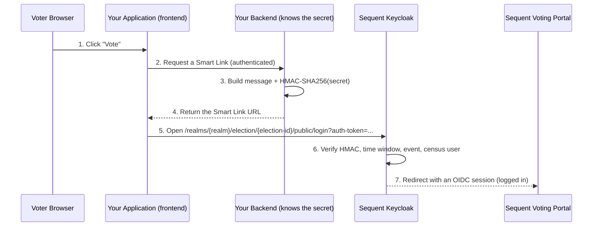

<!--
SPDX-FileCopyrightText: 2025 Sequent Tech <legal@sequentech.io>
SPDX-License-Identifier: AGPL-3.0-only
-->

# Smart Link SSO Integration Guide

## Overview

This guide is for **election managers and third-party organizations** who want
to send voters that are already authenticated in their own system straight into
a Sequent election, without asking them to log in again.

Smart Link is a Single Sign-On (SSO) mechanism based on a keyed
[HMAC](https://en.wikipedia.org/wiki/HMAC) authentication token. Your backend
mints a short-lived token, signed with a secret shared only between your servers
and Sequent, and the voter follows a link that carries that token. Sequent
verifies the token and logs the voter in.

:::note Other SSO methods
Sequent also supports SAML 2.0 IdP-initiated SSO and OpenID Connect. See the
[IdP-Initiated SSO Integration](./idp_initiated_sso_integration_guide.md) guide
if you already run a SAML identity provider.
:::

### Authentication, not authorization

Your external application performs **authentication** (it decides _who_ the voter
is). Sequent performs **authorization** (it decides whether that voter is _allowed_
to vote, by matching them against the election census). This means the voter must
already exist in the election census in Sequent; the Smart Link does not, by
default, create voters.

## How it works



The single voter interaction (clicking "Vote") triggers a token to be minted in
**your backend** and verified inside **Sequent's Keycloak**, which then drops the
voter into the voting portal already authenticated.

### Why the link points at Keycloak

In this generation of the platform, identity lives in **Keycloak**, with one
realm per election event. The shared secret, the census (the realm's users) and
the login session all live there, so that is where the token is verified. The
voting portal is just an OIDC client; it never sees the secret.

## The Smart Link URL

```
https://<keycloak-host>/realms/<realm>/election/<election-id>/public/login?auth-token=<auth-token>
```

The login route keeps the first-generation public path shape,
`/election/<election-id>/public/login`. In the second generation, the direct
Keycloak URL is also namespaced under `/realms/<realm>` because Keycloak owns
the login session. The `auth-token` parameter is byte-for-byte compatible with
first generation.

The `<realm>` is the resolved Keycloak event realm, for example
`tenant-acme-event-150017`. The `<election-id>` is the election event id parsed
from that realm name, for example `150017`.

For example, with Keycloak at `vote.university.com`, tenant `acme` and election
event `150017`, a Smart Link for the voter whose `user-id` is
`example@sequentech.io` looks like:

```
https://vote.university.com/realms/tenant-acme-event-150017/election/150017/public/login?auth-token=
khmac:///sha-256;89034fa3af76759f6edc658260afb30106c243fe86b60b652f714
73fecbb8c4e/example@sequentech.io:AuthEvent:150017:vote:1780869273
```

The direct URL has a Keycloak realm prefix because Keycloak now owns the login
session. The public login segment and the `auth-token` itself — its envelope,
message and HMAC — match first generation, so existing token generators only
need to point at the new host/path and use the second-generation election event
id in both the `/election/...` path and the token message.

### Differences from first generation

The Smart Link token itself stays first-generation-compatible, but the runtime is
now Keycloak:

- The direct URL is namespaced under `/realms/<realm>`. A root URL such as
  `/election/<election-id>/public/login` requires a reverse-proxy rule.
- The public election id is the election event id parsed from the Keycloak event
  realm name, not a separate realm attribute.
- Second generation rejects tokens minted too far in the future, using
  `smart-link-clock-skew-secs` as tolerance.
- Extra-field checks are limited to `email`, `tlf` and exact text user
  attributes. First-generation required-field types such as `password`,
  `otp-code`, `captcha`, `image` and `dict` are not implemented here.
- This endpoint authenticates the voter into Keycloak and then the voting portal.
  First-generation IAM-specific checks such as parent-election and vote-count
  checks are not performed by this endpoint.
- Errors are HTTP-oriented: disabled or misconfigured realms return `404`, and
  authentication failures return a generic `401`.

:::note URI encoding
The `auth-token` is a URL query parameter and must be URI-encoded. In a browser
use
[`encodeURIComponent()`](https://developer.mozilla.org/en-US/docs/Web/JavaScript/Reference/Global_Objects/encodeURIComponent);
for manual testing, [urlencoder.org](https://www.urlencoder.org/) works. We
**strongly recommend always** encoding it, even if your current ids look safe.
:::

## The `auth-token` format

```
khmac:///sha-256;<code>/<message>
```

The `<code>` is the lowercase-hex HMAC-SHA256 of `<message>` keyed with the
shared secret, per
[FIPS 198-1](https://csrc.nist.gov/publications/detail/fips/198/1/final).

### The message format

```
<user-id: String>:AuthEvent:<election-id: String>:vote:<timestamp: Int>
```

For example:

```
example@sequentech.io:AuthEvent:150017:vote:1780869273
```

- **user-id** — a unique identifier of the voter, matched against the census.
  It must be **stable** for a given voter and election (so re-votes map to the
  same person), and must exist in the census. To avoid leaking real identifiers,
  it is good practice to use a salted SHA-256 hash of your internal id, with a
  per-election salt. It must not contain `:`, because that character separates
  the signed message fields.
- **AuthEvent** / **vote** — fixed literals identifying the permission being
  granted. They must appear exactly as shown.
- **election-id** — binds the token to one Smart Link election event. It must
  equal the `/election/<election-id>/...` path segment and the election event id
  parsed from the Keycloak event realm name.
- **timestamp** — the Unix timestamp, in seconds, at which the token was minted:
  an integer count of seconds since `1970-01-01 00:00:00 UTC`. Do not send a
  local date/time string. It is what lets Sequent expire the token and reject
  future-dated ones, so the clocks of your backend and Sequent must be
  reasonably in sync.

### Generating the token

In any language with an HMAC library:

```python
import hmac, hashlib, time, urllib.parse

def build_smart_link(keycloak_host, tenant, event_id, user_id, secret):
    realm = f"tenant-{tenant}-event-{event_id}"
    message = f"{user_id}:AuthEvent:{event_id}:vote:{int(time.time())}"
    code = hmac.new(secret.encode(), message.encode(), hashlib.sha256).hexdigest()
    token = f"khmac:///sha-256;{code}/{message}"
    election_path = urllib.parse.quote(event_id, safe='')
    return (f"https://{keycloak_host}/realms/{realm}/election/{election_path}/public/login"
            f"?auth-token={urllib.parse.quote(token, safe='')}")
```

### Required extra attributes

Some elections require extra census fields to match before the voter is logged
in. These fields are configured by Sequent with
`smart-link-required-attributes`, a comma-separated list such as:

```
email,tlf,student_id
```

When configured, your Smart Link URL must include the same names as additional
query parameters. They are **not** added to the HMAC message; the `auth-token`
format stays exactly the same as first generation.

```
https://<keycloak-host>/realms/<realm>/election/<election-id>/public/login
  ?auth-token=<auth-token>
  &email=example%40sequentech.io
  &tlf=%2B34600111222
  &student_id=12345
```

Supported second-generation attribute checks are:

| Required attribute | Check |
| --- | --- |
| `email` | Compared with the Keycloak user's email, case-insensitively and ignoring spaces. |
| `tlf` | Compared with the Keycloak user's mobile phone attribute, `sequent.read-only.mobile-number`, ignoring whitespace. |
| any other name | Compared exactly with the Keycloak user attribute of the same name. |

Note that required attributes are plain query parameters: they are **not**
covered by the token's HMAC signature. They act as an additional knowledge
check against the census user, not as integrity-protected data.

Unsupported first-generation field types such as `password`, `otp-code`,
`captcha`, `image` and `dict` are not part of Smart Link HMAC authentication in
this generation.

Or, equivalently, with the shell:

```bash
M="example@sequentech.io:AuthEvent:150017:vote:$(date +%s)"
CODE=$(printf '%s' "$M" | openssl dgst -sha256 -hmac "the cake is in the oven" -r | cut -d' ' -f1)
echo "khmac:///sha-256;$CODE/$M"
```

## Configuration in Sequent

### Enabling Smart Link

Smart Link is enabled per election event realm. An election manager configures
it via the election event settings (which call the `update-realm-attributes`
admin endpoint). The feature is off unless `smart-link-enabled` is explicitly
set to `true`.

The shared secret is also stored as a **realm attribute** on the election event's
realm. It is set per election event, so each event can have its own secret. The
attribute keys are:

| Attribute | Meaning | Default |
| --- | --- | --- |
| `smart-link-enabled` | Enables the HMAC Smart Link endpoint for this realm. | `false` |
| `smart-link-shared-secret` | The HMAC key. Required when Smart Link is enabled. | _(unset)_ |
| `smart-link-timeout-secs` | How long a token stays valid after its timestamp. Must be positive. | `90` |
| `smart-link-clock-skew-secs` | Tolerance for tokens slightly ahead of Sequent's clock. Must be positive. | `5` |
| `smart-link-client-id` | OIDC client the voter lands in. | `voting-portal` |
| `smart-link-required-attributes` | Comma-separated extra attributes that must match the census user. | _(empty)_ |

If `smart-link-enabled` is unset or `false`, the endpoint returns `404`. If it
is `true` but `smart-link-shared-secret` is unset, the endpoint also returns
`404` and Sequent will treat the realm as misconfigured. If
`smart-link-timeout-secs` or `smart-link-clock-skew-secs` is configured as `0`,
negative or non-numeric, the endpoint also returns `404` and logs the
misconfiguration.

### The census

Because Sequent does authorization, **the voter's `user-id` must be in the census**
(the realm's users) before they follow the link. Upload the census as usual. A
Smart Link for an unknown `user-id` simply fails authentication.

If `smart-link-required-attributes` is configured, the corresponding values must
also be present on the census user. For example, `student_id` must be a Keycloak
user attribute, while `email` and `tlf` use the special checks described above.

## Security considerations

- **Mint in the backend, never in the browser.** The shared secret must never
  reach the voter's device, so the token must be generated server-side over an
  authenticated, TLS-protected request.
- **Tokens are bearer tokens.** Anyone who obtains the link can use it until it
  expires, so keep links out of logs, analytics and referrers, and keep the
  validity window short (the 90 s default is recommended).
- **Mint at click time.** Do not pre-generate links; generate one when the voter
  acts, so it is consumed well within its validity window.
- **Treat required attributes as login data.** Required attributes are URL query
  parameters that are not covered by the HMAC signature, so avoid adding more
  personal data than the election needs (it can end up in access logs and
  browser history), and keep the token lifetime short.
- **Keep clocks in sync.** Sequent rejects both expired tokens and tokens minted
  in the future (beyond `smart-link-clock-skew-secs`), so use NTP on both sides.
- **Errors are deliberately vague.** Disabled or misconfigured realms return
  `404`. Once Smart Link is enabled and configured, token and login failures
  return the same generic message, to avoid revealing which check failed.
  Diagnose using the Keycloak server logs, which record the specific reason.

## Testing manually

You can exercise the endpoint without your application:

1. Configure `smart-link-enabled=true` and `smart-link-shared-secret` on the
   event realm, then add a test voter to the census.
2. Build a token with the snippet above (using the current `date +%s`).
3. Open the resulting URL in a browser — you should be redirected into the
   voting portal, logged in and ready to cast a vote.

When required attributes are configured, append them as ordinary query
parameters after the encoded `auth-token`, as shown above. They are checked
after the HMAC validates and are not part of the signed message.

If it fails, check the Keycloak logs for a line like
`SmartLink HMAC rejected: error=TOKEN_EXPIRED ...`, which names the exact reason.
