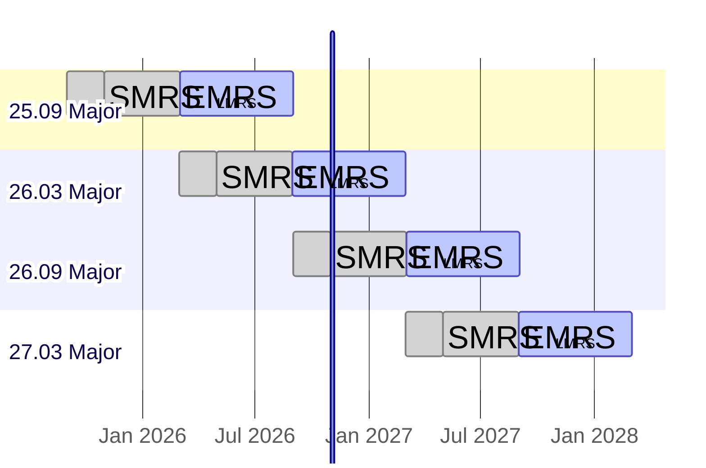
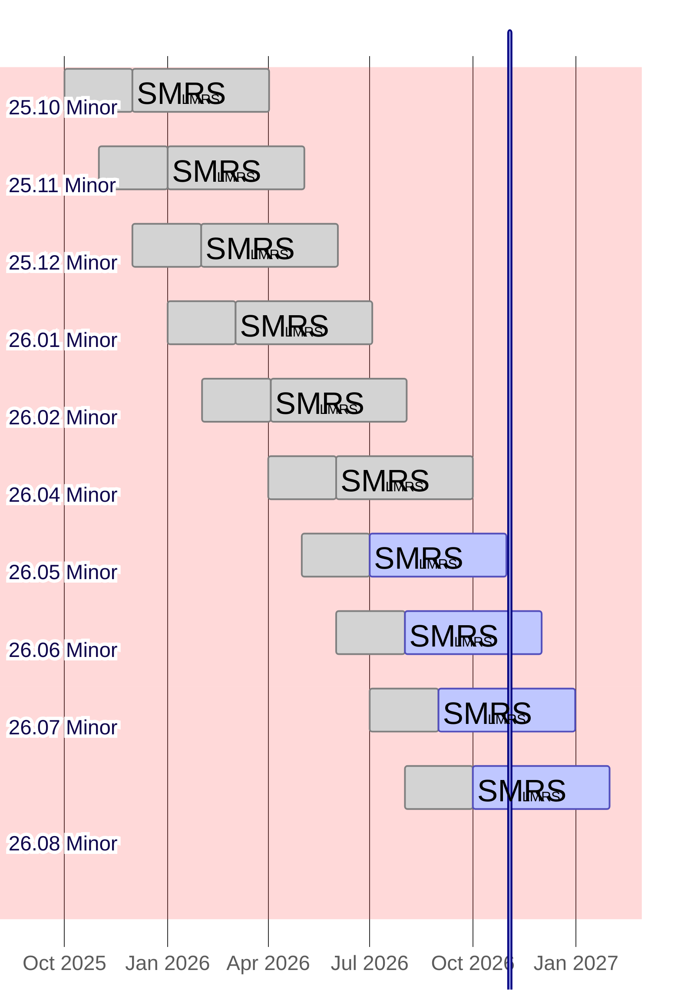
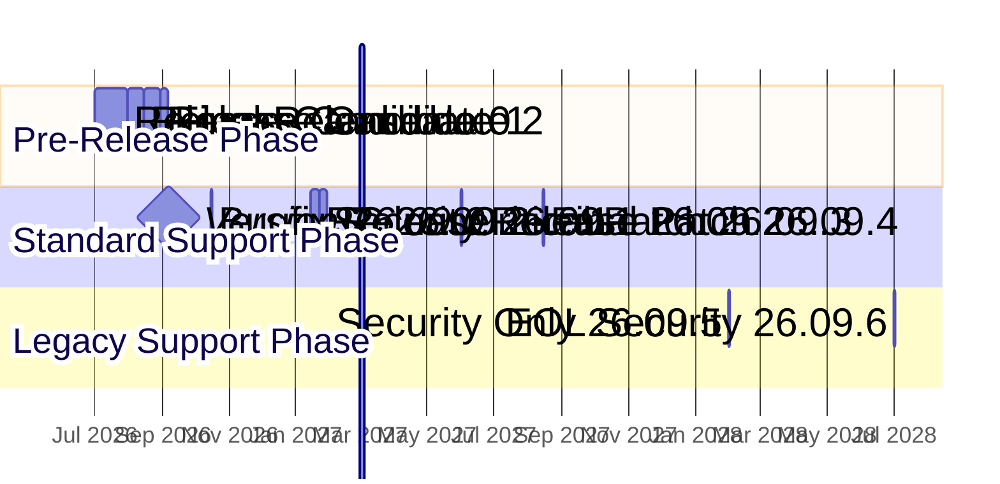
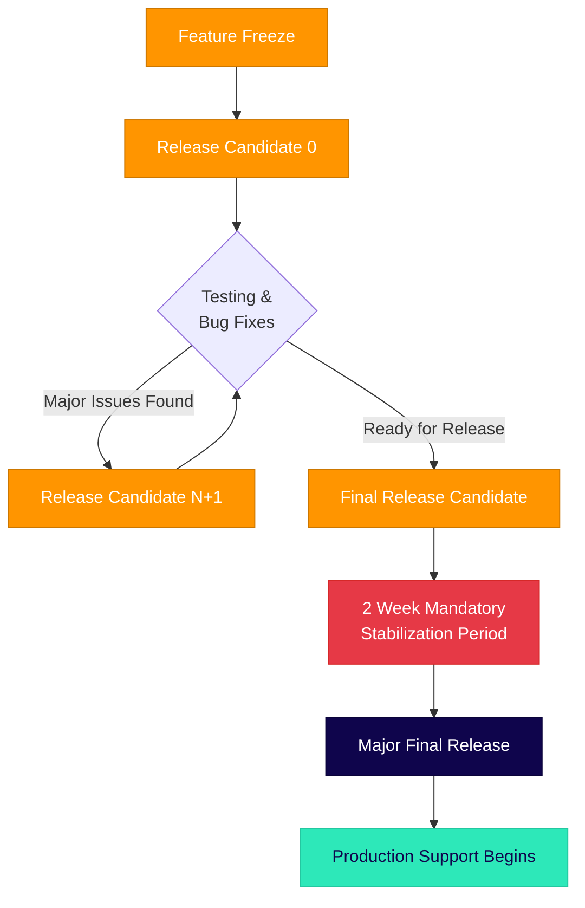

# Sequent Voting Platform (SVP) Product Lifecycle and Release Cadence

The Sequent Voting Platform follows a predictable release cadence designed to
provide stability for enterprise deployments while enabling continuous
innovation and security updates.

## Release Philosophy

SVP uses **YY.MM versioning** format for all releases:
- **YY**: Two-digit year (e.g., 25 for 2025)
- **MM**: Two-digit month (e.g., 09 for September)
- **PATCH**: Patch number for bug fixes and security updates (e.g., 25.09.1)

Major releases may contain breaking changes or significant architectural updates, while Minor releases are backward compatible feature additions. All releases follow the same YY.MM numbering scheme, with the release type determined by the release month and cadence.

## Release Types

### Major Releases

Major releases are enterprise-grade releases designed for production environments
requiring maximum stability and extended support. **Major releases may contain breaking changes** that require careful migration planning and testing.

- **Cadence**: Every 6 months (March and September)
- **Numbering**: YY.MM format (e.g., 25.09 for September 2025)
- **Breaking Changes**: May include API changes, database schema updates, or architectural modifications
- **Standard Major Release Support (SMRS)**: 2 months from release date
- **Extended Major Release Support (EMRS)**: Additional 4 months after standard support ends
- **Legacy Major Release Support (LMRS)**: Additional 6 months after extended support ends
- **Total Major Release Lifecycle**: 12 months (1 year)
- **Currently Supported Major Releases**: None
- **Next Major Release**: Version 25.09 (September 1st, 2025)

### Minor Releases

Minor releases provide the latest features and improvements for development
and testing environments, and can be also in special cases where a feature is
required in a short period of time. **Minor releases are backward compatible** and do not contain breaking changes.

- **Cadence**: Monthly releases
- **Numbering**: YY.MM format (e.g., 25.08 for August 2025)
- **Backward Compatibility**: All changes are backward compatible
- **Standard Minor Release Support (SMRS)**: 2 months from release date
- **Legacy Minor Release Support (LMRS)**: Additional 4 months after standard
  support ends
- **Total Minor Release Lifecycle**: 6 months
- **Currently Supported Minor Releases**: None
- **Next Minor Release**: Version 25.08 (August 1st, 2025)

## Release Schedule Table

| Version    | Release Date | Release Type | Standard Support Until | Extended Support Until | Legacy Support Until | Total Support |
|------------|-------------|---------|-----------------------|------------------------|---------------------|---------------|
| 25.08      | Aug 1, 2025 | Minor   | Oct 1, 2025           | -                      | Feb 1, 2026         | 6 months      |
| **25.09**  | Sep 1, 2025 | **Major** | Nov 1, 2025           | Mar 1, 2026            | Sep 1, 2026         | **12 months** |
| 25.10      | Oct 1, 2025 | Minor   | Dec 1, 2025           | -                      | Apr 1, 2026         | 6 months      |
| 25.11      | Nov 1, 2025 | Minor   | Jan 1, 2026           | -                      | May 1, 2026         | 6 months      |
| 25.12      | Dec 1, 2025 | Minor   | Feb 1, 2026           | -                      | Jun 1, 2026         | 6 months      |
| 26.01      | Jan 1, 2026 | Minor   | Mar 1, 2026           | -                      | Jul 1, 2026         | 6 months      |
| 26.02      | Feb 1, 2026 | Minor   | Apr 1, 2026           | -                      | Aug 1, 2026         | 6 months      |
| **26.03**  | Mar 1, 2026 | **Major** | May 1, 2026           | Sep 1, 2026            | Mar 1, 2027         | **12 months** |
| 26.04      | Apr 1, 2026 | Minor   | Jun 1, 2026           | -                      | Oct 1, 2026         | 6 months      |
| 26.05      | May 1, 2026 | Minor   | Jul 1, 2026           | -                      | Nov 1, 2026         | 6 months      |
| 26.06      | Jun 1, 2026 | Minor   | Aug 1, 2026           | -                      | Dec 1, 2026         | 6 months      |
| 26.07      | Jul 1, 2026 | Minor   | Sep 1, 2026           | -                      | Jan 1, 2027         | 6 months      |
| 26.08      | Aug 1, 2026 | Minor   | Oct 1, 2026           | -                      | Feb 1, 2027         | 6 months      |
| **26.09**  | Sep 1, 2026 | **Major** | Nov 1, 2026           | Mar 1, 2027            | Sep 1, 2027         | **12 months** |
| 26.10      | Oct 1, 2026 | Minor   | Dec 1, 2026           | -                      | Apr 1, 2027         | 6 months      |
| 26.11      | Nov 1, 2026 | Minor   | Jan 1, 2027           | -                      | May 1, 2027         | 6 months      |
| 26.12      | Dec 1, 2026 | Minor   | Feb 1, 2027           | -                      | Jun 1, 2027         | 6 months      |
| 27.01      | Jan 1, 2027 | Minor   | Mar 1, 2027           | -                      | Jul 1, 2027         | 6 months      |
| 27.02      | Feb 1, 2027 | Minor   | Apr 1, 2027           | -                      | Aug 1, 2027         | 6 months      |
| **27.03**  | Mar 1, 2027 | **Major** | May 1, 2027           | Sep 1, 2027            | Mar 1, 2028         | **12 months** |

## Support Levels

### Standard Support (SMRS)

- Security patches and critical bug fixes
- Technical support through official channels
- Documentation updates
- Community support

### Extended Support (EMRS)

*Available for Major releases only*

- Security patches and critical bug fixes
- Limited technical support through official channels
- Priority migration assistance to newer Major versions
- Extended maintenance for enterprise customers

### Legacy Support (LMRS)

- Critical security patches only
- Limited technical support
- Extended maintenance for enterprise customers
- Migration assistance to newer versions

## Release Timeline Visualization

## Support Lifecycle Visualization
### Major Release Support Timeline

In the example shown in the diagram (with `Current date` set to November 1,
2026):
- **Version 25.09 Major** (released September 1, 2025, section in yellow background): Currently in **Legacy Major Release Support** phase, having completed both its 2-month standard support and 4-month extended support periods. Legacy support continues until September 1, 2026.
- **Version 26.03 Major** (released March 1, 2026, section in blue background): Currently in **Extended Major Release Support** phase, having completed its 2-month standard support period in May 2026. Extended support continues until September 1, 2026, followed by legacy support until March 1, 2027.
- **Version 26.09 Major** (released September 1, 2026, section in blue background): Recently released and in **Standard Major Release Support** phase, with full support continuing until November 1, 2026, then extended support until March 1, 2027.
- **Version 27.03 Major** (release scheduled for March 1, 2027, section in white background): Future release shown with reduced opacity, representing the planned next Major version.

The diagram illustrates the overlapping support windows that provide enterprise
customers with migration flexibility. The three-tier support model (Standard → Extended → Legacy) allows organizations multiple opportunities to plan and execute upgrades between Major versions, with a total of 12 months of support coverage for each Major release.

### Minor Release Support Timeline

In the example shown in the diagram (with `Current date` set to November 1, 2026):

**Versions Out of Support** (sections in red background):
- **Versions 25.10 through 26.02**: These minor releases have completed both their 2-month standard support and 4-month legacy support phases. No security patches or support are provided for these versions.
- **Version 26.04** (released April 1, 2026): Both standard and legacy support phases completed by October 1, 2026.

**Versions Under Legacy Support Only** (sections in yellow background):
- **Version 26.05** (released May 1, 2026): Standard support ended July 1, 2026. Currently receiving only critical security patches through Legacy Minor Release Support (LMRS) until November 1, 2026.
- **Version 26.06** (released June 1, 2026): Standard support ended August 1, 2026. Currently in LMRS phase until December 1, 2026.
- **Version 26.07** (released July 1, 2026): Standard support ended September 1, 2026. Currently in LMRS phase until January 1, 2027.

**Versions Under Standard Support** (sections in blue background):
- **Version 26.08** (released August 1, 2026): Currently receiving full standard support until October 1, 2026, then legacy support until February 1, 2027.

The minor release model provides a much shorter support lifecycle compared to Major releases, with rapid iteration and feature updates. Development teams typically use these releases for testing new features before they're incorporated into the next Major release. The shorter 6-month support windows encourage frequent updates and prevent organizations from becoming dependent on outdated minor releases for production environments.

**Legend:**
- 🔵 **Blue bars** = Future releases (not yet released)
- 🟢 **Green bars** = Currently under support  
- 🔴 **Red bars** = Out of support
- 🟡 **Yellow bars** = Legacy support (LMRS)
- ⚫ **Black markers** = Release dates
- 🟢 **Green vertical line** = Current date (July 9, 2025)

## Feature Release Process

Each feature release follows this schedule:

1. **Feature Freeze**: 1 month before release date
2. **Beta Release**: 2 weeks before release date  
3. **Release Candidate**: 1 week before release date
4. **Final Release**: On scheduled date

## Security and Patch Updates

- **Security patches**: Released as needed for all supported versions
- **Regular patches**: Bi-weekly review cycle for dependencies
- **Emergency patches**: Released within 24-48 hours for critical security issues

## Enterprise Support

## Enterprise Support

All support levels are for enterprise customers. Free community support is
available via GitHub tickets and our Discord channel, with no SLA guarantees.

Enterprise customers receive:
- Priority support during standard support period
- Standard and Legacy support options
- Migration assistance between major versions
- Custom support agreements for extended lifecycles
- Dedicated support channels

## Recommendations

### For Production Environments
- Use **Major releases** for maximum stability
- Plan upgrades during the 6-month overlap between Major versions
- Subscribe to security update notifications

### For Development and Testing
- Use **Minor releases** for latest features
- Test on Minor releases before deploying to Major in production
- Maintain separate environments for different release tracks

### Migration Strategy
- Begin testing new Major releases during the Extended Support phase of your current Major (4-6 months after release)
- Use the overlapping Standard and Extended Support periods for gradual migration
- Consider Legacy Major Release Support for additional migration time if needed
- Plan for more frequent updates when using Minor releases due to their shorter 6-month lifecycle

---

*This release schedule is subject to change based on security requirements,
critical bug fixes, or significant architectural updates. Any changes will be
communicated at least 60 days in advance.*

## Minor Version Release Lifecycle

Each minor version follows a structured release process that includes
pre-releases, the final release, and subsequent patch releases during its
support lifecycle. This section illustrates the complete lifecycle of a single
minor version from initial development to end of support.

### Version 26.09.x Series Release Timeline (Example)

### Release Details Table (Example)

| Release | Release Date | Type | Purpose & Rationale |
|---------|-------------|------|-------------------|
| **26.09.0-rc.0** | Jul 1, 2026 | Release Candidate | Initial release candidate for community testing. Major features freeze completed. Focus on stability testing and performance validation. |
| **26.09.0-rc.1** | Aug 1, 2026 | Release Candidate | Second release candidate addressing critical bugs found in rc.0. Database migration optimizations and API refinements. |
| **26.09.0-rc.2** | Aug 15, 2026 | Release Candidate | Third release candidate for final testing. Documentation finalization and UI/UX polish. Performance benchmarking completed. |
| **26.09.0** | Sep 1, 2026 | **Major Final** | **Official Major release**. All quality gates passed. Production-ready with full documentation, security audit completed. |
| **26.09.1** | Oct 15, 2026 | Bugfix Patch | Address non-critical bugs reported in production: memory leak in vote processing, timezone handling issues, minor UI inconsistencies. |
| **26.09.2-rc.1** | Jan 15, 2027 | Pre-release | Release candidate for upcoming security patch. Testing compatibility with new authentication systems and database performance improvements. |
| **26.09.2** | Jan 22, 2027 | Security Patch | **Critical security update**: Fix for privilege escalation vulnerability (CVE-2027-0234), updated cryptographic libraries, enhanced input validation. |
| **26.09.3** | Jun 1, 2027 | Critical Patch | Emergency fix for vote tallying algorithm edge case discovered in large-scale elections. Includes performance optimizations for high-concurrency scenarios. |
| **26.09.4** | Aug 15, 2027 | Final Standard Patch | Last scheduled patch during standard support. Includes final compatibility updates, documentation improvements, and minor stability enhancements. |
| **26.09.5** | Feb 1, 2028 | Legacy Security | **Legacy support phase**: Security-only patch addressing newly discovered authentication bypass vulnerability. Limited support scope. |
| **26.09.6** | Jul 1, 2028 | End-of-Life Security | **Final security patch** before end-of-life. Critical security fix for zero-day vulnerability. End of support announced for Sep 1, 2028. |

### Release Process Timeline

Before diving into a specific example, it's important to understand the conceptual framework that governs all minor version releases. This process ensures quality, stability, and predictable timing for enterprise customers.

#### Mandatory Release Process Flow

#### Timing Requirements

| Phase | Duration | Description | Mandatory Wait |
|-------|----------|-------------|----------------|
| **Feature Freeze to RC.0** | 2-4 weeks | Code stabilization, initial testing | No mandatory wait |
| **Between Release Candidates** | 1-2 weeks | Bug fixes, regression testing | Minimum 1 week |
| **Final RC to Major Release** | **2 weeks** | **Mandatory stabilization period** | **Exactly 2 weeks** |
| **Post-Release Monitoring** | 2-4 weeks | Production stability validation | N/A |

#### Critical Rules

1. **Mandatory 2-Week Period**: There must be exactly 2 weeks between the final release candidate and the Major release. This is non-negotiable and allows for:
   - Final security audits
   - Documentation review and finalization
   - Community feedback integration
   - Infrastructure preparation for release

2. **Release Candidate Progression**: Each release candidate must be available for at least 1 week before the next RC or final release.

3. **No Direct-to-Production**: All Major releases must go through at least one release candidate phase.

4. **Emergency Exception Process**: In case of critical security vulnerabilities, the 2-week period may be shortened to 1 week with explicit approval from the security team and release management.

