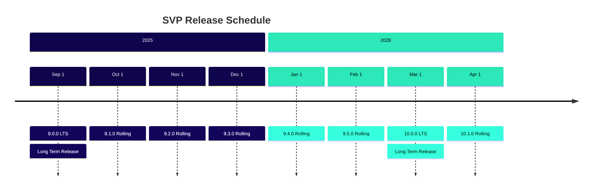
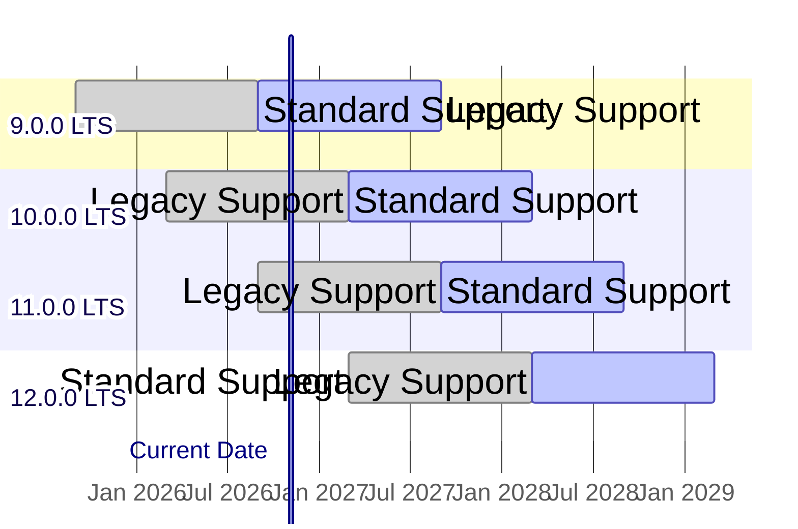
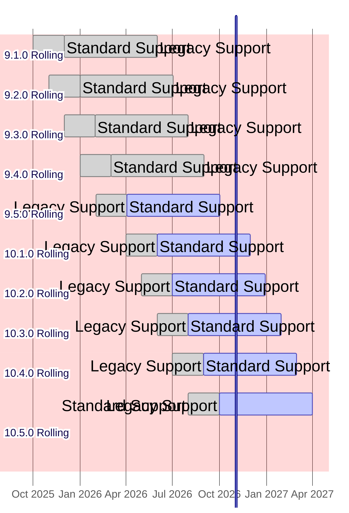
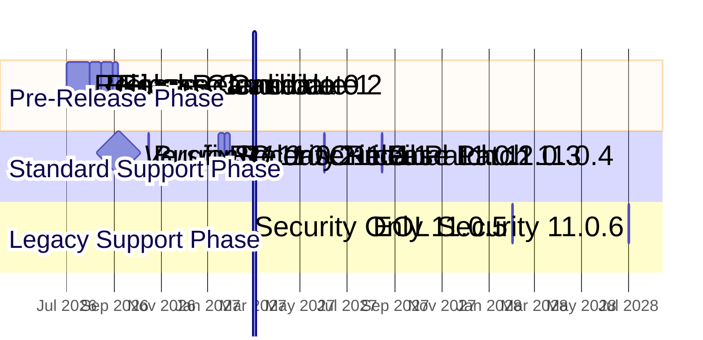
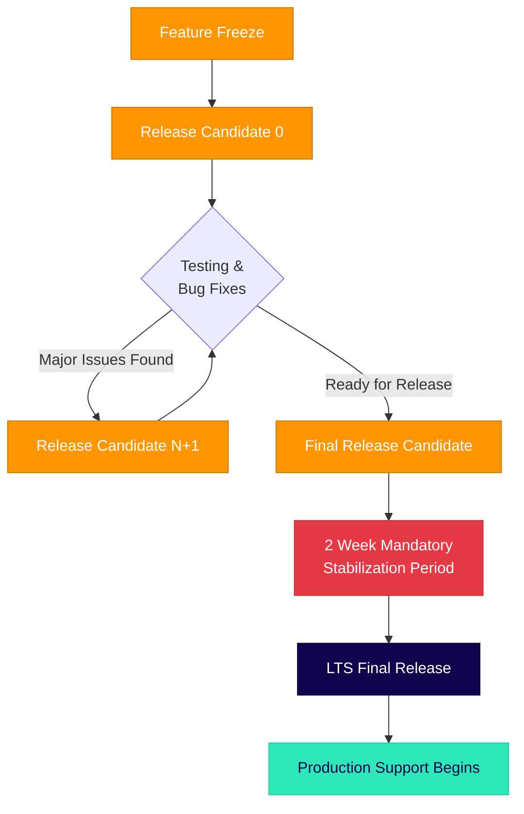
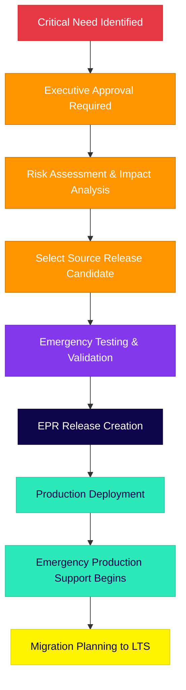
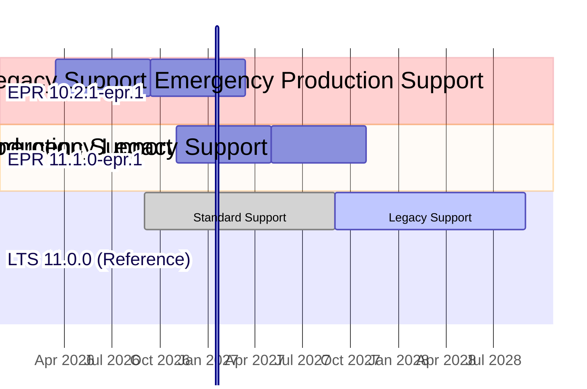

# Sequent Voting Platform (SVP) Product Lifecycle and Release Cadence

The Sequent Voting Platform follows a predictable release cadence designed to
provide stability for enterprise deployments while enabling continuous
innovation and security updates.

## Release Philosophy

SVP uses **semantic versioning** (SemVer) with the format `MAJOR.MINOR.PATCH`:
- **MAJOR**: Breaking changes or significant architectural updates
- **MINOR**: New features that are backward compatible  
- **PATCH**: Bug fixes and security updates

## Release Types

### Long Term Support (LTS) Releases

LTS releases are enterprise-grade releases designed for production environments
requiring maximum stability and extended support.

- **Cadence**: Every 6 months (March and September)
- **Standard Long Term Support (SLTS)**: 12 months from release date
- **Legacy Long Term Support (LLTS)**: Additional 12 months after standard support
  ends
- **Total LTS Lifecycle**: 24 months (2 years)
- **Currently Supported LTS Releases**: None
- **Next LTS Release**: Version 9.0.0 (September 1st, 2025)

### Rolling Releases

Rolling releases provide the latest features and improvements for development
and testing environments, and can be also in special cases where a feature is
required in a short period of time.

- **Cadence**: Monthly releases
- **Standard Rolling Release Support (SRRS)**: 2 months from release date
- **Legacy Rolling Release Support (LRRS)**: Additional 6 months after standard
  support ends
- **Total Rolling Release Lifecycle**: 8 months
- **Currently Supported Rolling Releases**: None
- **Next Rolling Release**: Version 8.5.0 (August 1st, 2025)

### Emergency Production Releases (EPR)

Emergency Production Releases are exceptional releases created for critical production deployments when standard release schedules cannot accommodate urgent requirements, typically for major elections or high-profile voting events.

- **Trigger**: Critical client requirements, major election events, or urgent security needs
- **Source**: Release candidates from upcoming LTS or rolling releases
- **Approval**: Requires executive approval and risk assessment
- **Emergency Production Support (EPS)**: 6 months from release date with full support scope
- **Post-Emergency Legacy Support (PELS)**: Additional 6 months with security-only support
- **Total EPR Lifecycle**: 12 months

**Important Notes:**
- EPRs are based on existing release candidates, not new development
- They receive the same support level as LTS releases during their EPS phase
- Migration path to the next planned LTS release is provided
- Usage is tracked and reported for future planning

## Release Schedule Table

| Version    | Release Date | Release Type | Standard Support Until | Legacy Support Until | Total Support |
|------------|-------------|---------|-----------------------|---------------------|---------------|
| 8.5.0      | Aug 1, 2025 | Rolling | Oct 1, 2025           | Apr 1, 2026         | 8 months      |
| **9.0.0**  | Sep 1, 2025 | **LTS** | Sep 1, 2026           | Sep 1, 2027         | **24 months** |
| 9.1.0      | Oct 1, 2025 | Rolling | Dec 1, 2025           | Jun 1, 2026         | 8 months      |
| 9.2.0      | Nov 1, 2025 | Rolling | Jan 1, 2026           | Jul 1, 2026         | 8 months      |
| 9.3.0      | Dec 1, 2025 | Rolling | Feb 1, 2026           | Aug 1, 2026         | 8 months      |
| 9.4.0      | Jan 1, 2026 | Rolling | Mar 1, 2026           | Sep 1, 2026         | 8 months      |
| 9.5.0      | Feb 1, 2026 | Rolling | Apr 1, 2026           | Oct 1, 2026         | 8 months      |
| **10.0.0** | Mar 1, 2026 | **LTS** | Mar 1, 2027           | Mar 1, 2028         | **24 months** |
| 10.1.0     | Apr 1, 2026 | Rolling | Jun 1, 2026           | Dec 1, 2026         | 8 months      |
| 10.2.0     | May 1, 2026 | Rolling | Jul 1, 2026           | Jan 1, 2027         | 8 months      |
| 10.3.0     | Jun 1, 2026 | Rolling | Aug 1, 2026           | Feb 1, 2027         | 8 months      |
| 10.4.0     | Jul 1, 2026 | Rolling | Sep 1, 2026           | Mar 1, 2027         | 8 months      |
| 10.5.0     | Aug 1, 2026 | Rolling | Oct 1, 2026           | Apr 1, 2027         | 8 months      |
| **11.0.0** | Sep 1, 2026 | **LTS** | Sep 1, 2027           | Sep 1, 2028         | **24 months** |
| 11.1.0     | Oct 1, 2026 | Rolling | Dec 1, 2026           | Jun 1, 2027         | 8 months      |
| 11.2.0     | Nov 1, 2026 | Rolling | Jan 1, 2027           | Jul 1, 2027         | 8 months      |
| 11.3.0     | Dec 1, 2026 | Rolling | Feb 1, 2027           | Aug 1, 2027         | 8 months      |
| 11.4.0     | Jan 1, 2027 | Rolling | Mar 1, 2027           | Sep 1, 2027         | 8 months      |
| 11.5.0     | Feb 1, 2027 | Rolling | Apr 1, 2027           | Oct 1, 2027         | 8 months      |
| **12.0.0** | Mar 1, 2027 | **LTS** | Mar 1, 2028           | Mar 1, 2029         | **24 months** |

## Support Levels

### Standard Support (SLTS, SRRS, EPS)

- Security patches and critical bug fixes
- Technical support through official channels
- Documentation updates
- Community support

### Legacy Support (LLTS, LRRS, PELS)

- Critical security patches only
- Limited technical support
- Extended maintenance for enterprise customers
- Migration assistance to newer versions

### Emergency Production Support (EPS)

- **Full production-grade support** equivalent to LTS standard support
- **Priority technical support** with dedicated channels
- **Accelerated patch delivery** within 24-48 hours for critical issues
- **Migration planning assistance** to transition to next planned LTS
- **Risk monitoring and reporting** throughout the emergency support period

## Release Timeline Visualization

## Support Lifecycle Visualization
### LTS Release Support Timeline

In the example shown in the diagram (with `Current date` set to November 1,
2026):
- **Version 9.0.0 LTS** (released September 1, 2025, section in yellow background): Currently in **Legacy LTS Support** phase, having completed its 12-month standard support period. Legacy support continues until September 1, 2027.
- **Version 10.0.0 LTS** (released March 1, 2026, section in blue background): Currently in **Standard LTS Support** phase, receiving full security patches, bug fixes, and technical support until March 1, 2027.
- **Version 11.0.0 LTS** (released September 1, 2026, section in blue background): Recently released and in **Standard LTS Support** phase, with full support continuing until September 1, 2027.
- **Version 12.0.0 LTS** (release scheduled for March 1, 2027, section in white background): Future release shown with reduced opacity, representing the planned next LTS version.

The diagram illustrates the overlapping support windows that provide enterprise
customers with migration flexibility. Notice how version 10.0.0 and 11.0.0 are
both under standard support simultaneously, giving organizations a 6-month
window to plan and execute upgrades between LTS versions.

### Rolling Release Support Timeline

In the example shown in the diagram (with `Current date` set to November 1, 2026):

**Versions Out of Support** (sections in red background):
- **Versions 9.1.0 through 9.4.0**: These rolling releases have completed both their 2-month standard support and 6-month legacy support phases. No security patches or support are provided for these versions.

**Versions Under Legacy Support Only** (sections in yellow background):
- **Version 9.5.0** (released February 1, 2026): Standard support ended April 1, 2026. Currently receiving only critical security patches through Legacy Rolling Release Support (LRRS) until October 1, 2026.
- **Version 10.1.0** (released April 1, 2026): Standard support ended June 1, 2026. Currently in LRRS phase until December 1, 2026.

**Versions Under Standard Support** (sections in blue background):
- **Version 10.2.0** (released May 1, 2026): Currently receiving full standard support until January 1, 2027, then legacy support until July 1, 2027.
- **Version 10.3.0** (released June 1, 2026): Standard support active until February 1, 2027, then legacy support until August 1, 2027.
- **Version 10.4.0** (released July 1, 2026): Standard support continues until March 1, 2027, then legacy support until September 1, 2027.

**Future Release** (section in white background):
- **Version 10.5.0** (released August 1, 2026): Recently released, shown with reduced opacity as it represents the latest rolling release available.

The rolling release model provides a much shorter support lifecycle compared to LTS releases, with rapid iteration and feature updates. Development teams typically use these releases for testing new features before they're incorporated into the next LTS release. The short support windows encourage frequent updates and prevent organizations from becoming dependent on outdated rolling releases for production environments.

**Legend:**
- 🔵 **Blue bars** = Future releases (not yet released)
- 🟢 **Green bars** = Currently under support  
- 🔴 **Red bars** = Out of support
- 🟡 **Yellow bars** = Legacy support (LRRS)
- ⚫ **Black markers** = Release dates
- 🟢 **Green vertical line** = Current date (July 9, 2025)

## Feature Release Process

Each feature release follows this schedule:

1. **Feature Freeze**: 1 month before release date
2. **Beta Release**: 2 weeks before release date  
3. **Release Candidate**: 1 week before release date
4. **Final Release**: On scheduled date

## Security and Patch Updates

- **Security patches**: Released as needed for all supported versions
- **Regular patches**: Bi-weekly review cycle for dependencies
- **Emergency patches**: Released within 24-48 hours for critical security issues

## Enterprise Support

## Enterprise Support

All support levels are for enterprise customers. Free community support is
available via GitHub tickets and our Discord channel, with no SLA guarantees.

Enterprise customers receive:
- Priority support during standard support period
- Standard and Legacy support options
- Migration assistance between major versions
- Custom support agreements for extended lifecycles
- Dedicated support channels

## Recommendations

### For Production Environments
- Use **LTS releases** for maximum stability
- Plan upgrades during the 6-month overlap between LTS versions
- Subscribe to security update notifications

### For Development and Testing
- Use **Rolling releases** for latest features
- Test on rolling releases before deploying to LTS in production
- Maintain separate environments for different release tracks

### Migration Strategy
- Begin testing new LTS releases 3 months before your current LTS loses standard
  support
- Use the 6-month LTS overlap period for gradual migration
- Consider Legacy LTS Support for additional migration time if needed

---

*This release schedule is subject to change based on security requirements,
critical bug fixes, or significant architectural updates. Any changes will be
communicated at least 60 days in advance.*

## Minor Version Release Lifecycle

Each minor version follows a structured release process that includes
pre-releases, the final release, and subsequent patch releases during its
support lifecycle. This section illustrates the complete lifecycle of a single
minor version from initial development to end of support.

### Version 11.0.x Series Release Timeline (Example)

### Release Details Table (Example)

| Release | Release Date | Type | Purpose & Rationale |
|---------|-------------|------|-------------------|
| **11.0.0-rc.0** | Jul 1, 2026 | Release Candidate | Initial release candidate for community testing. Major features freeze completed. Focus on stability testing and performance validation. |
| **11.0.0-rc.1** | Aug 1, 2026 | Release Candidate | Second release candidate addressing critical bugs found in rc.0. Database migration optimizations and API refinements. |
| **11.0.0-rc.2** | Aug 15, 2026 | Release Candidate | Third release candidate for final testing. Documentation finalization and UI/UX polish. Performance benchmarking completed. |
| **11.0.0** | Sep 1, 2026 | **LTS Final** | **Official LTS release**. All quality gates passed. Production-ready with full documentation, security audit completed. |
| **11.0.1** | Oct 15, 2026 | Bugfix Patch | Address non-critical bugs reported in production: memory leak in vote processing, timezone handling issues, minor UI inconsistencies. |
| **11.0.2-rc.1** | Jan 15, 2027 | Pre-release | Release candidate for upcoming security patch. Testing compatibility with new authentication systems and database performance improvements. |
| **11.0.2** | Jan 22, 2027 | Security Patch | **Critical security update**: Fix for privilege escalation vulnerability (CVE-2027-0234), updated cryptographic libraries, enhanced input validation. |
| **11.0.3** | Jun 1, 2027 | Critical Patch | Emergency fix for vote tallying algorithm edge case discovered in large-scale elections. Includes performance optimizations for high-concurrency scenarios. |
| **11.0.4** | Aug 15, 2027 | Final Standard Patch | Last scheduled patch during standard support. Includes final compatibility updates, documentation improvements, and minor stability enhancements. |
| **11.0.5** | Feb 1, 2028 | Legacy Security | **Legacy support phase**: Security-only patch addressing newly discovered authentication bypass vulnerability. Limited support scope. |
| **11.0.6** | Jul 1, 2028 | End-of-Life Security | **Final security patch** before end-of-life. Critical security fix for zero-day vulnerability. End of support announced for Sep 1, 2028. |

### Release Process Timeline

Before diving into a specific example, it's important to understand the conceptual framework that governs all minor version releases. This process ensures quality, stability, and predictable timing for enterprise customers.

#### Mandatory Release Process Flow

#### Timing Requirements

| Phase | Duration | Description | Mandatory Wait |
|-------|----------|-------------|----------------|
| **Feature Freeze to RC.0** | 2-4 weeks | Code stabilization, initial testing | No mandatory wait |
| **Between Release Candidates** | 1-2 weeks | Bug fixes, regression testing | Minimum 1 week |
| **Final RC to LTS Release** | **2 weeks** | **Mandatory stabilization period** | **Exactly 2 weeks** |
| **Post-Release Monitoring** | 2-4 weeks | Production stability validation | N/A |

#### Critical Rules

1. **Mandatory 2-Week Period**: There must be exactly 2 weeks between the final release candidate and the LTS release. This is non-negotiable and allows for:
   - Final security audits
   - Documentation review and finalization
   - Community feedback integration
   - Infrastructure preparation for release

2. **Release Candidate Progression**: Each release candidate must be available for at least 1 week before the next RC or final release.

3. **No Direct-to-Production**: All LTS releases must go through at least one release candidate phase.

4. **Emergency Exception Process**: In case of critical security vulnerabilities, the 2-week period may be shortened to 1 week with explicit approval from the security team and release management.

## Emergency Production Releases (EPR)

In exceptional circumstances, the Sequent Voting Platform may require immediate deployment of features or fixes that cannot wait for the standard release schedule. Emergency Production Releases provide a controlled mechanism for addressing critical business needs while maintaining stability and support standards.

### When EPRs Are Used

Emergency Production Releases are reserved for situations such as:

- **Major Election Events**: Large-scale elections requiring specific features
- **Critical Client Requirements**: High-profile deployments with immovable deadlines
- **Security Emergencies**: Urgent security fixes that cannot wait for scheduled releases
- **Regulatory Compliance**: Last-minute regulatory changes requiring immediate implementation

### EPR Creation Process

### EPR Support Timeline Example

### EPR Naming Convention

Emergency Production Releases follow a specific naming pattern:
- **Format**: `{MAJOR}.{MINOR}.{PATCH}-epr.{EPR_NUMBER}`
- **Examples**:
  - `10.2.1-epr.1` - First EPR based on version 10.2.1 release candidate
  - `11.1.0-epr.1` - First EPR based on version 11.1.0 release candidate
  - `11.1.0-epr.2` - Second EPR based on version 11.1.0 (rare, requires additional approval)

### EPR Support Lifecycle

| Phase | Duration | Support Level | Description |
|-------|----------|---------------|-------------|
| **Emergency Production Support (EPS)** | 6 months | Full LTS-equivalent | Complete technical support, security patches, bug fixes, priority handling |
| **Post-Emergency Legacy Support (PELS)** | 6 months | Security-only | Critical security patches, migration assistance, limited technical support |
| **End of Life** | - | None | Support ends, migration to LTS required |

### Approval Process

1. **Business Justification**: Detailed business case with timeline constraints
2. **Technical Assessment**: Engineering review of release candidate readiness
3. **Risk Analysis**: Security and stability impact evaluation
4. **Executive Sign-off**: C-level approval for EPR creation and support commitment
5. **Client Agreement**: Formal acceptance of EPR limitations and migration timeline

### EPR Limitations and Considerations

- **No Feature Development**: EPRs are based on existing release candidates only
- **Limited Scope**: Only critical fixes and security patches during EPS phase
- **Migration Requirement**: Clients must migrate to the next LTS within 12 months
- **Cost Implications**: EPRs may incur additional support costs for enterprise clients
- **Documentation**: Reduced documentation scope compared to full LTS releases

### Migration from EPR to LTS

All EPR deployments must have a defined migration path:

1. **Migration Planning** begins immediately after EPR deployment
2. **Testing Phase** with next LTS release candidates (months 3-4)
3. **Migration Window** during months 4-6 of EPS phase
4. **Transition Support** continues through PELS phase
5. **Mandatory Migration** completed before EPR end-of-life

Emergency Production Releases provide essential flexibility for critical business needs while maintaining the integrity and predictability of the standard release process. They should be used judiciously and always with a clear path back to the standard LTS release track.