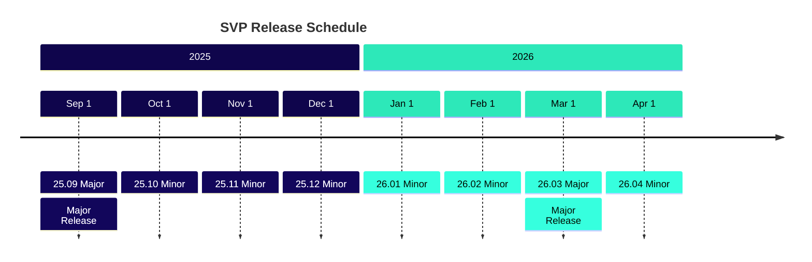
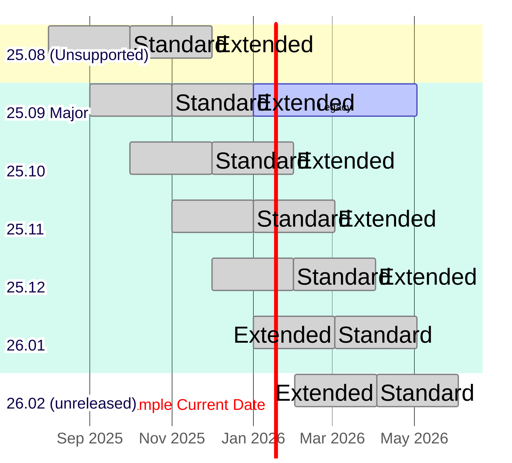
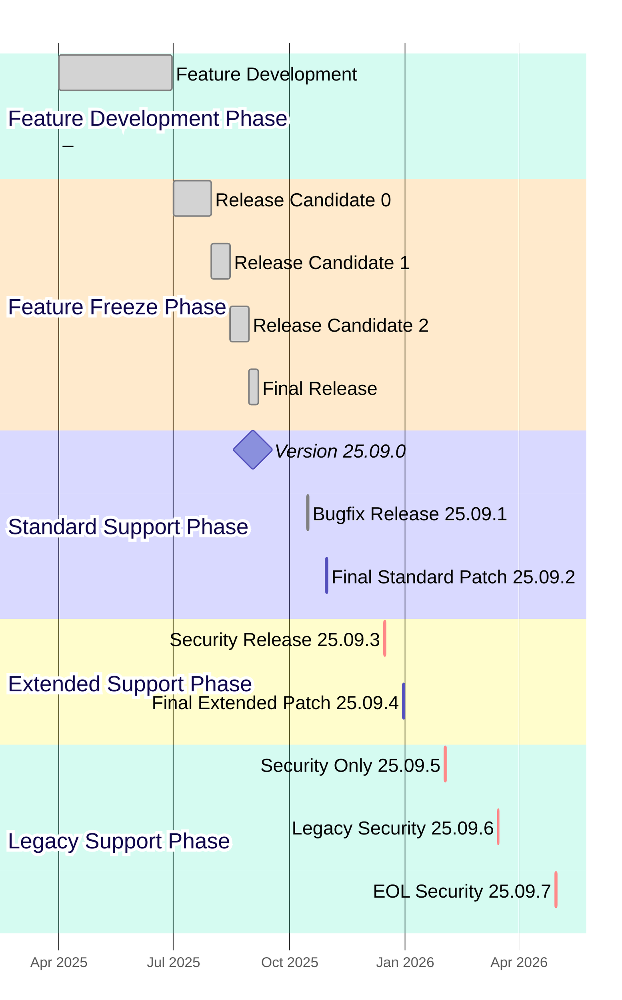
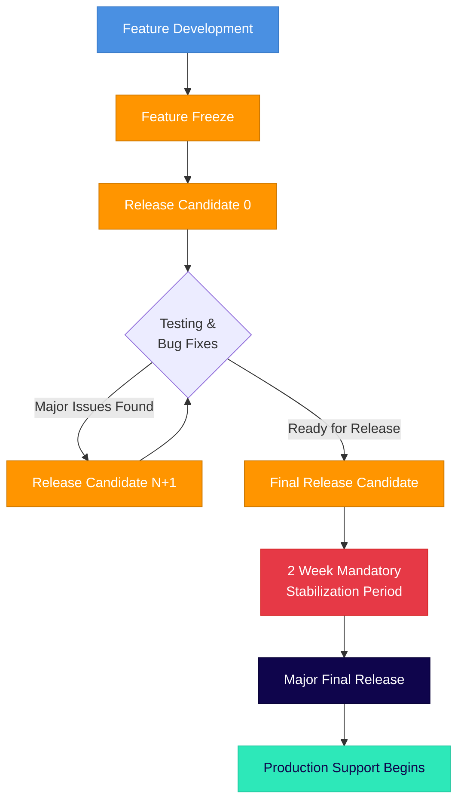

# Sequent Voting Platform (SVP) Product Lifecycle and Release Cadence

The Sequent Voting Platform follows a predictable release cadence designed to
provide stability for enterprise deployments while enabling continuous
innovation and security updates.

*This release schedule is subject to change based on security requirements,
critical bug fixes, or significant architectural updates. Any changes will be
communicated in advance to enterprise customers.*

## Release Philosophy

SVP uses **YY.MM versioning** format for all releases:
- **YY**: Two-digit year (e.g., 25 for 2025)
- **MM**: Two-digit month (e.g., 09 for September)
- **PATCH**: Patch number for bug fixes and security updates (e.g., 25.09.1)

Major releases may contain breaking changes or significant architectural
updates, while Minor releases are backward compatible feature additions. All
releases follow the same YY.MM numbering scheme, with the release type
determined by the release month and cadence.

## Release Types

### Major Releases

Major releases are enterprise-grade releases designed for production
environments requiring maximum stability and extended support. **Major releases
may contain breaking changes** that require careful migration planning and
testing.

- **Cadence**: Every 6 months (March and September)
- **Numbering**: YY.MM format (e.g., 25.09 for September 2025)
- **Breaking Changes**: May include API changes, database schema updates, or
  architectural modifications
- **Standard Release Support (SRS)**: 2 months from release date
- **Extended Release Support (ERS)**: Additional 2 months after standard support ends
- **Legacy Release Support (LRS)**: Additional 4 months after extended support ends
- **Total Major Release Lifecycle**: 8 months
- **Currently Supported Major Releases**: None
- **Next Major Release**: Version 25.09 (September 1st, 2025)

### Minor Releases

Minor releases provide the latest features and improvements for development and
testing environments, and can also be used in special cases where a feature is
required in a short period of time. **Minor releases are backward compatible**
and do not contain breaking changes.

- **Cadence**: Monthly releases
- **Numbering**: YY.MM format (e.g., 25.08 for August 2025)
- **Backward Compatibility**: All changes are backward compatible
- **Standard Release Support (SRS)**: 2 months from release date
- **Extended Release Support (ERS)**: Additional 2 months after standard
  support ends
- **Total Minor Release Lifecycle**: 4 months
- **Currently Supported Minor Releases**: None
- **Next Minor Release**: Version 25.08 (August 1st, 2025)

## Release Schedule Table

| Version    | Release Date | Release Type | Standard Support Until | Extended Support Until | Legacy Support Until | Total Support |
|------------|-------------|---------|-----------------------|------------------------|---------------------|---------------|
| 25.08      | Aug 1, 2025 | Minor   | Oct 1, 2025           | Dec 1, 2025            | -                   | 4 months      |
| **25.09**  | Sep 1, 2025 | **Major** | Nov 1, 2025           | Jan 1, 2026            | May 1, 2026         | **8 months** |
| 25.10      | Oct 1, 2025 | Minor   | Dec 1, 2025           | Feb 1, 2026            | -                   | 4 months      |
| 25.11      | Nov 1, 2025 | Minor   | Jan 1, 2026           | Mar 1, 2026            | -                   | 4 months      |
| 25.12      | Dec 1, 2025 | Minor   | Feb 1, 2026           | Apr 1, 2026            | -                   | 4 months      |
| 26.01      | Jan 1, 2026 | Minor   | Mar 1, 2026           | May 1, 2026            | -                   | 4 months      |
| 26.02      | Feb 1, 2026 | Minor   | Apr 1, 2026           | Jun 1, 2026            | -                   | 4 months      |
| **26.03**  | Mar 1, 2026 | **Major** | May 1, 2026           | Jul 1, 2026            | Nov 1, 2026         | **8 months** |
| 26.04      | Apr 1, 2026 | Minor   | Jun 1, 2026           | Aug 1, 2026            | -                   | 4 months      |
| 26.05      | May 1, 2026 | Minor   | Jul 1, 2026           | Sep 1, 2026            | -                   | 4 months      |
| 26.06      | Jun 1, 2026 | Minor   | Aug 1, 2026           | Oct 1, 2026            | -                   | 4 months      |
| 26.07      | Jul 1, 2026 | Minor   | Sep 1, 2026           | Nov 1, 2026            | -                   | 4 months      |
| 26.08      | Aug 1, 2026 | Minor   | Oct 1, 2026           | Dec 1, 2026            | -                   | 4 months      |
| **26.09**  | Sep 1, 2026 | **Major** | Nov 1, 2026           | Jan 1, 2027            | May 1, 2027         | **8 months** |
| 26.10      | Oct 1, 2026 | Minor   | Dec 1, 2026           | Feb 1, 2027            | -                   | 4 months      |
| 26.11      | Nov 1, 2026 | Minor   | Jan 1, 2027           | Mar 1, 2027            | -                   | 4 months      |
| 26.12      | Dec 1, 2026 | Minor   | Feb 1, 2027           | Apr 1, 2027            | -                   | 4 months      |
| 27.01      | Jan 1, 2027 | Minor   | Mar 1, 2027           | May 1, 2027            | -                   | 4 months      |
| 27.02      | Feb 1, 2027 | Minor   | Apr 1, 2027           | Jun 1, 2027            | -                   | 4 months      |
| **27.03**  | Mar 1, 2027 | **Major** | May 1, 2027           | Jul 1, 2027            | Nov 1, 2027         | **8 months** |

## Support Levels

### Community Support

Free community support is available via GitHub tickets and our Discord channel,
with no SLA guarantees and absolutely no warranty.

### Enterprise Support

Enterprise customers receive:
- Priority support during standard support period
- Standard, Extended and Legacy support options
- Migration assistance between major and minor versions
- Custom support agreements for extended lifecycles
- Dedicated support channels

#### Standard Support (SRS)

- Security patches and critical bug fixes
- Technical support through official channels
- Documentation updates
- Community support

#### Extended Support (ERS)

*Available for all releases*

- Security patches and critical bug fixes
- Limited technical support through official channels
- Extended maintenance for enterprise customers
- Migration assistance to newer versions

#### Legacy Support (LRS)

*Available for Major releases only*

- Security patches and critical bug fixes
- Limited technical support through official channels
- Priority migration assistance to newer Major versions
- Extended maintenance for enterprise customers

## Release Timeline Visualization

## Support Lifecycle Visualization

### Release Support Timeline

*Note: The diagram below shows an example timeline with a hypothetical current date of January 17, 2026, to illustrate how different releases would be in various support phases.*

In the example shown in the diagram (with `Example Current date` set to January 17, 2026):

**Major Releases:**
- **Version 25.09 Major** (released September 1, 2025): Currently in Legacy Release Support phase, having completed
  its 2-month standard support in November 1, 2025, and having also completed
  its 2-month extended support in January 1, 2026. Legacy support continues
  until May 1, 2026.

**Minor Releases:**
- **Version 25.08 Minor** (released August 1, 2025): End of Support - All support ended December 1, 
  2025. This release is no longer supported.
- **Version 25.10 Minor** (released October 1, 2025): Currently in Extended Release Support phase, having completed
  its 2-month standard support period. Extended support continues until February 1,
  2026.
- **Version 25.11 Minor** (released November 1, 2025): Currently in Extended Release Support phase, having completed
  its 2-month standard support period. Extended support continues until March 1,
  2026.
- **Version 25.12 Minor** (released December 1, 2025): Currently in Extended Release Support phase, having completed
  its 2-month standard support period. Extended support continues until April 1, 2026.
- **Version 26.01 Minor** (released January 1, 2026): Currently in Standard Release Support phase, with full support
  continuing until March 1, 2026, then extended support until May 1, 2026.
- **Version 26.02 Minor** (to be released February 1, 2026): Unreleased.

The diagram illustrates the overlapping support windows that provide enterprise
customers with migration flexibility. Major releases have a three-tier support
model (Standard → Extended → Legacy) with 8 months of total support coverage,
while Minor releases have a two-tier model (Standard → Extended) with 4 months
of total support coverage.

## Major & Minor Release Process

Each release follows this general schedule:

1. **Feature Development**: Active development phase (Major releases only)
2. **Feature Freeze**: 1 month before release date
3. **Release Candidate**: 1-2 weeks before release date  
4. **Final Release**: On scheduled date

## Security and Patch Updates

- **Security patches**: Released as needed for all supported versions
- **Regular patches**: Bi-weekly review cycle for dependencies
- **Emergency patches**: Released within 24-48 hours for critical security
  issues

## Version Release Lifecycle

Each major and minor version follows a structured release process that includes
pre-releases, the final release, and subsequent patch releases during its
support lifecycle. This section illustrates the complete lifecycle of a single
major version from initial development to end of support.

### Version 25.09.x Series Release Timeline (Example)

### Release Details Table (Example)

| Release | Release Date | Type | Purpose & Rationale |
|---------|-------------|------|-------------------|
| **Feature Development** | Apr 1 - Jun 30, 2025 | Development Phase | Active feature development period for Major release 25.09. New features, API enhancements, and architectural improvements. Breaking changes allowed during this phase. |
| **25.09.0-rc.0** | Jul 1, 2025 | Release Candidate | 
**Feature Freeze Phase**: Initial release candidate for community testing. Major features freeze completed. Focus on stability testing and performance validation. 

Sometimes used by customers depending on the new breaking changes and features for early testing and integration work.
 |
| **25.09.0-rc.1** | Aug 1, 2025 | Release Candidate | **Feature Freeze Phase**: Second release candidate addressing critical bugs found in rc.0. Database migration optimizations and API refinements. |
| **25.09.0-rc.2** | Aug 15, 2025 | Release Candidate | **Feature Freeze Phase**: Third release candidate for final testing. Documentation finalization and UI/UX polish. Performance benchmarking completed. |
| **25.09.0** | Sep 1, 2025 | **Major Final** | **Official Major release**. All quality gates passed. Production-ready with full documentation and often, a security audit is also completed too. |
| **25.09.1** | Oct 15, 2025 | Bugfix Patch | **Standard Support Phase**: Address non-critical bugs reported in production: memory leak in vote processing, timezone handling issues, minor UI inconsistencies. |
| **25.09.2** | Oct 30, 2025 | Final Standard Patch | **Standard Support Phase**: Last scheduled patch during standard support. Includes final compatibility updates and minor stability enhancements before transitioning to Extended Support. |
| **25.09.3** | Dec 15, 2025 | Security Patch | **Extended Support Phase**: Critical security update addressing privilege escalation vulnerability. Updated cryptographic libraries and enhanced input validation. |
| **25.09.4** | Dec 30, 2025 | Final Extended Patch | **Extended Support Phase**: Last scheduled patch during extended support. Final compatibility updates and documentation improvements before transitioning to Legacy Support. |
| **25.09.5** | Feb 1, 2026 | Legacy Security | **Legacy Support Phase**: Security-only patch addressing newly discovered authentication bypass vulnerability. Limited support scope, security patches only. |
| **25.09.6** | Mar 15, 2026 | Legacy Security | **Legacy Support Phase**: Critical security fix for zero-day vulnerability affecting authentication systems. Enterprise migration assistance provided. |
| **25.09.7** | Apr 30, 2026 | End-of-Life Security | **Legacy Support Phase**: Final security patch before end-of-life. Last critical security fix. End of support announced for May 1, 2026. |

### Release Process Timeline

Before diving into a specific example, it's important to understand the
conceptual framework that governs all major version releases. This process
ensures quality, stability, and predictable timing for enterprise customers.

#### Typical Release Process Flow

#### Timing Requirements

| Phase | Duration | Description | Mandatory Wait |
|-------|----------|-------------|----------------|
| **Feature Development** | 1-3 months | Active development, new features, breaking changes allowed | No mandatory wait |
| **Feature Freeze to RC.0** | 2-4 weeks | Code stabilization, initial testing | No mandatory wait |
| **Between Release Candidates** | 1-2 weeks | Bug fixes, regression testing | Minimum 1 week |
| **Final RC to Major Release** | **2 weeks** | **Mandatory stabilization period** | **Exactly 2 weeks** |
| **Post-Release Monitoring** | 2-4 weeks | Production stability validation | N/A |

#### Critical Rules

1. **Feature Development Phase**: During this phase, new features are actively
   developed and breaking changes are allowed. This phase typically lasts 1-3
   months depending on the scope of the Major release.

2. **Feature Freeze**: All new features must be code-complete and merged before
   the feature freeze deadline. Only bug fixes and stabilization work are
   allowed after this point.

3. **Mandatory 2-Week Period**: There must be exactly 2 weeks between the final
   release candidate and the Major release. This is non-negotiable and allows
   for:
   - Final security audits
   - Documentation review and finalization
   - Community feedback integration
   - Infrastructure preparation for release

2. **Release Candidate Progression**: Each release candidate must be available
   for at least 1 week before the next RC or final release.

3. **No Direct-to-Production**: All Major releases must go through at least one
   release candidate phase.

4. **Emergency Exception Process**: In case of critical security
   vulnerabilities, the 2-week period may be shortened to 1 week with explicit
   approval from the security team and release management.

