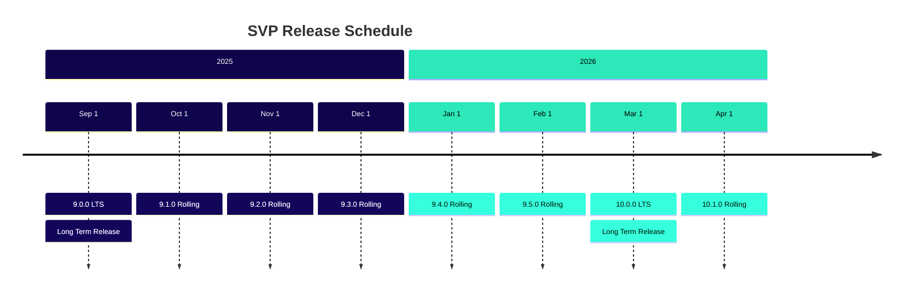
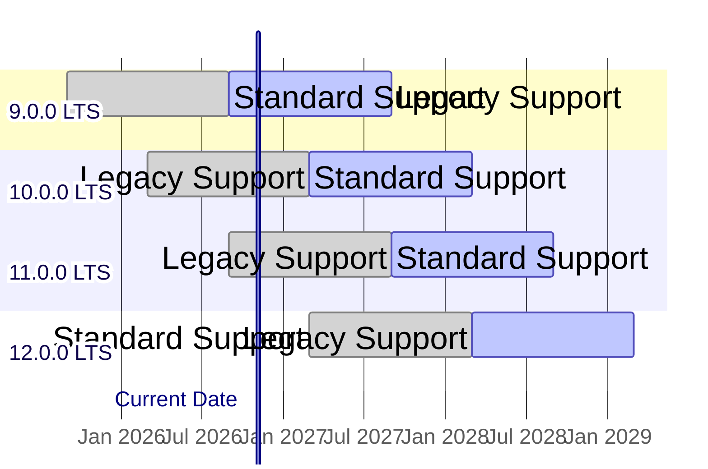
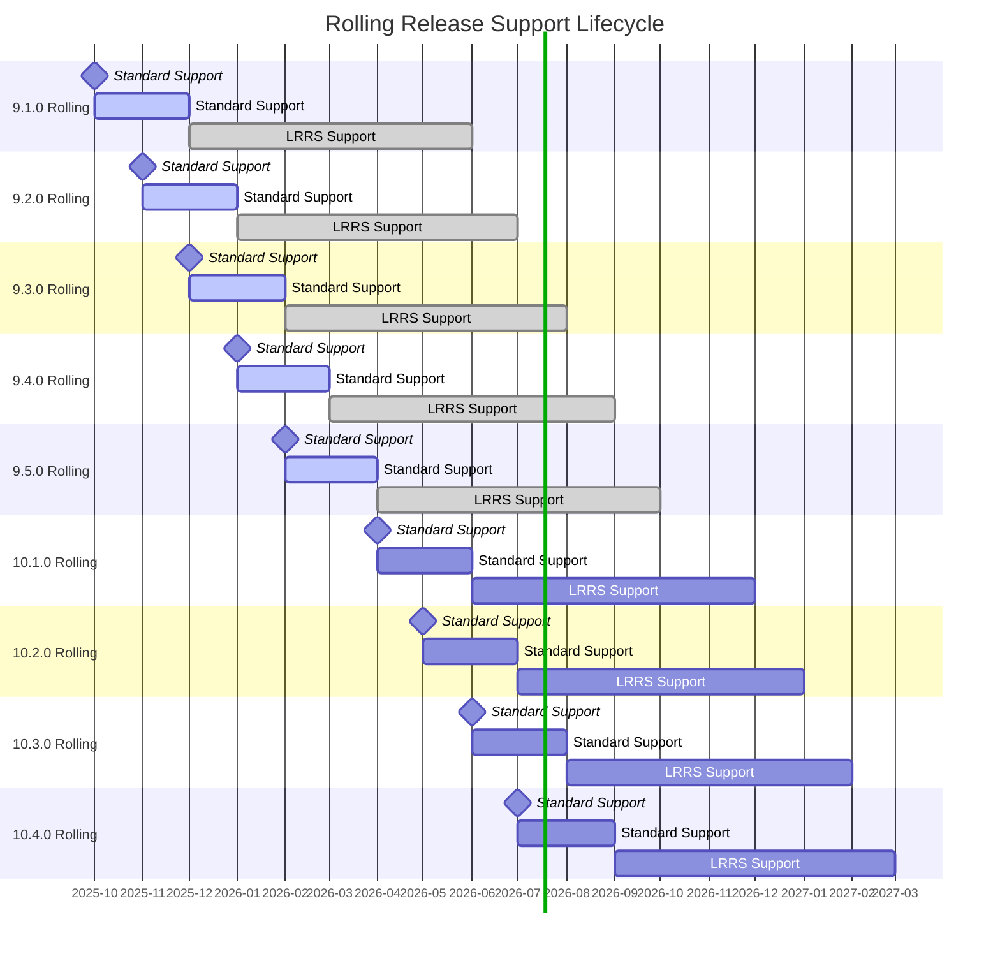

# Sequent Voting Platform (SVP) Product Lifecycle and Release Cadence

The Sequent Voting Platform follows a predictable release cadence designed to
provide stability for enterprise deployments while enabling continuous
innovation and security updates.

## Release Philosophy

SVP uses **semantic versioning** (SemVer) with the format `MAJOR.MINOR.PATCH`:
- **MAJOR**: Breaking changes or significant architectural updates
- **MINOR**: New features that are backward compatible  
- **PATCH**: Bug fixes and security updates

## Release Types

### Long Term Support (LTS) Releases

LTS releases are enterprise-grade releases designed for production environments
requiring maximum stability and extended support.

- **Cadence**: Every 6 months (March and September)
- **Last LTS**: None
- **Next LTS**: Version 9.0.0 (September 1st, 2025)
- **Standard Long Term Support (SLTS)**: 12 months from release date
- **Legacy Long Term Support (LLTS)**: Additional 12 months after standard support
  ends
- **Total LTS Lifecycle**: 24 months (2 years)

### Rolling Releases

Rolling releases provide the latest features and improvements for development
and testing environments.

- **Cadence**: Monthly releases
- **Standard Rolling Release Support (SRRS)**: 2 months from release date
- **Legacy Rolling Release Support (LRRS)**: Additional 6 months after standard
  support ends
- **Total Rolling Release Lifecycle**: 8 months

## Release Schedule Table

| Version    | Release Date | Release Type | Standard Support Until | Legacy Support Until | Total Support |
|------------|-------------|---------|-----------------------|---------------------|---------------|
| **9.0.0**  | Sep 1, 2025 | **LTS** | Sep 1, 2026           | Sep 1, 2027         | **24 months** |
| 9.1.0      | Oct 1, 2025 | Rolling | Dec 1, 2025           | Jun 1, 2026         | 8 months      |
| 9.2.0      | Nov 1, 2025 | Rolling | Jan 1, 2026           | Jul 1, 2026         | 8 months      |
| 9.3.0      | Dec 1, 2025 | Rolling | Feb 1, 2026           | Aug 1, 2026         | 8 months      |
| 9.4.0      | Jan 1, 2026 | Rolling | Mar 1, 2026           | Sep 1, 2026         | 8 months      |
| 9.5.0      | Feb 1, 2026 | Rolling | Apr 1, 2026           | Oct 1, 2026         | 8 months      |
| **10.0.0** | Mar 1, 2026 | **LTS** | Mar 1, 2027           | Mar 1, 2028         | **24 months** |
| 10.1.0     | Apr 1, 2026 | Rolling | Jun 1, 2026           | Dec 1, 2026         | 8 months      |
| 10.2.0     | May 1, 2026 | Rolling | Jul 1, 2026           | Jan 1, 2027         | 8 months      |
| 10.3.0     | Jun 1, 2026 | Rolling | Aug 1, 2026           | Feb 1, 2027         | 8 months      |
| 10.4.0     | Jul 1, 2026 | Rolling | Sep 1, 2026           | Mar 1, 2027         | 8 months      |
| 10.5.0     | Aug 1, 2026 | Rolling | Oct 1, 2026           | Apr 1, 2027         | 8 months      |
| **11.0.0** | Sep 1, 2026 | **LTS** | Sep 1, 2027           | Sep 1, 2028         | **24 months** |
| 11.1.0     | Oct 1, 2026 | Rolling | Dec 1, 2026           | Jun 1, 2027         | 8 months      |
| 11.2.0     | Nov 1, 2026 | Rolling | Jan 1, 2027           | Jul 1, 2027         | 8 months      |
| 11.3.0     | Dec 1, 2026 | Rolling | Feb 1, 2027           | Aug 1, 2027         | 8 months      |
| 11.4.0     | Jan 1, 2027 | Rolling | Mar 1, 2027           | Sep 1, 2027         | 8 months      |
| 11.5.0     | Feb 1, 2027 | Rolling | Apr 1, 2027           | Oct 1, 2027         | 8 months      |
| **12.0.0** | Mar 1, 2027 | **LTS** | Mar 1, 2028           | Mar 1, 2029         | **24 months** |

## Support Levels

### Standard Support (SLTS, SRRS)

- Security patches and critical bug fixes
- Technical support through official channels
- Documentation updates
- Community support

### Legacy Support (LLTS, LRRS)

- Critical security patches only
- Limited technical support
- Extended maintenance for enterprise customers
- Migration assistance to newer versions

## Release Timeline Visualization

## Support Lifecycle Visualization
### LTS Release Support Timeline

In the example shown in the diagram (with `Current date` set to November 1,
2026):
- **Version 9.0.0 LTS** (released September 1, 2025, section in yellow background): Currently in **Legacy LTS Support** phase, having completed its 12-month standard support period. Legacy support continues until September 1, 2027.
- **Version 10.0.0 LTS** (released March 1, 2026, section in blue background): Currently in **Standard LTS Support** phase, receiving full security patches, bug fixes, and technical support until March 1, 2027.
- **Version 11.0.0 LTS** (released September 1, 2026, section in blue background): Recently released and in **Standard LTS Support** phase, with full support continuing until September 1, 2027.
- **Version 12.0.0 LTS** (release scheduled for March 1, 2027, section in white background): Future release shown with reduced opacity, representing the planned next LTS version.

The diagram illustrates the overlapping support windows that provide enterprise
customers with migration flexibility. Notice how version 10.0.0 and 11.0.0 are
both under standard support simultaneously, giving organizations a 6-month
window to plan and execute upgrades between LTS versions.

### Rolling Release Support Timeline

**Legend:**
- 🔵 **Blue bars** = Future releases (not yet released)
- 🟢 **Green bars** = Currently under support  
- 🔴 **Red bars** = Out of support
- 🟡 **Yellow bars** = Legacy support (LRRS)
- ⚫ **Black markers** = Release dates
- 🟢 **Green vertical line** = Current date (July 9, 2025)

## Feature Release Process

Each feature release follows this schedule:

1. **Feature Freeze**: 1 month before release date
2. **Beta Release**: 2 weeks before release date  
3. **Release Candidate**: 1 week before release date
4. **Final Release**: On scheduled date

## Security and Patch Updates

- **Security patches**: Released as needed for all supported versions
- **Regular patches**: Bi-weekly review cycle for dependencies
- **Emergency patches**: Released within 24-48 hours for critical security issues

## Enterprise Support

Enterprise customers receive:
- Priority support during standard support period
- Extended legacy support options
- Migration assistance between major versions
- Custom support agreements for extended lifecycles
- Dedicated support channels

## Recommendations

### For Production Environments
- Use **LTS releases** for maximum stability
- Plan upgrades during the 6-month overlap between LTS versions
- Subscribe to security update notifications

### For Development and Testing
- Use **Rolling releases** for latest features
- Test on rolling releases before deploying to LTS in production
- Maintain separate environments for different release tracks

### Migration Strategy
- Begin testing new LTS releases 3 months before your current LTS loses standard support
- Use the 6-month LTS overlap period for gradual migration
- Consider Legacy LTS Support for additional migration time if needed

---

*This release schedule is subject to change based on security requirements, critical bug fixes, or significant architectural updates. Any changes will be communicated at least 60 days in advance.*