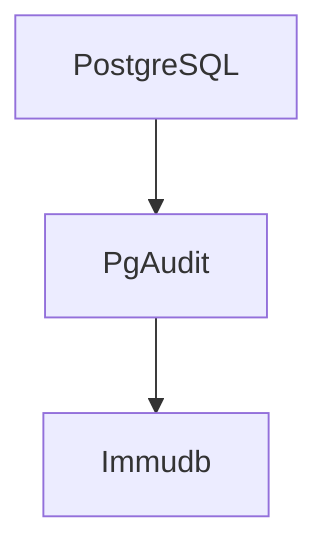
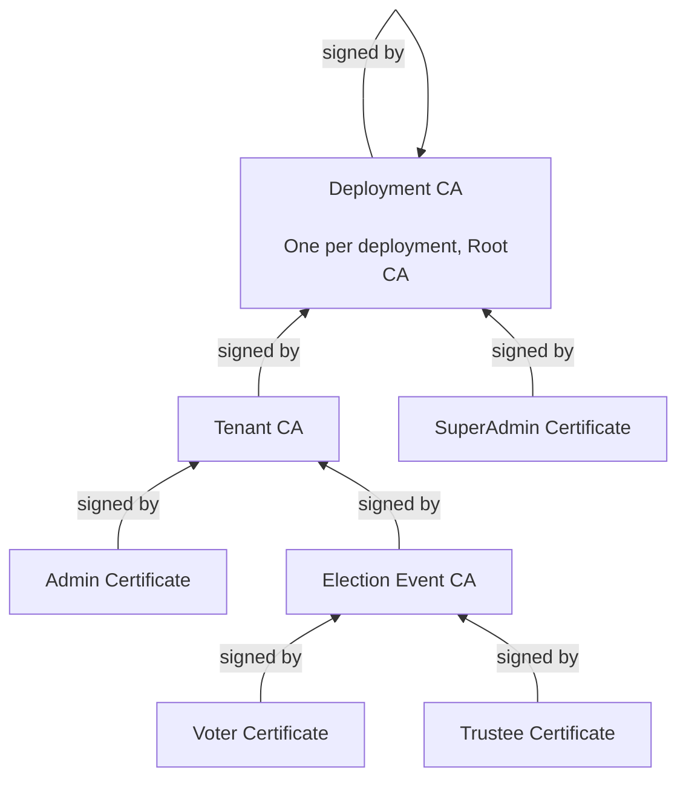

<!--
 SPDX-FileCopyrightText: 2025 Sequent Tech Inc <legal@sequentech.io>
SPDX-License-Identifier: AGPL-3.0-only
-->
# Immutable Logging

This document contains an overview of how we use Immudb some details related to 
each of these uses.

## Introduction: Immutable logging with Immudb

We use [Immudb] for our tamper-evident logging needs. Immudb is an "Open source
immutable database" with the following characteristics:
- High performance and easy to integrate
- Supports both Key/Value & SQL
- Cryptographical client-verification, tamper-resistant, and auditable
- Versioned and temporal queries subject to cryptographic verification

## 3 Different immutable logs

There are three different manners in which we use Immudb:

1. **Backend Database Log:** Our Backend API implements a GraphQL interface.
   This API is exposed by Hasura. The business logic is implemented by the
   `harvest` and `windmill` packages. The Backend API stores data in a
   PostgreSQL database. Changes to this database, and sometimes queries (based
   on settings), get logged by [PgAudit]. We record these logs in an Immudb
   Database. For this process, we use a vendored fork of `immudb-log-audit` in
   Go. You can find it in our repository under `vendor/immudb-log-audit/`.

   Database logging happens at the deployment level. There's a one to one
   relation between the deployment's single PostgreSQL database and the 
   Immudb immutable log populated with PgAudit.

2. **Cryptographic Board Log:** Sequent Voting Platform uses a Mixnet for
   preserving ballot secrecy. The mixnet shuffles the ballots in a
   mathematically verifiable manner. All these operations are orchestated and
   logged for transparency using an immutable log. This log is the basis of the
   Cryptographic Board. The Cryptographic Board is implemented using an Immudb
   Database. The Cryptographic Board defines a protocol for its operations. This
   protocol allows the actors involved to know what has happened. It also allows
   actors know if they have any next action to execute in the protocol.

   There's one Cryptographic Board per Election Event. Each Cryptographic Board
   has its own Immudb database.

3. **Election Protocol Log:** Important election operations need to be signed by
   one or more people and correctly registered in the Election Protocol Log. The
   Election Protocol register operations such as each cast vote by a voter or
   the request by one or more adminstrators to perform an election tally. These
   operations require the signature of of the person executing the action. Also,
   the backend registering the action signs on Sequent Voting Platform behalf. 
   Finally, the operation and both signatures are recorded in the Election 
   Protocol Board.

   Each Election Event has its own Election Protocol Board. And Each Election
   Protocol Board Log is implemented as an Immudb Database.

## Backend Database Log

[PgAudit] is a well stablished and mature PostgreSQL extension. The PostgreSQL
Audit Extension (or pgaudit) provides detailed session and/or object audit
logging via the standard logging facility provided by PostgreSQL. The goal of
PostgreSQL Audit to provide the tools needed to produce audit logs required to
pass certain government, financial, or ISO certification audits.

The way this works is as follows: PgAudit is configured to record its logs in
Json format in some `/logs` directory. This directory could perhaps be a mounted
volume, so that the `immudb-log-audit` service can also have access to it. The
`immudb-log-audit` service detects any new file or line change, process it, and
records this new output from PgAudit into the corresponding table in the 
corresponding Immudb database.

### Backend Database Logs UI

Harvest is our business logic backend API service. It's accessible via GraphQL 
through Hasura. Harvest provides an endpoint that allows an authenticated user
to list the PgAudit logs. This in turn allows us to present them in the Admin
Portal to authenticated users with the right permissions.

## Cryptographic Board Log

TODO

## Election Protocol Log

### Protocol Messages

Each Election Event has its own Election Protocol Immudb Database (EPID). It's
used to store messages related to the election protocol. These messages contain:
- **Sender:** Sender of the message.
- **Statement:** A fact recorded in the message, which is typically converted
  into a predicate and processed by the [crepe] library to run the protocol.
- **Signature:** Digital signature of the statement by the issuer.
- **SystemSignature:** Digital signature of the statement by the system.
- **Artifact:** Extra data related to the statement. The statement typically
  contains a hash of the artifact.

### Schema

All these messages are recorded in the `messages` table of the EPID, which
contains a column for each of the fields mentioned earlier. 

### Roles

The following roles exist in the protocol:
- **System:** When a statement is received, it must be included in the Election
  Protocol log by the system (typically through `windmill` or `harveest`). The
  system needs to sign the statement to ensure dispute-freeness regarding the
  inclusion of a statement in the log.
- **Election Admin:** Election Adminitrators configure the election and execute
  management operations.
- **Voters:** Voters can cast votes in the election. These votes are recorded as
  message in the Election Protocol Log and as such must be signed by voters (the
  sender) and the system (using the SystemSignature).

### Statements

The following statements (operations) are recorded in the Election Protocol:
- **Publication Protocol Configuration:** Commitment to a specific
  configuration, including roles assignments (defining which roles can execute
  what operations) and signature thresholds for each operation to be effective.
- **Publication of Ballot Styles:** Publication of ballot styles, used by voters
  to cast votes.
- **Publication of Role assigments:** Assignment of roles and areas to
  specific certificates/public-keys, for example the association of the Voter
  role to a public key digital certificate.
- **Publication of Role revokations:** Deassignment of roles or areas from
  specific certificates/public-keys, for example the dissociation of the Voter
  role from a public key digital certificate.
- **Vote casting:** Cast votes are registered by voters as a message in the
  board.
- **Publication of Election voting periods:** Start or stop time slots for any
  election.
- **Publication of Election Tally requests:** Publication of Election Tally
  requests by Administrators.
- **Reports and exports:** All report and exports generated by the system should
  be signed.

### Certificate chains

[Immudb]: https://immudb.io/
[PgAudit]: https://www.pgaudit.org/
[crepe]: https://crates.io/crates/crepe/
