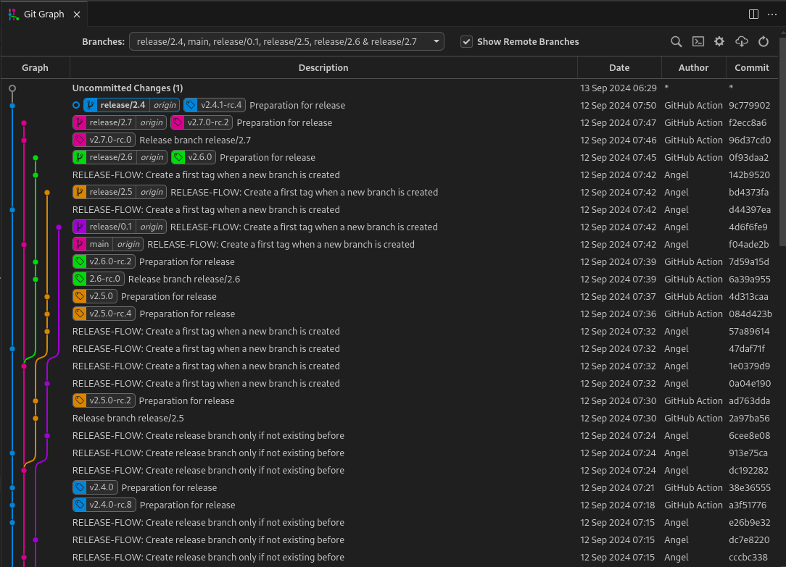
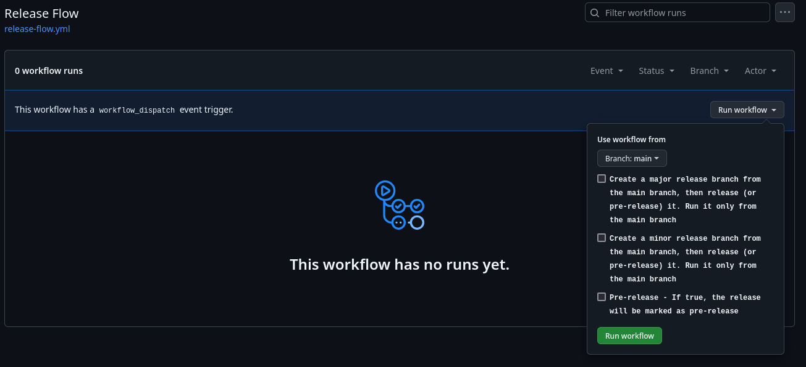

<!--
 SPDX-FileCopyrightText: 2025 Sequent Tech Inc <legal@sequentech.io>

SPDX-License-Identifier: AGPL-3.0-only
-->

# Release Flow

For more details, refer to the [official Release Flow documentation](http://releaseflow.org/).

## Important Notes

### Branching and Tagging

During testing, I encountered [this issue with `release-it`](https://github.com/release-it/release-it/issues/1142), which arose because I was **merging** feature branches into different release branches *(and sometimes into `main`)*. This caused `release-it` to fail to find the correct version number and reject the release due to attempting to release an earlier version.

The key solution is:

- Develop feature branches as usual, starting from `main`.
- Once the feature is ready, merge it back into the `main` branch using a **squash merge**.
- If you need the feature or fix in a release branch, use **cherry-pick**.

### Commit Messages

To ensure `release-it` work well, a few special commits are necessary:

- When creating a new branch, use the following command:  
  `git commit --allow-empty -m "Release branch $releaseBranchName"`
- When preparing a new release, commit with:  
  `git commit -m "Preparation for release"`
  - This commit writes the commit SHA of the release into a file named `.release-commit`.
    - This is required to ensure `release-it` works, even if there are no changes on the `trunk` or `release/*` branch.

## Example Flow

## GitHub Action Integration

## Use Cases

### Creating a New Feature Branch from `main` and Applying It to a Release

1. Create a new feature branch from `main`.
2. Merge the feature branch back into `main` using `--squash`.
3. Release the new version from `main`.

### Creating a New Release Branch

You can create a new minor or major release branch from `main` even if there are no changes on `main`.

1. Run the `Release Flow` GitHub Action. Ensure the `preRelease` input is set to `false`.
2. Pull the newly created release branch from the remote.

### Creating a New Release Candidate from the Release Branch

1. Run the `Release Flow` GitHub Action, ensuring the `preRelease` input is set to `true` (default is `true`).
2. Pull the latest changes from the remote.

## Considerations

- **Initial setup**: Every repository ([`step`](https://github.com/sequentech/step), [`beyond`](https://github.com/sequentech/beyond) and [`gitops`](https://github.com/sequentech/gitops)), must have the release branches and tags synchronized. This is necessary to ensure that the release process works correctly.
  - A commit must have only up to one tag.
  - Before implementing, ensure every environment is in sync polling from a specific version (not from `main`)
- **Release process Initiation**: The release process is initiated by running the [`Automated Release Process`](https://github.com/sequentech/step/actions/workflows/release.yml) GitHub Action from the `step` repository. It will trigger the release process on the other repositories ([`beyond`](https://github.com/sequentech/beyond) and [`gitops`](https://github.com/sequentech/gitops)) ensuring that the release is consistent across all repositories.
  - To prevent accidental releases on the other repositories ([`beyond`](https://github.com/sequentech/beyond) and [`gitops`](https://github.com/sequentech/gitops)), the `Automated Release Process` GitHub Action is configured to run only by the github user `sequentech-bot`. This way, only the [`step`](https://github.com/sequentech/step) repository can trigger the release process as it is configured to use a personal access token with the necessary permissions from the `sequentech-bot` user.
- **Create a new release branch**: A new release branch can be only created from the `main` branch. There is a validation to prevent the creation of a new release branch from a release branch.
  - In addition, the latest release must be an stable release (not a pre-release) in order to create a new release branch. [This is due to a limitation on the `release-it` tool](https://github.com/release-it/release-it/blob/main/docs/git.md#tag-exclude), which doesn't allow looking for tags in all branches while excluding certain tag patterns (e.g., pre-releases...). And, the `git.tagMatch` is not that powerful to filter out the pre-releases *(it's not regex based)*.
- **Substitution of versions**: Part of the release process is to substitute the version in the `kubernetes manifests`. This is done by some scripts that are part of the `Deployer Workflow` in the [`gitops`](https://github.com/sequentech/gitops) repository. This script has been made to replace some specific patterns in the `argocd/Applications` manifests in the `REGION/ENVIRONMENT/apps/argo` path. If there are other manifests apart from `argocd/Applications` in this path, the script can cause issues. So it is important to place other manifests in a different path (subdirectory) to avoid any issues (like the metrics, dashboards or alerts).
