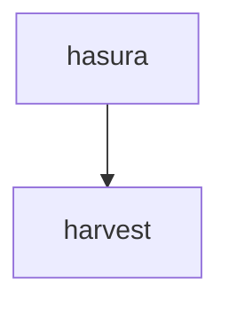
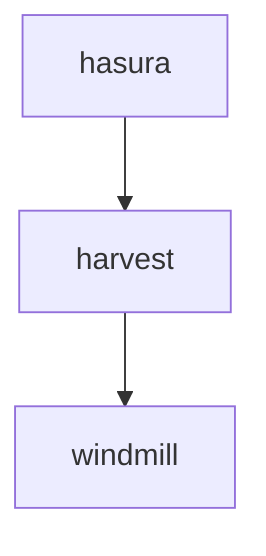
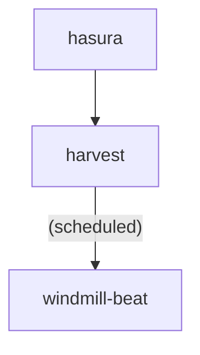
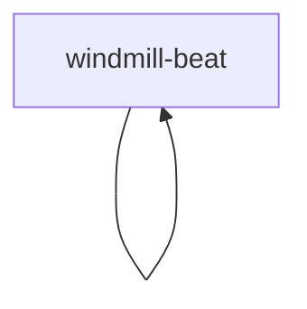

<!--
 SPDX-FileCopyrightText: 2025 Sequent Tech Inc <legal@sequentech.io>
SPDX-License-Identifier: AGPL-3.0-only
-->
# Tasks execution model for 2nd-gen

We define the following different pathsways to execute business logic by the
backend in our platform backend:

## 1. Harvest - synchronous task

Hasura executes an action that calls to an API callback in Harvest, and harvest
directly executes this task and returns the result. This execution path is ideal
for short-lived, synchronous tasks.

Example: cast votes should follow this pathway. Vote casting requires the
execution of some business logic before recording the vote so it cannot be
directly performed by Hasura, but it is simple enough that it can be performed
in a synchronous manner.

## 2. Harvest to Windmill - immediate asynchronous task

Hasura executes an action that calls to an API callback in Harvest, which in 
turns writes send to RabbitMQ a task to be executed by a Windmill worker. This
allows the execution of longer, more resource-intensive tasks in an asychronous
fashion.

Example: Creation of an Election Event. It requires the creation of an 
ImmuBoard (meaning the creation of an Immudb Database) and this is resource 
intensive enough that it requires the execution in a background task worker 
(a Windmill worker).

Note: Please read [Acks early vs acks late](https://rusty-celery.github.io/best-practices/index.html#acks-early-vs-acks-late) quoted below:

Tasks are only removed from a queue when they are acknowledged ("acked") by the
worker that received them. The `acks_late` setting determines when a worker will
ack a task. When set to `true`, tasks are acked after the worker finishes
executing them. When set to `false`, they are executed right before the worker
starts executing them.

The default of `acks_late` is `false`, however if your tasks are
[idempotent](https://docs.celeryproject.org/en/stable/glossary.html#term-idempotent)
it's strongly recommended that you set `acks_late` to `true`. This has two major
benefits.

First, it ensures that if a worker were to crash, any tasks currently executing
will be retried automatically by the next available worker.

Second, it provides a better
[back pressure](https://medium.com/@jayphelps/backpressure-explained-the-flow-of-data-through-software-2350b3e77ce7)
mechanism when used in conjunction with a suitable prefetch_count.

## 3. Harvest to Windmill Beat - asynchronous scheduled task 

Hasura executes an action that calls to an API callback in Harvest, which in
turns writes send to RabbitMQ a task to be executed by a Windmill Beat to 
schedule a task to be executed at a specific date and time or recurrently.

Example: scheduled reports. These reports should be generated at a specific date
and time, for example every day of the election week at 9am.

Even though the `Baskets` concept is not implemented yet in Rusty-celery, the
[baskets feature issue](https://github.com/rusty-celery/rusty-celery/issues/53)
has some relevant dicussion about what are repercussions of this type of tasks.

More information in 
[Rusty-Celery Beat](https://docs.rs/celery/latest/celery/beat/index.html).

## 4. Windmill Beat - asychronous recurrent task

By configuration, specific tasks can be configured to execute recurrently every
given time period. In this pathway the task is generated internally and forever, 
not by any external user request.

Example: Typically this will only be used to perform pooling in the bulletin 
boards, to watch for changes such as the availability of the public key of an
election or the decrypted ballots of a tally.

More information in 
[Rusty-Celery Beat](https://docs.rs/celery/latest/celery/beat/index.html) and
[Rusty-Celery Beat DeltaSchedule](https://docs.rs/celery/latest/celery/beat/struct.DeltaSchedule.html)

