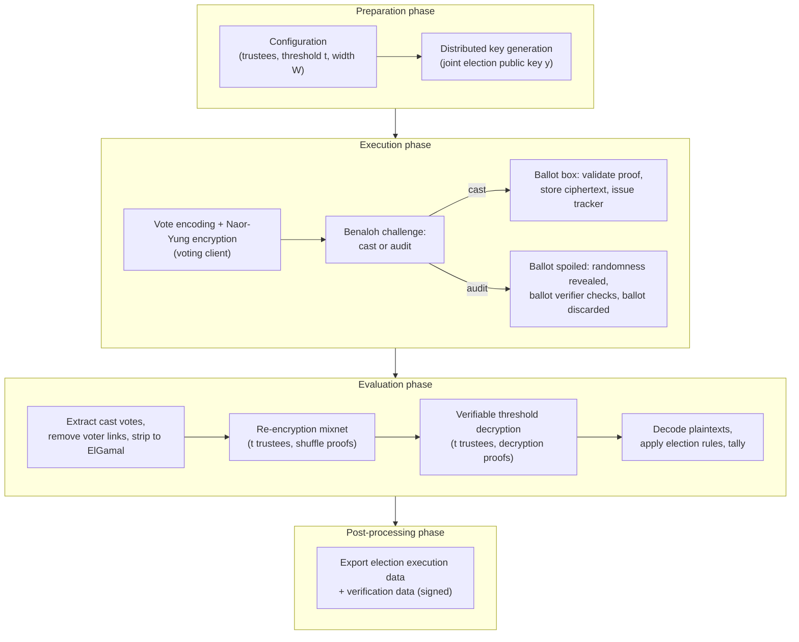

<!--
SPDX-FileCopyrightText: 2026 Sequent Tech <legal@sequentech.io>
SPDX-License-Identifier: AGPL-3.0-only
-->
# Cryptographic Protocol Description

*Status: draft. Items marked **TO BE CONFIRMED** are pending confirmation against
the implementation.*

---

## 1. Introduction

### 1.1 Purpose and scope

This document is a self-contained description of an online voting protocol. It
presents all cryptographic algorithms and the complete
protocol flow at the mathematical level, so that the security properties of the
protocol — in particular **end-to-end verifiability** and **ballot secrecy** — can be
assessed without consulting the academic papers on which the protocol is based.

The document has the following properties:

- **Self-contained.** Every algorithm used by the protocol is stated in full (key
  generation, encryption, zero-knowledge proofs, shuffling, threshold decryption,
  verification), including all prover computations, all verifier equations, and all
  Fiat-Shamir challenge derivations. No step requires reading an external reference;
  references are provided for attribution only.
- **Not an interoperability specification.** Concrete message formats, serializations and
  byte-level encodings are out of scope, with one deliberate exception: wherever a hash
  function is applied, the *components* of its input and their order are stated
  explicitly, because the soundness of non-interactive proofs depends on them.
- **Mathematically verifiable.** The description is intended to allow verification of the
  protocol at the mathematical and cryptographic level, including reconstruction of an
  independent verifier.

The description reflects the protocol as specified for the current platform, which
includes a small number of planned implementation alignments; these are identified where
relevant.

### 1.2 Audience

The document is written for cryptographers, security evaluators, and implementors of
independent verifiers, and is deliberately independent of any particular platform,
evaluation or certification context.

### 1.3 Actors and components

The protocol involves the following actors; the description is
implementation-independent.

| Protocol actor | Role |
|---|---|
| **Voter / voting client** | Encodes and encrypts the vote, performs the Benaloh challenge, computes verification data; runs on the voter's device, executing vote-encryption code provided by the voting platform |
| **Ballot box** | Receives, validates and stores cast ballots; enforces eligibility, one-cast-vote and re-voting rules; publishes trackers |
| **Trustees** $T_1, \dots, T_n$ | Hold shares of the election secret key; jointly generate keys, mix, and decrypt |
| **Trustee bulletin board** | Authenticated append-only message store by which trustees communicate |
| **Ballot verifier** | Verifies a spoiled (audited) ballot for cast-as-intended verification |
| **Election verifier** | Independently verifies the complete tally evidence (shuffle and decryption proofs) |
| **Protocol manager** | Authors the trustee-protocol configuration and submits the ballot ciphertext list for tallying |

(In this repository, the trustee actor is implemented by the `braid` crate and the
trustee bulletin board by the `b4` crate.)

The trustee bulletin board is **untrusted** in the protocol design: it stores opaque,
signed messages, and all validation is performed by the trustees themselves. Misbehaviour
of the board can prevent progress (halt) but cannot cause acceptance of incorrect
results.

### 1.4 Protocol overview

The protocol proceeds in four phases (preparation, execution, evaluation,
post-processing):

1. **Setup / DKG** (preparation phase). The $n$ trustees execute a distributed key
   generation over the bulletin board, producing a joint election public key $y$ whose
   secret key exists only as $n$ Shamir shares; any $t$ shares suffice to decrypt, and
   fewer than $t$ reveal nothing (Section 4).
2. **Vote casting** (execution phase). The voting client encodes the voter's choices as a
   group element, encrypts it under $y$ using the Naor-Yung construction (ElGamal with a
   proof of well-formedness that makes ballots non-malleable and proves knowledge of the
   plaintext), and either **casts** the ciphertext or **audits** it via the Benaloh
   challenge. The ballot box validates the proof and stores the ciphertext; the voter
   receives a ballot tracker (Section 5).
3. **Mixing** (evaluation phase). The final cast votes, with all voter links removed, are
   stripped to plain ElGamal ciphertexts and passed through a re-encryption mixnet
   operated by $t$ trustees in sequence. Each mix is accompanied by a Terelius-Wikström
   zero-knowledge proof of a shuffle, and each trustee verifies and counter-signs every
   other trustee's mix (Section 6).
4. **Decryption** (evaluation phase). The $t$ trustees jointly decrypt the mixed
   ciphertext list. Each contributes per-ciphertext partial decryption factors together
   with a batched Chaum-Pedersen proof of correctness; the factors are combined by
   Lagrange interpolation in the exponent (Section 7).
5. **Result and export** (evaluation / post-processing phase). Plaintexts are decoded and
   tallied according to the set of election rules; the election execution data, including
   all proofs, is exported so that anyone can re-run the complete verification
   (Sections 8, 9).

### 1.5 Notation

- $G$ is a cyclic group of prime order $q$, written multiplicatively, with fixed
  generator $g$. $\mathbb{Z}_q$ is the field of integers modulo $q$.
- $x \overset{\text{\textdollar}}{\leftarrow} S$ denotes sampling $x$ uniformly at random from
  the set $S$.
- Vectors are written by index: $e = (e_1, \dots, e_N)$. Indices are **1-based**
  throughout. $\langle a, b\rangle = \sum_i a_i b_i$ denotes the inner product of two
  scalar vectors.
- $H(x_1, \dots, x_m)$ denotes the protocol hash function (Section 2.3) applied to a
  domain-separated transcript of the listed components, in the listed order.
- $\mathsf{H2S}$ (hash-to-scalar) and $\mathsf{H2G}$ (hash-to-group) are the derived
  random oracles mapping transcripts into $\mathbb{Z}_q$ and $G$ respectively
  (Section 2.3).
- $\mathsf{Enc}_y(m;\, r) = (g^r,\, m\cdot y^r)$ denotes ElGamal encryption
  (Section 3.1).
- $a \parallel b$ denotes concatenation.
- In verifier algorithms, $\stackrel{?}{=}$ denotes an equality check; a verifier
  **accepts** only if every stated check holds, and **rejects** otherwise.

### 1.6 Reading the rendered mathematics

Mathematics in this document is written in standard LaTeX notation and renders in
common Markdown viewers with KaTeX support.

---

## 2. Preliminaries

### 2.1 The group

All protocol arithmetic takes place in the group **ristretto255** [RIS], a prime-order
group constructed over the elliptic curve Curve25519 [NIST-186]:

- The group $G$ has prime order

  $$
  q = 2^{252} + 27742317777372353535851937790883648493
  $$

  (the prime order of the Curve25519 subgroup). ristretto255 eliminates the cofactor of
  Curve25519: every encodable element is a member of the prime-order group, so no
  small-subgroup or cofactor-related attacks apply, and element equality is canonical.
- Each group element has a single canonical 32-byte encoding; decoding rejects
  non-canonical inputs. (This is the only encoding-level fact this document relies on:
  hashing a group element always means hashing its canonical encoding.)
- $g$ is the standard ristretto255 base point.
- The security of the protocol reduces to the hardness of the discrete-logarithm and
  decisional Diffie-Hellman (DDH) problems in $G$, providing a security level of 128
  bits.

Scalars are elements of $\mathbb{Z}_q$; scalar encodings are 32 bytes, reduced
canonically.

### 2.2 Message encoding

Plaintext payloads are embedded into group elements in blocks of **30 bytes**.

$\mathsf{EncodeElement}(b) \to G$, for a payload $b$ of at most 30 bytes:
place the 30 payload bytes at positions $1..30$ of a 32-byte candidate encoding; for
$i = 0..127$ and $j = 0..63$, set byte $0 := 2i$ and byte $31 := j$; return the first
candidate that is a valid canonical ristretto255 encoding. (The expected number of
trials is small; failure probability is negligible.)

$\mathsf{DecodeElement}(P) \to b$: return bytes $1..30$ of the canonical encoding of
$P$.

$\mathsf{DecodeElement}(\mathsf{EncodeElement}(b)) = b$ for all $b$. Longer payloads use
multiple group elements ("width", Section 3.2). A scalar (32 bytes) is transported as 2
elements ($\mathsf{EncodeScalar}$ / $\mathsf{DecodeScalar}$).

The mapping from *ballot choices* to the 30-byte payload is defined in Section 5.1.

### 2.3 Hash functions and random oracles

The protocol hash function is **SHA3-512** [FIPS-202]. Three derived functions are used,
all modeled as random oracles:

- $H(x_1, \dots, x_m)$: the SHA3-512 digest of the **domain-separated transcript**
  formed by feeding, in order, each component $x_i$ followed by its distinguishing tag
  $t_i$ — a fixed ASCII label naming the component's role (e.g. `"pk"`,
  `"shuffle_challenge"`):

  $$
  H(x_1,\dots,x_m) = \mathrm{SHA3\text{-}512}\bigl(x_1 \parallel t_1 \parallel x_2
  \parallel t_2 \parallel \dots \parallel x_m \parallel t_m\bigr)
  $$

  Components that are group elements or scalars contribute their canonical encodings;
  components that are lists contribute their length-prefixed concatenation. In the
  remainder of this document the tags are implied by the listed component names.
- $\mathsf{H2S}(x_1,\dots,x_m) \to \mathbb{Z}_q$: hash-to-scalar. The SHA3-512 digest
  (64 bytes) of the transcript is reduced modulo $q$ ("wide reduction"); the 512-bit
  input makes the output distribution statistically indistinguishable from uniform on
  $\mathbb{Z}_q$.
- $\mathsf{H2G}(x_1,\dots,x_m) \to G$: hash-to-group. The transcript digest is mapped to
  a group element by the ristretto255 one-way map (Elligator-based, as standardized for
  ristretto255 [RIS]). The discrete logarithm of the output with respect to $g$ (or any
  other element) is unknown to all parties.

**Vector challenges (seed-then-counter).** Where a proof requires a vector of $N$
independent challenge scalars, the vector is derived in two stages to keep hashing
linear in $N$:

$$
\mathit{seed} = H(\text{transcript}), \qquad
e_i = \mathsf{H2S}(\mathit{seed},\, i) \quad \text{for } i = 1..N
$$

with $i$ encoded as a 64-bit big-endian integer.

### 2.4 Domain separation and session binding

Every non-interactive proof in the protocol is bound to its execution context through a
**domain label** included in its Fiat-Shamir transcript:

$$
\mathrm{label}(P) = \mathsf{cfg} \parallel \mathrm{len}(P) \parallel P,
\qquad
\mathrm{ctx}(P, \mathit{input}) = \mathrm{label}(P) \parallel H(\mathit{input})
$$

where:

- $\mathsf{cfg} = H(\text{Configuration})$ is the SHA3-512 hash of the trustee-protocol
  **Configuration** (Section 4.1). The Configuration contains the global protocol
  parameters — the election-execution identifier, the trustee identities and their keys,
  the threshold $t$, and the ciphertext width $W$ — so binding $\mathsf{cfg}$ binds
  every proof to one specific election execution and parameter set.
- $\mathrm{len}(P)$ is the byte length of $P$, encoded as a 64-bit big-endian integer.
  (Every 64-bit integer entering a hash transcript in this protocol — this length and
  the counters of Sections 2.3 and 2.5 — is encoded big-endian.)
- $P$ is a fixed ASCII purpose string naming the proof family (e.g. `"shuffle"`,
  `"decryption proof"`, `"shuffle_generators"`).
- $H(\mathit{input})$ is the hash of the instance input (e.g. the list of ciphertexts
  being mixed), so that proofs cannot be replayed across instances even within one
  execution.

A proof transcript therefore never verifies outside (a) its election execution, (b) its
proof family, and (c) its concrete instance.

Proofs within a **tally** — mixing (Section 6) and decryption (Section 7) — additionally
bind the tally execution. Several tallies may run under a single Configuration (sibling
contests over one key generation, or a re-run after a halt), sharing $\mathsf{cfg}$, the
public key, and possibly the ciphertext lists; their transcript domains are separated by
a **tally identifier** $\mathit{tid}$, a 128-bit big-endian integer declared in the
signed tally input (Section 5.5), inserted after the configuration hash:

$$
\mathrm{label}(P) = \mathsf{cfg} \parallel \mathit{tid} \parallel \mathrm{len}(P) \parallel P
\qquad\text{(tally-scoped proofs)}
$$

The key-generation proofs (Section 4.3) precede any tally and use the execution-scoped
form above, without $\mathit{tid}$.

### 2.5 Independent generators

The Terelius-Wikström proof of a shuffle (Section 6) requires, for a list of $N$
ciphertexts, a vector $h = (h_1, \dots, h_N)$ of generators of $G$ that are
*independent*: no party can know a non-trivial representation
$g^{e}\prod_i h_i^{e_i} = 1$. They are derived by hashing into the group:

$$
h_i = \mathsf{H2G}(\mathit{seed},\, i) \quad \text{for } i = 1..N
$$

with $i$ encoded as a 64-bit big-endian integer under the distinguishing tag
`"independent_generators"`, and
$\mathit{seed} = \mathrm{ctx}(\texttt{"shuffle\_generators"}, \mathit{input})$ bound to
the configuration and to the input ciphertext list of the mix instance (Section 2.4).
Under the random-oracle model for $\mathsf{H2G}$, finding a non-trivial
discrete-logarithm relation among $g, h_1, \dots, h_N$ is as hard as the
discrete-logarithm problem in $G$.

### 2.6 Randomness

All secret scalars (keys, encryption randomizers, proof randomizers, polynomial
coefficients, permutations) are sampled uniformly at random from cryptographically secure
random number generators of the executing platform: the operating system CSPRNG on
servers and trustee machines, and the Web Crypto API (`crypto.getRandomValues`) in the
voting client. Permutations are sampled uniformly by the Fisher-Yates method driven by
the same source.

---

## 3. Cryptographic primitives

### 3.1 ElGamal encryption

The ElGamal cryptosystem [ELG85] over $G$:

$$
\begin{aligned}
\mathsf{KeyGen}():\quad & x \overset{\text{\textdollar}}{\leftarrow} \mathbb{Z}_q;\quad y = g^x;
  \quad \text{return } (sk = x,\ pk = y) \\
\mathsf{Enc}_y(m;\, r):\quad & r \overset{\text{\textdollar}}{\leftarrow} \mathbb{Z}_q
  \text{ (if not given)};\quad \text{return } (u, v) = (g^r,\, m\cdot y^r) \\
\mathsf{Dec}_x(u, v):\quad & \text{return } m = v\cdot u^{-x} \\
\mathsf{ReEnc}_y((u,v);\, s):\quad & s \overset{\text{\textdollar}}{\leftarrow} \mathbb{Z}_q
  \text{ (if not given)};\quad \text{return } (u\cdot g^s,\, v\cdot y^s)
\end{aligned}
$$

Properties used by the protocol:

- **Homomorphism**:
  $(u_1 u_2,\, v_1 v_2) = \mathsf{Enc}_y(m_1 m_2;\, r_1 + r_2)$. With $m_2 = 1$ this
  yields **re-encryption**: $\mathsf{ReEnc}_y((u,v);\, s) = \mathsf{Enc}_y(m;\, r+s)$ is
  a fresh-looking ciphertext of the same plaintext, computable without knowledge of $m$
  or $r$.
- **IND-CPA security** under DDH in $G$.
- $\mathsf{Enc}_y(1;\, r) = (g^r,\, y^r)$ denotes an encryption of the neutral element,
  used in re-encryption and in the shuffle proof.

### 3.2 Width-$W$ ciphertexts

A ballot whose payload exceeds 30 bytes is encrypted as a **width-$W$** ciphertext: the
plaintext is a vector $m = (m^{(1)}, \dots, m^{(W)}) \in G^W$, and encryption applies
ElGamal componentwise with **independent randomizers**
$r = (r^{(1)}, \dots, r^{(W)}) \in \mathbb{Z}_q^W$:

$$
\mathsf{Enc}_y(m;\, r) = \Bigl(\bigl(g^{r^{(1)}},\, m^{(1)} y^{r^{(1)}}\bigr),\ \dots,\
\bigl(g^{r^{(W)}},\, m^{(W)} y^{r^{(W)}}\bigr)\Bigr)
$$

All algorithms in this document generalize componentwise to width $W$; scalar operations
on the randomizer side become vector operations in $\mathbb{Z}_q^W$. For readability the
protocol is presented at width 1, with the width-$W$ generalization noted where it is
not purely componentwise (the shuffle proof, Section 6.4). $W$ is a per-election
configuration parameter (Section 4.1).

### 3.3 Schnorr proof of knowledge of a discrete logarithm

Non-interactive proof of knowledge of $x$ such that $Y = b^x$, for a base $b \in G$
[SCH89], via the strong Fiat-Shamir transformation (the full statement is hashed).

$\mathsf{SchnorrProve}(b, Y, x, \mathit{ctx})$:

$$
a \overset{\text{\textdollar}}{\leftarrow} \mathbb{Z}_q; \quad
A = b^a; \quad
v = \mathsf{H2S}(b,\, Y,\, A,\, \mathit{ctx}); \quad
k = v\cdot x + a; \quad
\text{return } \sigma = (A, k)
$$

$\mathsf{SchnorrVerify}(b, Y, \sigma = (A,k), \mathit{ctx})$: recompute
$v = \mathsf{H2S}(b, Y, A, \mathit{ctx})$ and

$$
\text{accept iff}\quad b^{k} \stackrel{?}{=} Y^{v}\cdot A
$$

### 3.4 Chaum-Pedersen proof of discrete-logarithm equality (DLEQ)

Non-interactive proof of knowledge of $x$ such that $Y_0 = b_0^{\,x}$ **and**
$Y_1 = b_1^{\,x}$ for bases $b_0, b_1$ [CP92]. This is the verifiable-decryption
primitive. The second base and value may be vectors ($b_1, Y_1 \in G^W$), in which case
the same exponent applies componentwise.

$\mathsf{DleqProve}(b_0, Y_0, b_1, Y_1, x, \mathit{ctx})$:

$$
\begin{aligned}
& a \overset{\text{\textdollar}}{\leftarrow} \mathbb{Z}_q; \qquad
  A_0 = b_0^{\,a}, \quad A_1 = b_1^{\,a} \\
& v = \mathsf{H2S}(b_0,\, b_1,\, Y_0,\, Y_1,\, A_0,\, A_1,\, \mathit{ctx}); \qquad
  k = a + v\cdot x \\
& \text{return } \sigma = (A_0, A_1, k)
\end{aligned}
$$

$\mathsf{DleqVerify}(b_0, Y_0, b_1, Y_1, \sigma = (A_0, A_1, k), \mathit{ctx})$:
recompute $v$ as above and

$$
\text{accept iff}\quad
b_0^{\,k} \stackrel{?}{=} Y_0^{\,v}\cdot A_0
\quad\text{and}\quad
b_1^{\,k} \stackrel{?}{=} Y_1^{\,v}\cdot A_1
$$

### 3.5 Plaintext-equality proof (Naor-Yung well-formedness)

Given the election public key $y$, the auxiliary key $z$ (Section 3.6) and a Naor-Yung
ciphertext $(u_b, v_b, u_a)$, the following proves knowledge of $r$ such that
$u_b = g^r$ **and** $u_a = z^r$ — i.e. that the two components encrypt consistently
under the same randomness. The challenge additionally binds $v_b$, so the proof commits
to the complete ciphertext and cannot be transplanted onto a different payload.

$\mathsf{PlEqProve}(g, y, z, (u_b, v_b, u_a), r, \mathit{ctx})$:

$$
\begin{aligned}
& a \overset{\text{\textdollar}}{\leftarrow} \mathbb{Z}_q; \qquad
  A = (A_1, A_2) = (g^a,\, z^a) \\
& v = \mathsf{H2S}(g,\, y,\, z,\, u_b,\, v_b,\, u_a,\, A,\, \mathit{ctx}); \qquad
  k = v\cdot r + a \\
& \text{return } \sigma = (A, k)
\end{aligned}
$$

$\mathsf{PlEqVerify}(g, y, z, (u_b, v_b, u_a), \sigma = (A, k), \mathit{ctx})$:
recompute $v$ as above and

$$
\text{accept iff}\quad
u_b^{\,v}\cdot A_1 \stackrel{?}{=} g^{k}
\quad\text{and}\quad
u_a^{\,v}\cdot A_2 \stackrel{?}{=} z^{k}
$$

For width $W$, $r \in \mathbb{Z}_q^W$ and the proof is applied componentwise with a
single challenge over the full transcript.

### 3.6 Naor-Yung ballot encryption

Ballots are encrypted under a **Naor-Yung-style double ciphertext** [NY90]: an ElGamal
ciphertext augmented with a second "encryption leg" under an auxiliary key and a
zero-knowledge proof tying the two together. This makes ballot ciphertexts
**non-malleable** and constitutes a **proof of knowledge of the plaintext**, preventing
both malleability attacks on ballot secrecy (an attacker re-randomizing or transforming
another voter's ciphertext) and **ballot copying** (an attacker submitting a related
ciphertext without knowing the vote) [BPW12].

**Keys.** The primary key is the election public key $y$ from the DKG (Section 4). The
auxiliary key is derived by hashing into the group:

$$
z = \mathsf{H2G}(\mathit{ctx}_{\mathrm{enc}},\ \texttt{"naor\_yung\_public\_key\_a"})
$$

where $\mathit{ctx}_{\mathrm{enc}}$ is the encryption context (Section 5.2). Because $z$
is a random-oracle output, **no party knows** $\log_g z$ or $\log_y z$; the auxiliary
leg is never decrypted and no second secret key exists.

**Encryption, verification, stripping:**

$\mathsf{NYEnc}_{(y,z)}(m;\, r)$:

$$
\begin{aligned}
& r \overset{\text{\textdollar}}{\leftarrow} \mathbb{Z}_q \text{ (if not given)} \\
& u_b = g^r; \qquad v_b = m\cdot y^r; \qquad u_a = z^r \\
& \sigma = \mathsf{PlEqProve}\bigl(g, y, z, (u_b, v_b, u_a), r,
  \mathit{ctx}_{\mathrm{enc}}\bigr) \\
& \text{return } C = (u_b, v_b, u_a, \sigma)
\end{aligned}
$$

$\mathsf{NYVerify}_{(y,z)}(C)$: accept iff
$\mathsf{PlEqVerify}\bigl(g, y, z, (u_b, v_b, u_a), \sigma, \mathit{ctx}_{\mathrm{enc}}\bigr)$
accepts.

$\mathsf{NYStrip}_{(y,z)}(C)$: if $\mathsf{NYVerify}$ fails, reject; otherwise return
the ElGamal ciphertext $(u_b, v_b)$.

Every component of the system that accepts a ballot ciphertext (the ballot box on
casting, and every trustee before mixing) first runs $\mathsf{NYVerify}$. Only after
verification is the ciphertext **stripped** to its ElGamal part $(u_b, v_b)$ for
homomorphic processing (re-encryption mixing), which the auxiliary leg deliberately does
not support.

**Security.** The construction follows the Naor-Yung paradigm [NY90]: an IND-CPA
cryptosystem is augmented with a second encryption leg and a non-interactive
zero-knowledge proof tying the two together, yielding security against chosen-ciphertext
attacks. Here the proof is the strong-Fiat-Shamir proof of equality of discrete
logarithms (Section 3.5), which in the random-oracle model is both straight-line
simulatable (by programming the oracle) and sound [BPW12]; an attacker's advantage
against a ciphertext therefore reduces to the soundness error of the plaintext-equality
proof plus the DDH advantage in $G$. One design decision deserves explicit statement:
an alternative instantiation would derive the auxiliary key as $z = y^{w}$ (or $g^{w}$)
for a random $w$ known to whoever performs the augmentation. Such a $w$ is a
**trapdoor**: its holder could decrypt any ballot unilaterally as
$v_b\cdot(u_a^{1/w})^{-1}$, bypassing the threshold key. Deriving $z$ by hashing into
the group removes this trapdoor entirely — no party knows $\log_g z$ or $\log_y z$, so
the only decryption path is the threshold protocol of Section 7. Security reductions
are unaffected: in the random-oracle model, a reduction programs $\mathsf{H2G}$ to
return $z = y^{w}$ for a $w$ of its own choice, recovering the standard two-key
argument. Finally, a ballot with an invalid proof is never accepted anywhere: the
ballot box rejects it at casting, and a trustee finding one in the tally input halts.

**Role in the tally.** The well-formedness proofs serve a second purpose beyond
non-malleability: they are proofs of knowledge of the encryption randomness — and hence
of the plaintext — so the ballot list entering the tally is **plaintext-aware**: for
every ciphertext submitted for decryption, a plaintext is extractable in the
random-oracle model without the secret key. The threshold decryption protocol of
Section 7 relies on this property — it ensures that decryption is only ever applied to
ciphertexts whose plaintexts were already known to their submitters, so the tally cannot
be abused as a decryption oracle against honestly encrypted ballots; the accumulated
error is bounded by the sum of the soundness errors of the individual plaintext-equality
proofs. This is why every component verifies the proof of every ballot before any
ciphertext reaches the mixnet.

### 3.7 Digital signatures

Two signature uses occur in the protocol; both use **Ed25519** [RFC-8032]:

- **Protocol message authentication.** Every message a trustee or the protocol manager
  posts to the bulletin board is signed with the poster's Ed25519 key, whose public part
  is fixed in the Configuration (Section 4.1). The signed statement covers the message
  head (context references: $\mathsf{cfg}$ and the hashes of the artifacts the message
  responds to) and the hash of the message body, so signatures transfer neither across
  executions nor across protocol positions.
- **Export signing.** Exported election execution data is signed with a dedicated
  Ed25519 export key. The export function belongs to the surrounding platform rather
  than to the voting protocol proper and is not further described here.

---

## 4. Election setup and distributed key generation

### 4.1 Configuration

A trustee-protocol execution is defined by a **Configuration**, authored and signed by
the protocol manager and accepted by every trustee out-of-band before the protocol
starts:

| Field | Meaning |
|---|---|
| `id` | Unique election-execution identifier |
| `trustees` | Ordered list of the $n$ trustee identities: Ed25519 verifying keys |
| $t$ | Threshold: number of trustees required to mix and decrypt ($2 \le t \le n$) |
| $W$ | Ciphertext width (Section 3.2) |
| `share_encryption_keys` | One ElGamal public key per trustee, used to confidentially deliver DKG shares (Section 4.3) |
| `protocol manager` | Ed25519 verifying key of the protocol manager |

$\mathsf{cfg} = H(\text{Configuration})$ anchors all subsequent messages and proofs
(Section 2.4).

**Key granularity.** By default one Configuration — and hence one DKG and one tally — is
executed **per contest**, so each contest has its own election key $y$. A deployment may
alternatively use a single election key for all contests of an election; the protocol is
identical in both cases, applied once per key.

**Halt semantics.** The trustee protocol is *detect-and-halt*: every trustee validates
every message on the board, and any invalid message, inconsistency, or equivocation (two
different messages occupying the same protocol slot) causes an immediate, attributable
halt of the ceremony. There is no complaint-and-disqualify subprotocol; a halted ceremony
is investigated and restarted. This is appropriate for the small, contractually bound
trustee sets of the target deployments and eliminates entire classes of protocol-level
attacks (nothing a misbehaving party sends can ever cause an honest party to *accept*
wrong data — at most it can stop the ceremony).

### 4.2 Trustee bulletin board

Trustees communicate exclusively by posting signed messages to the bulletin board `b4`
and reading the messages of others. The board is a plain content store and is untrusted
(Section 1.3); its correctness properties are enforced client-side:

- every message is Ed25519-signed by its sender (Section 3.7); trustees accept only
  messages signed by keys listed in the Configuration;
- each protocol step of each trustee occupies one **slot**; a second, different message
  in an occupied slot is equivocation and halts the protocol;
- each trustee persists the digests of all messages it has accepted; on every
  re-connection it checks that all previously accepted messages are still present and
  unmodified on the board (anti-rewrite), and halts otherwise.

### 4.3 Distributed key generation

The $n$ trustees run a **joint-Feldman (Pedersen) DKG** [PED91, FEL87, CGGI13],
producing a joint ElGamal public key $y = g^x$ whose secret key $x$ is Shamir-shared
with threshold $t$: it is never materialized anywhere, any $t$ trustees can jointly use
it, and fewer than $t$ learn nothing about it. Trustees are indexed $i = 1..n$; the
Shamir evaluation point of trustee $i$ is the field element $i$.

**Round 1 — dealing.** Each trustee $d = 1..n$ acts as a dealer:

1. Sample a random polynomial of degree $t-1$ over $\mathbb{Z}_q$:

   $$
   p_d(z) = a_{d,0} + a_{d,1}\,z + \dots + a_{d,t-1}\,z^{t-1},
   \qquad a_{d,j} \overset{\text{\textdollar}}{\leftarrow} \mathbb{Z}_q
   $$

2. Compute Feldman checking values with proofs of knowledge, for $j = 0..t-1$:

   $$
   A_{d,j} = g^{a_{d,j}}, \qquad
   \sigma_{d,j} = \mathsf{SchnorrProve}\bigl(g,\, A_{d,j},\, a_{d,j},\,
   \mathrm{label}(\texttt{"dkg\_checking\_value"})\bigr)
   $$

   The proof context is the domain label alone (Section 2.4): there is no
   instance input at dealing time — the ceremony is bound to its execution
   through $\mathsf{cfg}$, and the statement $(g, A_{d,j})$ is hashed by the
   proof itself (Section 3.3).

3. Compute one share per trustee: $s_{d,i} = p_d(i)$ for $i = 1..n$.

4. Encrypt each share to its recipient:

   $$
   \mathit{ES}_{d,i} = \mathsf{Enc}_{ek_i}\bigl(\mathsf{EncodeScalar}(s_{d,i});\,
   \text{fresh randomness}\bigr)
   $$

   where $ek_i$ is trustee $i$'s share-encryption key from the Configuration and
   $\mathsf{EncodeScalar}$ embeds the 32-byte scalar into 2 group elements
   (Section 2.2).

5. Post to the board (signed):
   $\bigl((A_{d,0}, \sigma_{d,0}), \dots, (A_{d,t-1}, \sigma_{d,t-1}),\
   \mathit{ES}_{d,1}, \dots, \mathit{ES}_{d,n}\bigr)$.

The Schnorr proofs on the checking values prevent rogue-key-style attacks in which a
dealer chooses its commitments as a function of other dealers' commitments without
knowing the corresponding coefficients [BNP24].

**Round 2 — verification and key derivation.** Each trustee $i$, once dealings from
**all $n$** dealers are on the board:

1. Verify every dealer's checking-value proofs, for all $d, j$:
   $\mathsf{SchnorrVerify}\bigl(g, A_{d,j}, \sigma_{d,j},
   \mathrm{label}(\texttt{"dkg\_checking\_value"})\bigr)$. Any failure → **HALT**.

2. Decrypt own shares, for all $d$:
   $s_{d,i} = \mathsf{DecodeScalar}\bigl(\mathsf{Dec}_{xk_i}(\mathit{ES}_{d,i})\bigr)$,
   where $xk_i$ is trustee $i$'s share-encryption secret key.

3. Verify each share against the dealer's checking values, for all $d$:

   $$
   g^{\,s_{d,i}} \stackrel{?}{=} \prod_{j=0}^{t-1} A_{d,j}^{\;i^{\,j}}
   $$

   Any failure → **HALT**.

4. Derive:

   $$
   \begin{aligned}
   \text{secret share:}\quad & x_i = \sum_{d=1}^{n} s_{d,i} \\
   \text{joint public key:}\quad & y = \prod_{d=1}^{n} A_{d,0} \\
   \text{verification keys:}\quad & vk_m = \prod_{d=1}^{n}\prod_{j=0}^{t-1}
     A_{d,j}^{\;m^{\,j}} \;=\; g^{\,x_m} \qquad \text{for } m = 1..n
   \end{aligned}
   $$

   (the verification keys are computable from public data alone).

5. Post to the board (signed): $(y,\, vk_1, \dots, vk_n)$.

**Completion.** The DKG succeeds only when all $n$ trustees have posted **identical**
values $(y, vk_1, \dots, vk_n)$; any mismatch halts the ceremony. The election public
key $y$ is then published (in the deployed system: signed into the election
configuration served to voting clients).

### 4.4 Correctness and security

Let $p(z) = \sum_d p_d(z)$; then $x = p(0) = \sum_d a_{d,0}$ and $x_i = p(i)$, i.e. the
trustees hold a Shamir sharing of $x$ with threshold $t$, and $y = g^{p(0)} = g^x$,
$vk_i = g^{p(i)} = g^{x_i}$.

- **Correctness of shares** follows from step 3:
  $g^{s_{d,i}} = \prod_j A_{d,j}^{\,i^j}$ holds iff $s_{d,i} = p_d(i)$ given
  $A_{d,j} = g^{a_{d,j}}$.
- **Secrecy.** Any coalition of at most $t-1$ trustees sees $t-1$ points of each honest
  dealer's degree-$(t-1)$ polynomial plus the Feldman commitments; by the perfect
  secrecy of Shamir sharing and the DDH assumption, the coalition's view is simulatable
  and reveals nothing about $x$ beyond $y$ itself.
- **Dealer misbehaviour.** All $n$ dealings enter the key. A dealer that distributes
  inconsistent shares is caught by step 3 (with certainty, since *all* $n$ trustees
  verify *all* their shares) and the ceremony halts; under halt semantics there is no
  continuation path in which a corrupted key could be adopted. The checking-value proofs
  of knowledge exclude rogue-key attacks in which a dealer's commitments are computed
  from other dealers' values without knowledge of the coefficients [BNP24]. A rushing
  dealer who posts last can still *bias the distribution* of the joint key $y$ (by
  choosing its polynomial after seeing others' checking values); this bias does not
  weaken the scheme: the joint secret retains the uniformly random additive contribution
  of every honest dealer, so the secrecy bound above is unaffected, and no security
  claim in this document relies on the public key being uniformly distributed.

---

## 5. Vote casting

### 5.1 Ballot encoding

The voter's selections in a contest are encoded deterministically and reversibly into
the 30-byte payload of Section 2.2 by a **mixed-radix encoding**:

1. Form the digit vector $d = (d_0, d_1, \dots, d_k\ [,\, w_1, \dots, w_l])$ with bases
   $(b_0, b_1, \dots, b_k\ [,\, c, \dots, c])$:
   - $d_0 \in \{0,1\}$, $b_0 = 2$: explicit-invalid flag ($1$ = deliberately invalid
     vote);
   - $d_j$, $j = 1..k$: one digit per candidate $j$ of the contest; the base $b_j$
     depends on the voting method — plurality: $b_j = 2$ (selected or not); cumulative:
     $b_j = \text{(number of checkboxes)} + 1$; ranked (Borda-family):
     $b_j = \text{max\_votes} + 1$;
   - $w_1..w_l$ (optional): write-in text digits, one digit per character, base $c$ =
     size of the permitted character alphabet.
2. Interpret $d$ in mixed radix:

   $$
   I = d_0 + b_0\bigl(d_1 + b_1(d_2 + \dots)\bigr)
   $$

3. Encode the integer $I$ as a little-endian byte string (at most 29 bytes), prefixed by
   its length byte, zero-padded to 30 bytes.

$\mathsf{Decode}$ is the exact inverse; a payload that does not decode to a digit vector
within the bases of the ballot style is an invalid vote (Section 8).

The plaintext group element is
$m = \mathsf{EncodeElement}(\mathsf{Encode}(\text{choices}))$. Ballots whose encoding
exceeds one block use width $W > 1$ (Section 3.2), splitting the byte string across $W$
blocks.

### 5.2 Ballot encryption

The voting client receives the election public key $y$ (published as part of the signed
election configuration) and derives the auxiliary key
$z = \mathsf{H2G}(\mathit{ctx}_{\mathrm{enc}}, \texttt{"naor\_yung\_public\_key\_a"})$
(Section 3.6). It computes:

$$
C = \mathsf{NYEnc}_{(y,z)}(m;\, r), \qquad
r \overset{\text{\textdollar}}{\leftarrow} \mathbb{Z}_q^W
$$

with the encryption context $\mathit{ctx}_{\mathrm{enc}}$ binding the ciphertext and its
proof to the election execution and its public key:

$$
\mathit{ctx}_{\mathrm{enc}} = \mathit{id} \parallel y
$$

where $\mathit{id}$ is the election-execution identifier (the Configuration's numeric
identifier, Section 4.1) encoded as a 128-bit big-endian integer, and $y$ is the
fixed-width encoding of the election public key. Both components are published in the
signed election configuration, and the trustees reconstruct them from their own
Configuration and the DKG output — a tally input posted against a wrong execution or
key yields a different $z$, so every well-formedness proof fails and the trustees halt.

Contest binding is inherited rather than explicit: in a deployment with one key
generation per contest, $y$ (and $\mathit{id}$) identifies the contest, so ciphertexts
and their proofs cannot be replayed across contests or elections; in a deployment where
all contests share one key, a ballot carries all contests' selections and has no
per-contest identity to bind. $\mathit{ctx}_{\mathrm{enc}}$ is deliberately
**tally-agnostic** (unlike the proof labels of Section 2.4): the same ballots may be
processed by more than one tally execution — e.g. a re-run after a halt — without
re-encryption. A design with a shared key **and** per-contest single-contest ballots
would require revisiting this list to add an explicit contest binding.

The vote encryption code executed by the browser is provided by the platform; the
encryption itself takes place on the voter's device, so the plaintext vote never leaves
the client.

### 5.3 Cast-as-intended: the Benaloh challenge

The voting client is not trusted to encrypt honestly (a compromised client could encrypt
a different vote than displayed). The **Benaloh challenge** [BEN06] lets the voter — or
an auditor on the voter's behalf — detect a cheating client with probability growing in
the number of audits, using *encrypt-then-choose*:

1. **Commit.** The client encrypts the ballot, $C = \mathsf{NYEnc}_{(y,z)}(m;\, r)$, and
   displays the ballot tracker $\tau = \mathsf{Tracker}(C)$ (Section 5.4) **before** the
   voter decides whether to cast or audit. At this point the client is committed to $C$.
2. **Choose.** The voter chooses:
   - **Cast**: the client submits the *hashable ballot* ($C$ only — the ciphertext and
     its well-formedness proof; neither $m$ nor $r$) to the ballot box. Proceed to
     Section 5.4.
   - **Audit**: the client reveals the *auditable ballot* $(C, m, r)$ — ciphertext,
     plaintext and encryption randomness.
3. **Verify** (audit case). The voter transfers the auditable ballot to an independent
   ballot verifier — a separate application, ideally on a separate device — which
   checks:

   $$
   \text{(i)}\ \ \mathsf{NYVerify}_{(y,z)}(C); \qquad
   \text{(ii)}\ \ (u_b, v_b, u_a) \stackrel{?}{=} \bigl(g^r,\ m\cdot y^r,\ z^r\bigr);
   \qquad
   \text{(iii)}\ \ \mathsf{Tracker}(C) \stackrel{?}{=} \tau
   $$

   — i.e. the proof is valid, deterministic re-encryption with the revealed randomness
   reproduces the **ciphertext components** exactly (the proof $\sigma$ contains fresh
   prover randomness and is covered by checks (i) and (iii), not recomputed), and the
   displayed tracker matches this ciphertext — and displays the decoded choices
   $\mathsf{Decode}(\mathsf{DecodeElement}(m))$ to the voter for comparison with their
   intent.
4. **Discard.** An audited ballot is **spoiled**: it is discarded and can never be cast.
   The voter re-runs the process (with fresh randomness) to cast.

Because the client must commit to $C$ (via the displayed tracker) before learning
whether it will be audited, a client that encrypts dishonestly is caught by each audit
with certainty; a voter following the practice of auditing a random number of times
before casting bounds the client's cheating probability accordingly. Spoiling audited
ballots ensures that no ballot whose randomness has been revealed — and whose content is
therefore no longer secret and whose coercion-resistance is void — can enter the ballot
box.

### 5.4 Ballot tracker and recorded-as-cast verification

The **ballot tracker** is the hash of the hashable ballot:

$$
\tau = \mathsf{Tracker}(C) = \mathrm{Trunc}_{256}\Bigl(\mathrm{SHA3\text{-}512}\bigl(
\text{version},\ \text{issue date},\ \text{contest id(s)},\ C\bigr)\Bigr)
$$

hex-encoded.

> **TO BE CONFIRMED.**
> Final truncation length (256 bits shown here) and exact preimage field list to be
> confirmed at implementation alignment; the preimage covers exactly the fields of the
> cast ballot (ciphertext and proof), never the plaintext or randomness.

On casting, the ballot box:

1. authenticates the voter and checks eligibility and the voting record / re-voting
   rules (enforced by the surrounding platform's access-control and voting-record
   functions — outside the scope of this document);
2. runs $\mathsf{NYVerify}_{(y,z)}(C)$ and rejects ballots with invalid proofs;
3. rejects duplicate ciphertexts (a ciphertext identical to one already stored);
4. stores the ballot, records the cast in the voter's voting record, and returns the
   tracker $\tau$ to the voter as the casting confirmation.

**Recorded-as-cast verification**: at any time during the execution phase, the voter (or
anyone holding $\tau$) can query the platform's ballot locator for $\tau$ and receive
the stored hashable ballot; recomputing $\mathsf{Tracker}$ over it and comparing with
$\tau$ confirms that the committed ciphertext is recorded unmodified. Because
$\mathsf{Tracker}$ is collision-resistant, a matching tracker implies the stored ballot
is bit-identical to the one the client committed to in step 1 of the Benaloh challenge.

### 5.5 Re-voting and ballot-box extraction

If re-voting is enabled, each new cast vote of a voter replaces the previous one in the
intermediate ballot box; only the **last** cast vote per voter is tallied. At the
transition to the evaluation phase:

1. the final cast vote of each voter is selected from the intermediate ballot box;
2. **every link between ciphertext and voter identity is removed**: the extracted list
   contains ciphertexts only;
3. the resulting list $B = (C_1, \dots, C_N)$ of Naor-Yung ciphertexts is submitted by
   the protocol manager to the trustee bulletin board, together with the ordered list of
   the $t$ trustees forming the **tally quorum** and the tally identifier $\mathit{tid}$
   (Section 2.4), as the signed input to the tally.

Each trustee independently verifies every $C_i$ ($\mathsf{NYVerify}$) and strips it
(Section 3.6), yielding the initial ElGamal list for mixing:

$$
L_0 = \bigl(\mathsf{NYStrip}(C_1),\ \dots,\ \mathsf{NYStrip}(C_N)\bigr)
$$

From this point on, correctness no longer depends on the ballot box: the mixing and
decryption evidence (Sections 6, 7) is verifiable against $B$ by anyone.

---

## 6. Mixing

### 6.1 Overview

The tally quorum $Q = (Q_1, \dots, Q_t)$ (an ordered subset of the $n$ trustees, fixed
in the tally input, Section 5.5) passes the ciphertext list through a **re-encryption
mixnet** [SK95]: trustee $Q_k$ transforms $L_{k-1}$ into $L_k$ by re-encrypting every
ciphertext and permuting the list, and proves in zero knowledge that $L_k$ is a permuted
re-encryption of $L_{k-1}$ — without revealing the permutation or the randomizers. After
$t$ mixes, the correspondence between positions in $L_0$ and $L_t$ is hidden from any
coalition that does not include **all** $t$ quorum members, while the multiset of
encrypted votes is provably unchanged.

Every quorum trustee (not only the mixer) verifies every mix proof and **counter-signs**
the mix (posting a signed statement naming the input and output list hashes). Mix $k$
may only build on $L_{k-1}$ once $L_{k-1}$ carries valid counter-signatures from the
whole quorum. The mixnet evidence therefore forms a hash-linked, fully cross-verified
chain from the posted ballot list $B$ to the final mix.

The links of that chain — and the instance inputs of the shuffle contexts below,
written over $L_{k-1}$ — are hashes of the **posted messages**: the tally input $B$
(Section 5.5) for the first mix, and mix message $k$, which carries $L_k$ together with
its proof, thereafter. $L_0$ is a deterministic projection of $B$ and $L_k$ travels
inside mix message $k$, so binding the posted message binds the list (and additionally
the accompanying proofs).

### 6.2 Shuffle generation

Trustee $Q_k$ computes, for input $L_{k-1} = w = (w_1, \dots, w_N)$ with
$w_i = (u_i, v_i)$:

$$
\begin{aligned}
& \pi \overset{\text{\textdollar}}{\leftarrow} \text{permutations of } \{1..N\}
  \quad\text{(Fisher-Yates)} \\
& s_i \overset{\text{\textdollar}}{\leftarrow} \mathbb{Z}_q^W
  \quad\text{(re-encryption randomizers, } i = 1..N\text{)} \\
& w'_i = \mathsf{ReEnc}_y\bigl(w_{\pi^{-1}(i)};\ s_{\pi^{-1}(i)}\bigr)
  \qquad\text{output list } L_k = w' = (w'_1, \dots, w'_N)
\end{aligned}
$$

and independent generators and Pedersen permutation commitments:

$$
\begin{aligned}
& h = (h_1, \dots, h_N) = \mathsf{IndGenerators}\bigl(N,\
  \mathrm{ctx}(\texttt{"shuffle\_generators"}, L_{k-1})\bigr) \\
& r_i \overset{\text{\textdollar}}{\leftarrow} \mathbb{Z}_q; \qquad
  u_i = g^{\,r_{\pi(i)}}\cdot h_{\pi(i)} \qquad\text{for } i = 1..N
\end{aligned}
$$

The vector $u = (u_1, \dots, u_N)$ is a commitment to the permutation matrix of $\pi$,
perfectly hiding and computationally binding under the independence of
$g, h_1, \dots, h_N$.

*Note (notation overload):* within Sections 6.2–6.4, $u_i$ denotes the $i$-th
permutation commitment, while the components of a ciphertext $w_i$ are written
$(w_i.u,\ w_i.v)$ where needed.

### 6.3 Proof of a shuffle — prover

The proof is the Terelius-Wikström proof of a restricted shuffle [TW10, HLKD17],
identical in structure and verification equations to the proof used by the Verificatum
mix-net [VMNV]. All challenges are derived by strong Fiat-Shamir over the complete
statement, with $\mathit{ctx} = \mathrm{ctx}(\texttt{"shuffle"}, L_{k-1})$
(Section 2.4).

**Batching challenges** (seed-then-counter, Section 2.3):

$$
\mathit{seed} = H(g,\ h,\ u,\ y,\ w,\ w',\ \mathit{ctx}), \qquad
e_i = \mathsf{H2S}(\mathit{seed},\, i), \qquad
e'_i = e_{\pi^{-1}(i)} \qquad\text{for } i = 1..N
$$

**Bridging commitments:** with $B_0 = h_1$ and $b_i \overset{\text{\textdollar}}{\leftarrow}
\mathbb{Z}_q$:

$$
B_i = g^{\,b_i}\cdot B_{i-1}^{\;e'_i} \qquad\text{for } i = 1..N
$$

**Proof commitments:** sample
$\alpha, \gamma, \delta \overset{\text{\textdollar}}{\leftarrow} \mathbb{Z}_q$;
$\beta_i, \epsilon_i \overset{\text{\textdollar}}{\leftarrow} \mathbb{Z}_q$ for $i = 1..N$;
$\phi \overset{\text{\textdollar}}{\leftarrow} \mathbb{Z}_q^W$; and compute:

$$
\begin{aligned}
A' &= g^{\alpha}\prod_{i=1}^{N} h_i^{\,\epsilon_i}
  & C' &= g^{\gamma} \\
B'_i &= g^{\,\beta_i}\cdot B_{i-1}^{\;\epsilon_i} \quad (i = 1..N)
  & D' &= g^{\delta} \\
F' &= \mathsf{Enc}_y(1;\, -\phi)\cdot\prod_{i=1}^{N} (w'_i)^{\epsilon_i}
\end{aligned}
$$

**Challenge:** with $B = (B_1, \dots, B_N)$ and $B' = (B'_1, \dots, B'_N)$:

$$
v = \mathsf{H2S}(\mathit{seed},\ B,\ A',\ B',\ C',\ D',\ F',\ \mathit{ctx})
$$

**Responses:** compute

$$
a = \langle r, e'\rangle, \qquad
c = \sum_{i=1}^{N} r_i, \qquad
f = \langle s, e\rangle \quad(\text{componentwise in } \mathbb{Z}_q^W),
$$

$$
d_1 = b_1, \qquad d_i = b_i + e'_i\, d_{i-1} \ \ (i = 2..N), \qquad d = d_N,
$$

and the response values:

$$
\begin{aligned}
k_A &= v\cdot a + \alpha
  & k_C &= v\cdot c + \gamma \\
k_{B,i} &= v\cdot b_i + \beta_i \quad (i = 1..N)
  & k_D &= v\cdot d + \delta \\
k_{E,i} &= v\cdot e'_i + \epsilon_i \quad (i = 1..N)
  & k_F &= v\cdot f + \phi \quad(\text{componentwise in } \mathbb{Z}_q^W)
\end{aligned}
$$

The proof is
$\bigl(u,\ B,\ A',\ B',\ C',\ D',\ F',\ k_A,\ k_B,\ k_C,\ k_D,\ k_E,\ k_F\bigr)$.

Notes:

- In $F'$ and in verification equation V5 below, $(w'_i)^{\epsilon_i}$ denotes
  componentwise exponentiation of the width-$W$ ciphertext by the scalar $\epsilon_i$,
  ciphertext multiplication is componentwise, and $\mathsf{Enc}_y(1;\, -\phi)$ uses the
  width-$W$ generalization.
- The batching-challenge seed binds the generators $h$, the permutation commitments $u$,
  the public key, both ciphertext lists and the domain context; the challenge $v$
  additionally binds all proof commitments. This is the strong Fiat-Shamir
  transformation of the underlying interactive protocol (Appendix A).

### 6.4 Proof of a shuffle — verifier

Recompute the challenges exactly as the prover:

$$
\mathit{seed} = H(g,\ h,\ u,\ y,\ w,\ w',\ \mathit{ctx}), \qquad
e_i = \mathsf{H2S}(\mathit{seed},\, i), \qquad
v = \mathsf{H2S}(\mathit{seed},\ B,\ A',\ B',\ C',\ D',\ F',\ \mathit{ctx})
$$

Compute the derived values (with $B_0 = h_1$):

$$
A = \prod_{i=1}^{N} u_i^{\,e_i}, \qquad
F = \prod_{i=1}^{N} w_i^{\,e_i} \ \ (\text{componentwise over the ciphertexts}),
$$

$$
C = \Bigl(\prod_{i=1}^{N} u_i\Bigr)\Bigl(\prod_{i=1}^{N} h_i\Bigr)^{-1}, \qquad
D = B_N\cdot h_1^{\,-\prod_{i=1}^{N} e_i}
$$

**Accept iff all five equations hold:**

$$
\begin{aligned}
\text{V1:}\quad & A^{v}\cdot A' \stackrel{?}{=}
  g^{\,k_A}\prod_{i=1}^{N} h_i^{\,k_{E,i}} \\
\text{V2:}\quad & B_i^{\,v}\cdot B'_i \stackrel{?}{=}
  g^{\,k_{B,i}}\cdot B_{i-1}^{\,k_{E,i}} \qquad\text{for } i = 1..N \\
\text{V3:}\quad & C^{v}\cdot C' \stackrel{?}{=} g^{\,k_C} \\
\text{V4:}\quad & D^{v}\cdot D' \stackrel{?}{=} g^{\,k_D} \\
\text{V5:}\quad & F^{v}\cdot F' \stackrel{?}{=}
  \mathsf{Enc}_y(1;\, -k_F)\cdot\prod_{i=1}^{N} (w'_i)^{\,k_{E,i}}
\end{aligned}
$$

**Why this proves a shuffle (sketch).** Equations V3 and V4 force the committed matrix
to have column sums 1 ($\prod_i u_i = g^{\sum_i r_i}\prod_i h_i$) and to reproduce the
product of the challenges ($B_N$ telescopes to
$g^{d}\, h_1^{\prod_i e'_i}$, and V4 forces $\prod_i e'_i = \prod_i e_i$); by the
Schwartz-Zippel lemma over the random challenges $e$, a matrix satisfying both for
random $e$ is a permutation matrix except with probability at most $N/q$ [TW10].
Equation V1 forces $k_E$ to open the batched commitment $A$ consistently, i.e.
$e' = \pi^{-1}(e)$ for the committed permutation $\pi$. Equation V5 then states that the
$e$-weighted product of the inputs equals the $e'$-weighted product of the outputs up to
an encryption of $1$ — which, again by Schwartz-Zippel over random $e$, holds only if
each $w'_i$ is a re-encryption of $w_{\pi^{-1}(i)}$. Zero-knowledge follows since all
commitments are uniformly distributed and the responses are one-time-padded by the fresh
randomizers.

### 6.5 Mixnet chain rules

The rules enforced identically by every trustee over the bulletin board are, for the
tally with input $B$ and quorum $Q = (Q_1, \dots, Q_t)$:

1. $Q_1$ mixes $L_0$ (the stripped ballots, Section 5.5); $Q_k$ ($k \ge 2$) mixes the
   output $L_{k-1}$ of $Q_{k-1}$, and only after $L_{k-1}$ has been counter-signed by
   **all** $t$ quorum members.
2. A counter-signature by trustee $T$ on mix $k$ is posted only after $T$ has itself
   (a) recomputed $L_0$ from $B$ by verifying and stripping, for $k = 1$, and
   (b) verified the shuffle proof for mix $k$ on the exact input/output hashes. A
   trustee's own mix counts as its counter-signature.
3. Each quorum trustee mixes exactly once; positions are consecutive; the chain must
   start at $H(L_0)$ and have length exactly $t$. Any violation — two mixes from one
   trustee, two mixes with the same input or the same output, a fork, a gap, a
   non-quorum mixer — halts the tally.

The complete, $t$-fold counter-signed chain
$H(L_0) \to H(L_1) \to \dots \to H(L_t)$ together with the $t$ shuffle proofs
constitutes the mixing evidence in the election execution data.

---

## 7. Verifiable threshold decryption

After the mix chain is complete, the quorum decrypts $L_t = (w_1, \dots, w_N)$ with
$w_j = (u_j, v_j)$, without ever reconstructing the secret key.

### 7.1 Partial decryption

Each quorum trustee $i$ (Shamir evaluation point $i$, secret share $x_i$, verification
key $vk_i = g^{x_i}$ from the DKG) computes its **partial decryption factors**
(componentwise for width $W$):

$$
f_{i,j} = u_j^{\,x_i} \qquad\text{for } j = 1..N
$$

and a **batched proof of correctness** — one proof for all $N$ ciphertexts, with
$\mathit{ctx}_i = \mathrm{label}(\texttt{"decryption proof"})$ (the tally-scoped label
of Section 2.4; it carries no instance input, because the ciphertext list and the
factors are bound directly by the batching seed below):

$$
\begin{aligned}
\mathit{seed}_i &= H\bigl(vk_i,\ (u_1, \dots, u_N),\ (f_{i,1}, \dots, f_{i,N}),\
  \mathit{ctx}_i\bigr) \\
e_j &= \mathsf{H2S}(\mathit{seed}_i,\, j) \qquad\text{for } j = 1..N \\
A_i &= \prod_{j=1}^{N} u_j^{\,e_j}, \qquad
B_i = \prod_{j=1}^{N} f_{i,j}^{\,e_j} \\
\sigma_i &= \mathsf{DleqProve}\bigl(g,\ vk_i,\ A_i,\ B_i,\ x_i,\ \mathit{ctx}_i\bigr)
\end{aligned}
$$

Trustee $i$ posts (signed): $\bigl(f_{i,1}, \dots, f_{i,N},\ \sigma_i\bigr)$.

The batching seed binds the trustee's verification key, the ciphertexts and all its
factors, so factors cannot be replayed across trustees or across ciphertext lists; the
challenges $e_j$ are fixed only after all factors are determined. The single DLEQ proof
demonstrates $\log_g vk_i = \log_{A_i} B_i = x_i$; by Schwartz-Zippel over the random
$e_j$, this implies $f_{i,j} = u_j^{\,x_i}$ for **every** $j$ except with probability at
most $N/q$.

### 7.2 Verification and combination

Every quorum trustee (and any external verifier) checks every other trustee's
contribution and combines:

1. **Verify each contribution (attributable).** For each trustee $i \in Q$: recompute
   $\mathit{seed}_i$, $e_j$, $A_i$, $B_i$ from the **posted** factors as in Section 7.1
   and check
   $\mathsf{DleqVerify}\bigl(g, vk_i, A_i, B_i, \sigma_i, \mathit{ctx}_i\bigr)$.
   Failure → reject, attributing trustee $i$. The $t$ contributing trustees must be
   pairwise distinct members of $Q$.
2. **Lagrange coefficients** for the evaluation points of $Q$ (all arithmetic in
   $\mathbb{Z}_q$):

   $$
   \lambda_i = \prod_{k \in Q,\, k \neq i} \frac{k}{k - i}
   $$

3. **Combine and decrypt**, for $j = 1..N$:

   $$
   F_j = \prod_{i \in Q} f_{i,j}^{\,\lambda_i}, \qquad
   m_j = v_j \cdot F_j^{-1}
   $$

**Correctness:** $\sum_{i \in Q} \lambda_i x_i = p(0) = x$ (Lagrange interpolation at
$0$ of the degree-$(t-1)$ polynomial $p$), hence
$F_j = u_j^{\,\sum_i \lambda_i x_i} = u_j^{\,x}$ and
$m_j = v_j\, u_j^{-x} = \mathsf{Dec}_x(w_j)$.

Each trustee posts the resulting plaintext list; the tally completes only when all $t$
quorum members post **identical** lists (halt otherwise). The factors, proofs and
plaintext list are part of the election execution data.

**Design notes.** The batching technique — one proof covering all $N$ ciphertexts via
random-weighted products — follows Bellare et al. [BGR98]. A further optimization would
merge the proofs of all trustees into a single combined verification (as the Verificatum
mix-net does [VMNV]); this protocol deliberately keeps **one proof per trustee**, so
that any failure is attributable to a specific trustee. The composition is secure
against fewer than $t$ static corruptions provided the decrypted ciphertexts are
plaintext-aware (Section 3.6), which every ballot's well-formedness proof guarantees.

---

## 8. Result determination

Each plaintext $m_j \in G^W$ is decoded:

$$
\mathit{payload}_j = \mathsf{DecodeElement}(m_j)
\ \ (\text{concatenated over the } W \text{ components}), \qquad
\mathit{choices}_j = \mathsf{Decode}(\mathit{payload}_j)
$$

using the mixed-radix decoding of Section 5.1. A plaintext that fails to decode within
the bases of the ballot style, that carries the explicit-invalid flag, or that violates
the selection constraints of the set of election rules (e.g. too many selections) is
counted as an **invalid vote**. Valid votes are tallied according to the set of election
rules to produce the election result (numbers of valid and invalid votes, and the
distribution of votes over candidates). The evaluation is deterministic and repeatable
by anyone from the published plaintext list.

---

## 9. Complete verification

### 9.1 Individual verification (voter)

| Principle | Mechanism | Section |
|---|---|---|
| Cast-as-intended | Benaloh challenge: re-encryption check on audited ballots | 5.3 |
| Recorded-as-cast | Ballot tracker lookup: hash comparison against the stored ballot | 5.4 |
| Counted-as-recorded (individual) | The stored hashable ballot's ciphertext appears in $B$; the published evidence (below) proves $B$'s content is what was tallied | 9.2 |

### 9.2 Universal verification algorithm

Anyone in possession of the exported election execution data can execute the following;
the `election-verifier` component implements it, and this document is intended to allow
independent re-implementation.

**Inputs:** Configuration; $y$; $vk_1, \dots, vk_n$; the DKG transcript; the ballot list
$B$; the quorum $Q$; the lists $L_0, \dots, L_t$ with shuffle proofs; the decryption
factors and proofs; the plaintexts $m$; the published result.

1. **Configuration and signatures.** Check every message in the transcript is signed by
   a key listed in the Configuration, occupies a unique slot, and references
   $\mathsf{cfg}$.
2. **DKG consistency.** For each dealer $d$: verify all Schnorr proofs on the checking
   values $A_{d,j}$. Recompute

   $$
   y \stackrel{?}{=} \prod_{d=1}^{n} A_{d,0}, \qquad
   vk_m \stackrel{?}{=} \prod_{d=1}^{n}\prod_{j=0}^{t-1} A_{d,j}^{\;m^{\,j}}
   \quad\text{for } m = 1..n
   $$

   and check that all $n$ trustees posted identical $(y, vk_1, \dots, vk_n)$. (Share
   confidentiality/consistency was enforced interactively; the external verifier checks
   the public key derivation.)
3. **Ballot list.** For each $C_i$ in $B$: check $\mathsf{NYVerify}_{(y,z)}(C_i)$ and
   that there are no duplicate ciphertexts. Recompute
   $L_0 = (\mathsf{NYStrip}(C_1), \dots, \mathsf{NYStrip}(C_N))$.
4. **Mix chain.** Check that $Q$ has exactly $t$ distinct members in the configured
   order and that the chain from $B$ to the final mix is consecutive, complete and
   counter-signed by all of $Q$ (the links are hashes of the posted messages,
   Section 6.1). For $k = 1..t$: derive
   $h = \mathsf{IndGenerators}(N, \mathrm{ctx}(\texttt{"shuffle\_generators"},
   L_{k-1}))$ and run the shuffle verifier of Section 6.4 on
   $(L_{k-1}, L_k, \text{proof}_k)$ with
   $\mathit{ctx} = \mathrm{ctx}(\texttt{"shuffle"}, L_{k-1})$, in both contexts taking
   the posted message as the instance input (Section 6.1). Reject on any failure.
5. **Decryption.** For each trustee $i \in Q$: recompute $\mathit{seed}_i$, $e_j$,
   $A_i$, $B_i$ from the posted factors and run
   $\mathsf{DleqVerify}(g, vk_i, A_i, B_i, \sigma_i, \mathit{ctx}_i)$. Reject on any
   failure. Recompute $\lambda_i$, $F_j$ and $m'_j = v_j F_j^{-1}$; check
   $m'_j \stackrel{?}{=} m_j$ for all $j$.
6. **Result.** Decode all $m_j$ and re-evaluate the set of election rules; check the
   published result matches.

**Accept iff all steps pass.** Step-by-step failure is attributable: every artifact is
signed by its author, and every proof names one prover.

**Outside the algorithm's scope** (and covered by the surrounding platform's
access-control, audit and export functions): voter eligibility and
authentication, the correspondence between the intermediate ballot box contents and $B$,
and the authenticity of the exported data (Ed25519 export signature).

---

## 10. Security properties

### 10.1 Assumptions

The properties below hold under:

| # | Assumption | Domain |
|---|---|---|
| A1 | DDH (and hence DL) is hard in ristretto255; SHA3-512 behaves as a random oracle in the Fiat-Shamir transformations | cryptographic setting |
| A2 | Fewer than $t$ trustees are corrupted (confidentiality); at least one member of the tally quorum is honest (unlinkability); trustees follow halt semantics | trustee trust model |
| A3 | The voting client executes the provided code faithfully **or** is audited by the voter via the Benaloh challenge; the voter's device randomness is sound | client trust model |
| A4 | The server-side platform functions operate as specified (access control, phase control, audit, voter-link removal) | platform trust model |
| A5 | The ballot box may be *incorrect* but not *undetectably* so: all tally evidence is verified against the published ballot list $B$ | design property (Section 5.5) |

### 10.2 End-to-end verifiability and correctness

- **Cast-as-intended.** The Benaloh challenge (Section 5.3): the client commits to the
  ciphertext (tracker display) before the cast/audit decision; an audit reveals
  $(m, r)$ and the deterministic re-encryption check
  $C \stackrel{?}{=} \mathsf{NYEnc}(m; r)$ catches any dishonest encryption with
  certainty. Spoil-on-audit preserves ballot secrecy for cast ballots.
- **Recorded-as-cast.** The tracker $\tau = \mathsf{Tracker}(C)$ (Section 5.4) is
  collision-resistant; the ballot locator returns the stored ballot, and a matching
  recomputed tracker proves bit-identical storage of the committed ciphertext.
- **Counted-as-recorded / universal verifiability.** The published evidence chain — the
  ballot list $B$, $t$ shuffle proofs over a fully counter-signed hash chain, and $t$
  batched decryption proofs — allows anyone to verify (Section 9.2) that the multiset of
  plaintexts tallied is exactly the multiset encrypted in $B$, with soundness error on
  the order of $N t/q$ plus the negligible Fiat-Shamir error. No coalition of trustees
  (even all of them) can alter, insert or delete a vote after $B$ is fixed without
  producing an invalid proof or breaking the hash chain.
- **Individual verifiability.** The voter's tracker identifies their ciphertext in the
  stored data; its inclusion in $B$ and the universal evidence extend the guarantee to
  the result.
- **At most one cast vote per voter / abort without loss of eligibility.** Eligibility,
  the voting record and re-voting rules are enforced by the platform (A4);
  cryptographically, the last-vote selection is the only vote entering $B$, and an
  aborted (or audited) ballot never enters the ballot box, leaving eligibility
  untouched.

### 10.3 Ballot secrecy

- **In transit and at rest**, votes exist only as Naor-Yung/ElGamal ciphertexts
  (IND-CPA under DDH; the well-formedness proofs are zero-knowledge and reveal nothing
  about $m$ or $r$). Non-malleability (Section 3.6) prevents an attacker from casting a
  ciphertext related to another voter's, which would otherwise create a tally-visible
  correlation attack on secrecy.
- **No single point of decryption.** The secret key exists only as a $t$-of-$n$ Shamir
  sharing (Section 4); fewer than $t$ colluding trustees learn nothing (perfect secrecy
  of the sharing; DDH for the public values). Decryption happens only on the mixed list
  $L_t$, and only through the interactive quorum protocol.
- **Unlinkability.** Before mixing, all voter links are removed from $B$ (A4). The
  mixnet then breaks the positional link: as long as **one** quorum trustee keeps its
  permutation and randomizers secret, the correspondence between $L_0$ and $L_t$
  positions is computationally hidden under DDH; the shuffle proofs are zero-knowledge
  and reveal nothing beyond the shuffle relation itself.
- **Audited ballots** have their randomness revealed, which is precisely why they are
  spoiled and never cast (Section 5.3).
- **After the election**, the threshold key shares and related keying material are
  destroyed by zeroization, so stored ciphertexts cannot be decrypted outside the
  completed, evidenced tally; published data (result, proofs, ciphertext lists) reveals
  nothing about individual votes beyond the result itself (proofs are zero-knowledge;
  ciphertexts remain IND-CPA protected).

---

## 11. References

Attribution only — this document is self-contained.

- [ELG85] T. ElGamal, *A Public Key Cryptosystem and a Signature Scheme Based on Discrete Logarithms*, IEEE Trans. IT, 1985.
- [NY90] M. Naor, M. Yung, *Public-Key Cryptosystems Provably Secure against Chosen Ciphertext Attacks*, STOC 1990.
- [SCH89] C.-P. Schnorr, *Efficient Identification and Signatures for Smart Cards*, CRYPTO 1989. (Cf. RFC 8235.)
- [CP92] D. Chaum, T. Pedersen, *Wallet Databases with Observers*, CRYPTO 1992.
- [PED91] T. Pedersen, *A Threshold Cryptosystem without a Trusted Party*, EUROCRYPT 1991.
- [FEL87] P. Feldman, *A Practical Scheme for Non-interactive Verifiable Secret Sharing*, FOCS 1987.
- [CGGI13] V. Cortier, D. Galindo, S. Glondu, M. Izabachène, *Distributed ElGamal à la Pedersen: Application to Helios*, WPES 2013.
- [SK95] K. Sako, J. Kilian, *Receipt-Free Mix-Type Voting Scheme*, EUROCRYPT 1995.
- [TW10] B. Terelius, D. Wikström, *Proofs of Restricted Shuffles*, AFRICACRYPT 2010.
- [HLKD17] R. Haenni, P. Locher, R. Koenig, E. Dubuis, *Pseudo-Code Algorithms for Verifiable Re-Encryption Mix-Nets*, Financial Crypto (Voting) 2017.
- [BEN06] J. Benaloh, *Simple Verifiable Elections*, EVT 2006.
- [BPW12] D. Bernhard, O. Pereira, B. Warinschi, *How Not to Prove Yourself: Pitfalls of the Fiat-Shamir Heuristic and Applications to Helios*, ASIACRYPT 2012.
- [BNP24] J. Benaloh, M. Naehrig, O. Pereira, *REACTIVE: Rethinking Effective Approaches Concerning Trustees in Verifiable Elections*, IACR ePrint 2024/915. (Rogue-key concerns on DKG checking values; motivates the Schnorr proofs of Section 4.3.)
- [BGR98] M. Bellare, J. Garay, T. Rabin, *Batch Verification with Applications to Cryptography and Checking*, LATIN 1998.
- [VMNV] D. Wikström, *How to Implement a Stand-alone Verifier for the Verificatum Mix-Net (VMN 3.1.0)*, 2022.
- [RIS] ristretto255 group specification (RFC 9496 / draft-irtf-cfrg-ristretto255-decaf448).
- [FIPS-202] NIST FIPS 202, *SHA-3 Standard*.
- [NIST-186] NIST SP 800-186, *Recommendations for Discrete Logarithm-based Cryptography* (Curve25519 domain parameters).
- [RFC-8032] *Edwards-Curve Digital Signature Algorithm (EdDSA)*.

---

## Appendix A: Interactive origins of the zero-knowledge proofs

All non-interactive proofs in this document are strong Fiat-Shamir transformations of
standard public-coin honest-verifier zero-knowledge protocols:

- **Schnorr (3.3)** and **DLEQ (3.4, 3.5)** are sigma protocols with special soundness
  (a witness is extractable from two accepting transcripts with distinct challenges) and
  perfect honest-verifier zero knowledge (transcripts are simulatable by choosing
  $k, v$ first).
- **The proof of a shuffle (6.3/6.4)** is the interactive protocol of [TW10] in which
  the verifier first sends the batching vector $e$ (here: derived from
  $\mathit{seed}$) and then the challenge $v$ (here: derived from $\mathit{seed}$ and
  the proof commitments). The interactive protocol is complete, sound as sketched in
  Section 6.4, and honest-verifier zero-knowledge; the two verifier moves are replaced
  by the two random-oracle derivations shown, each hashing the complete preceding
  transcript (strong Fiat-Shamir [BPW12]).

## Appendix B: Symbol table

| Symbol | Meaning | Introduced |
|---|---|---|
| $G, q, g$ | prime-order group (ristretto255), its order, base point | 2.1 |
| $H, \mathsf{H2S}, \mathsf{H2G}$ | SHA3-512 transcript hash; hash-to-scalar; hash-to-group | 2.3 |
| $\mathrm{ctx}(P, \mathit{input})$ | domain label: configuration hash + purpose + instance hash | 2.4 |
| $h = (h_1, \dots, h_N)$ | independent generators for the shuffle proof | 2.5 |
| $n, t, W$ | number of trustees; threshold; ciphertext width | 4.1 |
| $\mathsf{cfg}$ | hash of the trustee-protocol Configuration | 4.1 |
| $p_d, a_{d,j}, A_{d,j}$ | dealer $d$'s polynomial, coefficients, checking values | 4.3 |
| $s_{d,i}, x_i, vk_i$ | share from dealer $d$ to trustee $i$; trustee $i$'s secret share; verification key $g^{x_i}$ | 4.3 |
| $x, y$ | election secret key (never materialized); election public key | 4.3 |
| $z$ | Naor-Yung auxiliary key $\mathsf{H2G}(\mathit{ctx}_{\mathrm{enc}}, \dots)$ | 3.6 |
| $m, r$ | plaintext group element; encryption randomness | 3.1, 5.2 |
| $C = (u_b, v_b, u_a, \sigma)$ | Naor-Yung ballot ciphertext with well-formedness proof | 3.6 |
| $\sigma$ | a zero-knowledge proof (Schnorr, DLEQ, plaintext-equality) | 3.3–3.5 |
| $\tau$ | ballot tracker | 5.4 |
| $B, N$ | published list of cast ballot ciphertexts; its length | 5.5 |
| $Q = (Q_1, \dots, Q_t)$ | tally quorum (ordered) | 6.1 |
| $L_0, \dots, L_t$ | mixnet ciphertext lists ($L_0$ = stripped ballots) | 5.5, 6 |
| $\pi, s_i, r_i, u_i$ | mix permutation; re-encryption randomizers; commitment randomizers; permutation commitments | 6.2 |
| $e, e', v$ | batching challenge vector; its permuted form; the proof challenge | 6.3 |
| $f_{i,j}, \lambda_i, F_j$ | partial decryption factors; Lagrange coefficients; combined factors | 7 |
