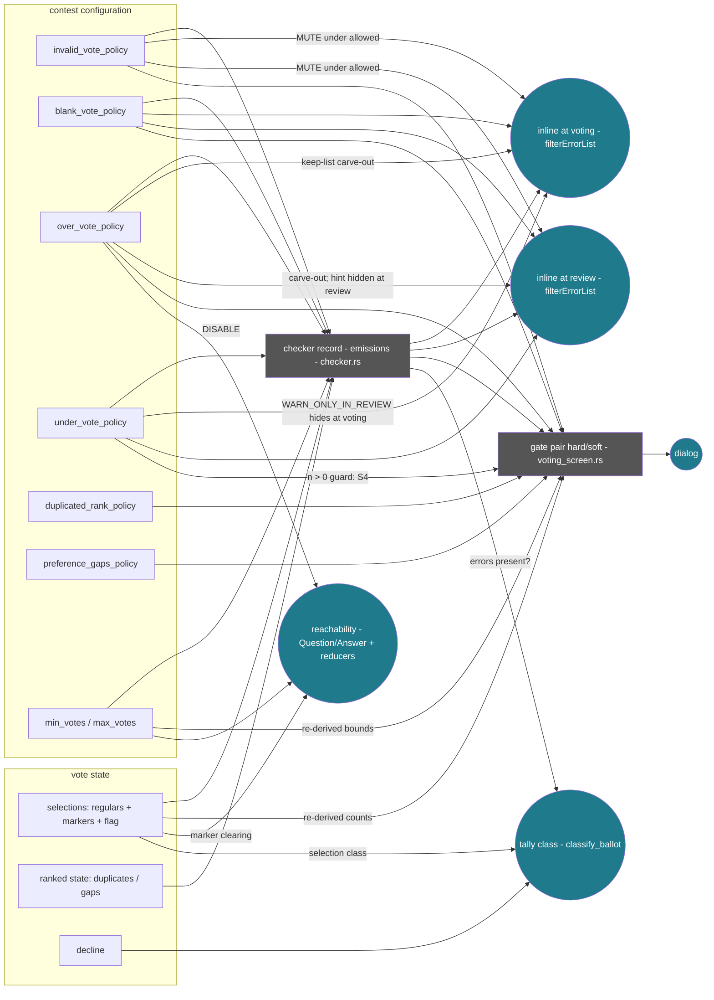

<!--
 SPDX-FileCopyrightText: 2026 Sequent Tech Inc <legal@sequentech.io>

SPDX-License-Identifier: AGPL-3.0-only
-->

# The effect map — the validation mapping as a causal diagram

Generated by `characterization/effect-map.mjs` from the validated
dependency ledger (`effect-dependencies.recorded.json`); do not edit by
hand.

**What this is.** The vote-validation mapping drawn as a deterministic
*structural causal model*: each node a variable, each arrow "appears in
the parent list of that node's structural equation" (the spec function
in the node's box). Setting a policy in the admin portal, or a voter
forming a selection, is an intervention on an input node; the effects
that can respond are the descendants. The topology is the spec's own
factorization, and the generator checks it against the exhaustively
computed ledger: it can never under-report a dependence (checked on
every run), and paths that carry no real dependence are listed below as
*functional cancellations*.

Evidence behind every arrow: the pipeline of
[`effect-dependencies.md`](effect-dependencies.md) (witnesses),
[`headless-sweep.md`](headless-sweep.md) (exhaustive, 276,480 cells),
[`browser-witnesses.md`](browser-witnesses.md) and
[`quotient-validate.md`](quotient-validate.md) (booth) — zero
disagreements; residual labels live in those artifacts.

Round nodes are the four **effect categories** (what is observable);
rectangles inside the mapping are the two **checkable intermediates**
(the record and the gate pair — validated against the WASM but not
directly observable; VALIDATION_LOGIC_DISTILLATION.md §1). Edge labels
carry the crisp guards; the full conditional-independence set (317
restrictions) is in the ledger.

**How to read S1 off the diagram:** the inputs that can change the
*tally* are `sel`, `dec`, and — through the record — `blank`, `bounds`,
`ranks`. For a voter to notice, the same change must reach *dialog* or
*inline*. The MUTE edge (`invalid = allowed`) severs the record's
messages on their way into both inline nodes except for the two
carve-outs, and the gate clauses that would raise a dialog are exactly
the ones the silent-prone configurations switch off — outcome-path
open, signal-paths severed. That geometry is the silent-discount
family; the cells realizing it are `no-silent-discount.md`.

## Functional cancellations — paths that provably carry nothing

A path in the diagram means influence is *plumbed*, not that it ever
changes the effect: determinism lets compositions cancel, and the
exhaustive ledger proves these do. The flagship result — the
"dimmer-switch" theorem — reads off in two parts: `duplicated_rank` /
`preference_gaps` policies have **no path to the tally at all**
(structurally disconnected from the count), and the three policies
below have a path through the checker record yet **provably never
change the count** — leaving `blank_vote_policy` as the only policy the
tally depends on. The policies dim the signalling around a wall whose
position they cannot move.

| input | effect it can reach but provably never changes |
|---|---|
| invalid_vote_policy | tally class |
| over_vote_policy | tally class |
| under_vote_policy | tally class |

## Per-knob cards — what each policy provably does and does not control

Each card is a column-slice of the validated support matrix
(`effect-dependencies.md`), grouped by effect category. "Never" means
proven over the whole modelled domain, exhaustively on the spec and
per the pipeline against production.

### `invalid_vote_policy`

Can change — **checker record**: notAllowed, alert; **inline (voting)**: selectedMax, selectedMin, duplicatedPosition, preferenceOrderWithGaps, notAllowed, alert; **inline (review)**: selectedMax, selectedMin, duplicatedPosition, preferenceOrderWithGaps, notAllowed, alert; **gates / dialog**: gate.hard, gate.soft, dialog.

**Provably never changes** — reachability, tally.

Conditional (policy-level):

- selectedMax ∈ inline.voting responds to it only when `over_vote_policy` ∈ {allowed}
- selectedMax ∈ inline.review responds to it only when `over_vote_policy` ∈ {allowed}

### `blank_vote_policy`

Can change — **checker record**: blankVote; **inline (voting)**: blankVote, underVote; **inline (review)**: blankVote, underVote; **gates / dialog**: gate.hard, gate.soft, dialog; **tally**: tally.

**Provably never changes** — reachability.

Conditional (policy-level):

- underVote ∈ inline.voting responds to it only when `under_vote_policy` ∈ {warn, warn-and-alert}
- underVote ∈ inline.review responds to it only when `under_vote_policy` ∈ {warn, warn-only-in-review, warn-and-alert}

### `over_vote_policy`

Can change — **checker record**: selectedMax, overVoteDisabled; **inline (voting)**: selectedMax, overVoteDisabled; **inline (review)**: selectedMax; **gates / dialog**: gate.hard, gate.soft, dialog; **reachability**: reachability.

**Provably never changes** — tally.

Conditional (policy-level):

- selectedMax ∈ inline.voting responds to it only when `invalid_vote_policy` ∈ {allowed}
- selectedMax ∈ inline.review responds to it only when `invalid_vote_policy` ∈ {allowed}
- gate.hard responds to it only when `invalid_vote_policy` ∈ {allowed, warn, warn-invalid-implicit-and-explicit}
- gate.soft responds to it only when `invalid_vote_policy` ∈ {allowed}
- dialog responds to it only when `invalid_vote_policy` ∈ {allowed, warn, warn-invalid-implicit-and-explicit}

### `under_vote_policy`

Can change — **checker record**: underVote; **inline (voting)**: underVote; **inline (review)**: underVote; **gates / dialog**: gate.soft, dialog.

**Provably never changes** — reachability, tally.

### `duplicated_rank_policy`

Can change — **gates / dialog**: gate.hard, gate.soft, dialog.

**Provably never changes** — checker record, inline (voting), inline (review), reachability, tally.

Conditional (policy-level):

- gate.hard responds to it only when `invalid_vote_policy` ∈ {allowed, warn, warn-invalid-implicit-and-explicit}
- gate.soft responds to it only when `invalid_vote_policy` ∈ {allowed}
- dialog responds to it only when `invalid_vote_policy` ∈ {allowed, warn, warn-invalid-implicit-and-explicit}

### `preference_gaps_policy`

Can change — **gates / dialog**: gate.hard, gate.soft, dialog.

**Provably never changes** — checker record, inline (voting), inline (review), reachability, tally.

Conditional (policy-level):

- gate.hard responds to it only when `invalid_vote_policy` ∈ {allowed, warn, warn-invalid-implicit-and-explicit}
- gate.soft responds to it only when `invalid_vote_policy` ∈ {allowed}
- dialog responds to it only when `invalid_vote_policy` ∈ {allowed, warn, warn-invalid-implicit-and-explicit}

